# LE1

## LE1 Lernziele:

* Gegenstand des **Informationsmanagement** 
* seine **Problemstellungen und Aufgaben** des Informationsmanagements
* Begriff der **Information** 
* **Konzepte und Modelle** des Informationsmanagements 
* **Ebenenmodell des Informationsmanagement** an Beispielen erläutern.

# 1. Informationsmanagement als Managementaufgabe

## Aufgabe/ Ziel：

* „die in Bezug auf die Unternehmensziele **effiziente Versorgung** ~~aller Mitarbeiter und anderer Stakeholder~~ **mit relevanten Informationen** mit Hilfe der Gestaltung und des Einsatzes von IKT“ => 
**(effiziente Versorgung mit relevanten Informationen mit IKT)**

* „generelles **Sachziel des Informationsmanagements** ist
es, das **Leistungspotential der Informationsfunktion**
für die Erreichung der strategischen Unternehmensziele
durch die Schaffung und Aufrechterhaltung einer
**geeigneten Informationsinfrastruktur** in Unternehmenserfolg umzusetzen“
=> **(Leistungspotential der Informationsfunktion durch geeigneten Informationsinfrastruktur umzusetzen)**
---
## Information: Definitionen
* Information vermindert Unsicherheit 
* Information = Kenntnis von Sachverhalten und Vorgängen
* Information = zweckbezogenes Wissen
* Information ist die handlungsbestimmende Kenntnis von vergangenen, gegenwärtigen und zukünftigen Zuständen und/oder Ereignissen in der Realität sowie von handlungs- bzw. entscheidungsbeeinflussenden
* Ansichten und Meinungen maßgeblicher Personen oder Gruppen.
---
## Begriffshierarchie

**Zeichen als Basis** (in einen regelbasierten Zusammenhang gebracht) -> 

**Daten** (Die Anreicherung mit zusätzlichem Kontext verleiht den Daten eine Bedeutung) -> 

**Information** _(mithilfe des Kontexts, dass mit 0,87 der Wert des Dollars in Euro gemeint ist)(Information mit anderen Informationen vernetzt)->_ 

_**Wissen**_

* _Signale： physikalisch wahrnehmbare Tatbestände die Voraussetzung für die Übermittlung und Speicherung von Zeichen._ 
* _Zwischen Nachricht und Daten
wird anhand der Verwendung so differenziert, dass die Zeichenübertragung zu Nachrichten führt, während ihre Speicherung in Datenform geschieht._
---
## **Semiotik符号学!!!!!**
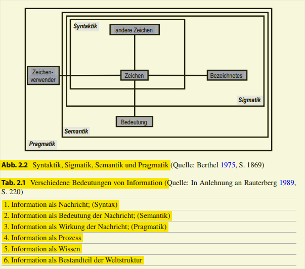

### Semiotik符号学:
 * Syntaktik: Regeln, nach denen diese Abbildung erfolgen kann 
 
 * Sigmatik (eine Abbildung eines bezeichneten Objekts)
 
 * Semantik: dass Inhalt (also Daten) und seine Bedeutung separat und voneinander trennbar sind. 
 
 * Pragmatik: Der
Verwendungszusammenhang 
---
* **Syntaktik 句法学 (Syntax)** : mit der **Beziehung zwischen den Zeichen eines Sprachsystems**, also den durch Konvention festgelegten Regeln einer Sprache, nach denen einzelne Zeichen zu gültigen Ausdrücken und Sätzen kombiniert werden können.
  
* **Sigmatik 语义学**：  die Theorie der Referenzen und befasst sich mit der **Relation zwischen dem Sprachzeichen und dem bezeichneten Objekt**.

* **Semantik**: mit der möglichen **inhaltlichen Bedeutung von Zeichen**.
Sie untersucht sowohl die **Beziehung zwischen dem Zeichen und seiner Bedeutung als auch die Beziehung zwischen dem Zeichen und dem bezeichneten Objekt (Sigmatik).**

* **Pragmatik 语用学**: **die Relation zwischen dem Zeichen und seinem Verwender**, d. h. auf die Absicht, die der Sender mit der Information verfolgt
---
**$\color{red}{\text{Aufgabe}}$**
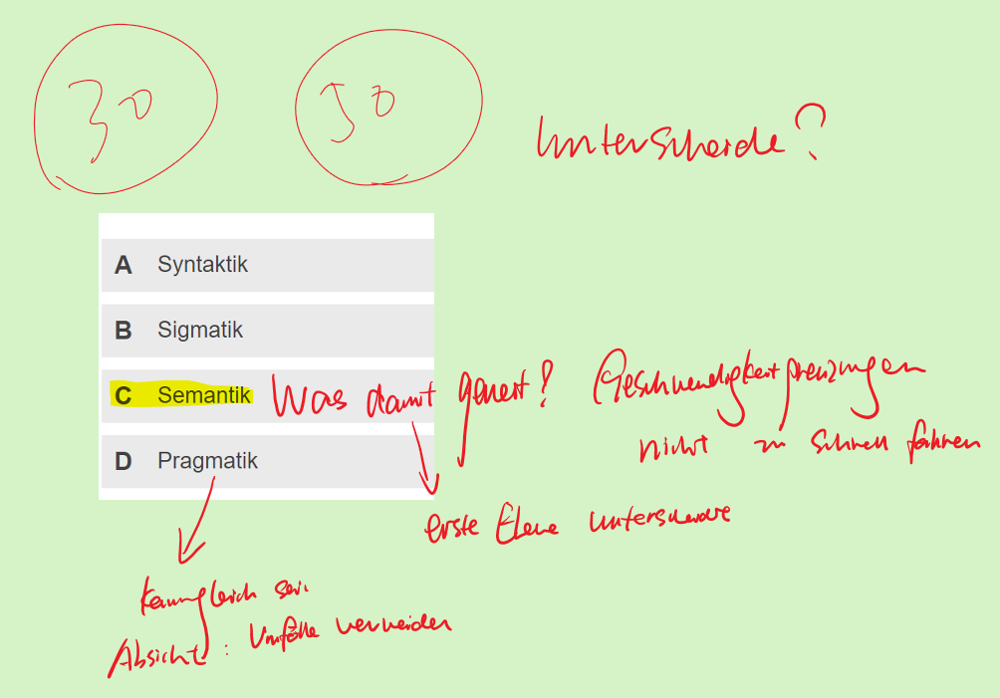

Erläuten Sie ein Beispiel, warum Info als Modell eines Subjects zu verstehen?

Antwort: mit Graph und Bus als ein Beispiel

---
## Materielles Wirtschaftsgut und Information(Vergleich)

| Materielles Wirtschaftsgut                                 | Information                                                                                           |
| ---------------------------------------------------------- | ----------------------------------------------------------------------------------------------------- |
| Hohe **Vervielfältigungskosten** (复制)                    | Niedrige Vervielfältigungskosten                                                                      |
| ~~Angleichung der Grenzkosten an die Durchschnittskosten~~ | Grenzkosten der (Re-)Produktion nahe Null                                                             |
| **Wertverlust** durch Gebrauch                             | Kein Wertverlust durch Gebrauch                                                                       |
| Individueller **Besitz**                                   | Vielfacher **Besitz** möglich                                                                         |
| Wertverlust durch Teilung, begrenzte Teilbarkeit           | Kein Wertverlust durch Teilung, fast beliebige Teilbarkeit                                            |
| ~~Identifikations- und Schutzmöglichkeit~~                 | Probleme des Datenschutzes und der Datensicherheit                                                    |
| **Logistik** oft aufwändig                                 | Logistik einfach                                                                                      |
| **Preis/Wert im Markt ermittelbar**                        | Preis/Wert nur schwer bestimmbar                                                                      |
| ~~Begrenzte Kombinationsmöglichkeiten~~                    | Ansammlung schafft bereits neue Qualitäten, weitgehende Möglichkeiten der Erweiterung und Verdichtung |

~~_Wirtschaftsguts: als technisches Mittel, sind neben der Verwendung für Zwecke des Wirtschaftssubjekts selbst, das Vorhandensein und die Verfügbarkeit im Wirkungsbereich eines Wirtschaftssubjekts sowie die Übertragbarkeit von einem Wirkungsbereich in einen anderen maßgebend._~~

* _Informationen sind **immaterielle** Güter, die auch bei **mehrfacher Nutzung** nicht verbraucht werden._
* _Informationen stiften dem Informationsverwender Nutzen, bspw. wenn sie in Handeln umgesetzt werden._
* _Informationen sind keine freien Güter, sie können daher einen kostenadäquaten Wert haben._
* _Der Wert der Information hängt von der kontextspezifischen und von der zeitlichen Verwendung ab._
* _Der Wert der Information kann durch das Hinzufügen, Selektieren, Konkretisieren und Weglassen verändert werden. Information ist erweiterbar und verdichtbar._
* _Es gibt unterschiedliche Qualitäten von Informationen, wie z. B. inhaltliche sowie zeitliche Genauigkeit, Vollständigkeit und Zuverlässigkeit._
* _Informationen können **mit Lichtgeschwindigkeit transportiert** werden, auch wenn die Objekte, auf die sich die Information bezieht nicht mit der gleichen Geschwindigkeit transportiert werden können_.
* _Informationen sind leicht kopierbar, so dass sich die Durchsetzung exklusiver Rechte insbesondere Eigentumsrechte als schwierig erweist._
* _Informationen werden kodiert übertragen, daher sind für ihren Austausch gemeinsame Standards notwendig_

~~_Information ist einerseits ein abstraktes Modell und andererseits bei Übertragung und Speicherung immer an physikalische Signale gebunden. Diese Dualität bedeutet, dass Informationen Modelle einer physischen Realität darstellen und gleichzeitig selbst physische Realität sind._~~

---
## Management - Definitionen
**Management**: müssen Analysen durchgeführt,
Entscheidungen getroffen, Bewertungen vorgenommen und Kontrollen ausgeübt werden.

**Management**: die Verarbeitung von Informationen
und ihre Verwendung zur zielorientierten Steuerung von Menschen und
Prozessen.

### **Management**: Zusammenfassung vom **Setzen von Zielen und Visionen, Organisieren, Entscheiden, Kontrollieren, Menschen entwickeln und fördern**

---
## Informationsmanagement - Definition

**Informationsmanagement**: das **Management der InformationsWirtschaft,
der (IS) InformationsSYsteme, der IKT und der Führungsaufgaben**.

**Das Ziel des Informationsmanagements**： im Hinblick auf die
**Unternehmensziele** den **bestmöglichen Einsatz der Ressource Information**
zu gewährleisten. ~~IM ist sowohl Management- wie Technikdisziplin und gehört
zur den elementaren Bestandteilen der Unternehmensführung.~~

---
## Informationssysteme: Definition
Informations- und Kommunikationssysteme == Informationssysteme == IS

IS: **soziotechnische
(„Mensch-Maschine“-) Systeme**, die menschliche und maschinelle
Komponenten (Teilsysteme) umfassen und **zum Ziel der optimalen
Bereitstellung von Information und Kommunikation nach wirtschaftlichen
Kriterien** eingesetzt werden.

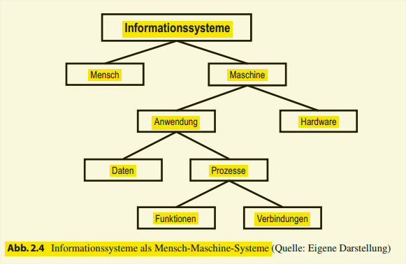

---
# 2. Konzepte des Informationsmanagement

## Problemorientierte Ansätze
_Ausgangspunkt, Fokus: das Problem – konkret in vorliegendem
Fall Problem- und Fragestellungen im Zusammenhang mit dem Einsatz und der Steuerung
von IT._

_**Ziel**: mittels Untersuchung von Ursachen-Wirkungs-Beziehungen und den
daraus abgeleiteten Maßnahmen und Ansätzen diese Probleme zu lösen. Dabei können Probleme als Untersuchungsgegenstand anhand verschiedener Aspekte, z. B. thematisch
in verschiedene Bereiche oder Felder eingeordnet werden._

### Enterprise Wide Information Management (EWIM)
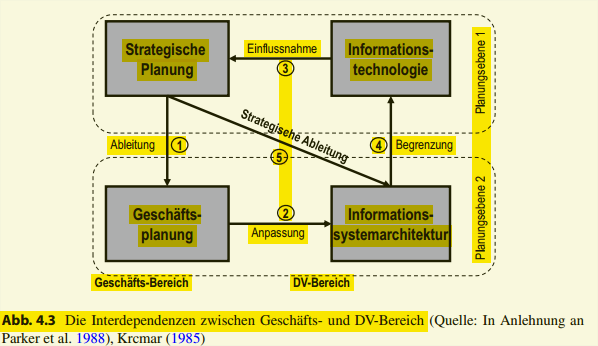
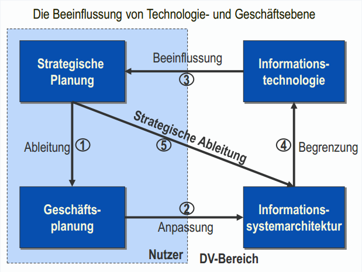

_zeigt, wie „Geschäfts-Bereich“ und „DV-Bereich auf zwei Ebenen miteinander verbunden sind, und dass diese Verbindungen in entgegengesetzte Richtungen laufen_

_fünf Prozesse:_ 

_**Die Ableitung der Geschäftsplanung aus der strategischen Planung ①**_ 
_liefert die generelle Basis für die weiteren Prozesse, ohne dass das IM direkt betroffen ist._

_Der darauf aufbauende klassische Planungsprozess für das IM, **die Anpassung der Informationssystemarchitektur an die Geschäftsziele ②**, **versucht,
die Unterstützung durch IT zu optimieren**, indem die IS an die Unternehmensorganisation
und die Bereichszielsetzungen angepasst werden. 
Damit entspricht der Anpassungsprozess dem klassischen Bild der DV als Dienstleister im Unternehmen (Earl 1989)._ 

_Probleme können allerdings entstehen, wenn (a) der Bedarf an IT-Unterstützung sich schneller ändert als die Umsetzung dauert, (b) der Bedarf erst während der Nutzung entsteht, (c) der Bedarf während der Nutzung wegfällt, oder (d) der Bedarf sich nicht klar auf Jahre im Voraus bestimmen lässt. Tatsächlich sind jedoch diese vier Bedingungen gerade bei größeren Projekten oft gleichzeitig gegeben._
_Deswegen wird der nächste Prozess der **Einflussnahme der Informationstechnologie auf die Unternehmensstrategie ③** relevant, obwohl dieser Einfluss oft unterschätzt wurde und wird._

_Strategische Planung wandelt sich im Zuge der Veränderungen in der Umwelt und berücksichtigt diese Veränderungen. Diese Veränderungen werden auch und gerade durch IT geprägt, wie bspw. durch neue Distributionsformen, verbesserte Geschäftsabwicklung oder flexiblere Produktionstechniken. Dabei nimmt nicht die Technik an sich, sondern die Nutzung der Technik Einfluss auf die Strategie. Nutzungspotenziale
durch IT sind z. B. bei elektronischen Märkten und der Integration von Prozessen entlang
der Wertschöpfungskette gegeben. Dieser Beeinflussungsprozess erfordert das Einbringen von Nutzungswissen in den strategischen Planungsprozess und setzt damit Kommunikationsfähigkeit auf beiden Seiten voraus_

_Beeinflussen der Strategie heißt jedoch nicht nur Möglichkeiten eröffnen, da im Sinne einer **Begrenzung der Technikoptionen ④** die Nutzung der IT auch ihre technischen
Grenzen erfährt. Das in Unternehmen theoretisch vorhandene Nutzungspotenzial kann auf Grund der existierenden IS-Architektur, der Qualifikation der Mitarbeiter und nicht zuletzt wegen des knappen unternehmensspezifischen Wissens der Techniknutzung nicht ausgeschöpft werden._

_Ist erst einmal die Rolle der existierenden IS-Architektur als Begrenzung für die Unternehmensstrategie erkannt, erscheint es sinnvoll, deren Entwicklung im Prozess **Strategische Ableitung der Informationssystemarchitektur ⑤** in direkter Verbindung mit der
Geschäftsstrategie zu gestalten und somit den „Umweg“ über die Entwicklung operativer
Geschäftspläne zu verkürzen. Da dennoch konkrete Anwendungen und Geschäftsprozesse betroffen sind, erfordert auch dieser Prozess eine detaillierte Abstimmung der beteiligten Abteilungen._

_**Die Bedeutung** des Enterprise Wide Information Management-Ansatzes (EWIM): zu verdeutlichen, dass **Nutzer und Bereitsteller von IT untrennbar miteinander verbunden sind:** Technische Optionen beeinflussen die strategischen Pläne, während die Geschäftsorganisation eine Anpassung der IS-Architektur an ihre Ziele verlangt. Wenn für
die Unternehmensstrategie Entscheidungen über die Ausnutzung der durch Technologie gelieferten Handlungsspielräume zu treffen sind, dann sind Beurteilungsmaßstäbe für diese Spielräume notwendig, wodurch der EWIM-Ansatz die Know-how-Anforderungen auf
beiden Seiten herausstellt._ 

_Des Weiteren wird bereits 1985 verdeutlicht, dass das IM sowohl Impulse aus der geschäftlichen Welt erhält (Alignment) als auch an sie gibt (Impact), wodurch der IT die Rolle eines Enablers zukommt_

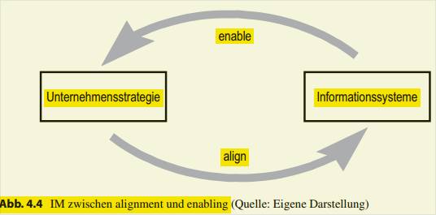

---

## Aufgabenorientierte Ansätze
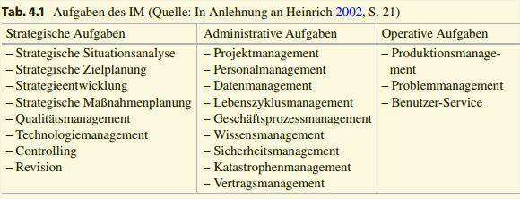

_Fokus: Aufzeigen von Wegen zu deren Erreichung in der Strukturierung der Aufgaben. Die an dieser Stelle relevanten Aufgaben – und der übergeordneten Ziele – sind, die die im Rahmen von IT-Einsatz und -Steuerung anfallen._

„generelles Sachziel des Informationsmanagements ist es, das **Leistungspotential der Informationsfunktion** für die Erreichung der strategischen Unternehmensziele durch die Schaffung und Aufrechterhaltung einer **geeigneten Informationsinfrastruktur in Unternehmenserfolg umzusetzen**“

**siehe bei 1**

_**strategischen Aufgaben**: dienen der **langfristigen Ausrichtung der IT** an den Unternehmenszielen._

_**administrativen Aufgaben** des IM: **setzen die strategische Planung um**
und sind die **Führungsaufgaben der Realisierung und Aufrechterhaltung der Infrastruktur**, insbesondere der gesamten Systemplanung und Systementwicklung._ 

_**operativen Aufgaben** des IM: die **Führungsaufgaben des Betriebes** und der Nutzung einer vorhandenen IKT-Infrastruktur._

----
## Prozessorientierte Ansätze des Informationsmanagements
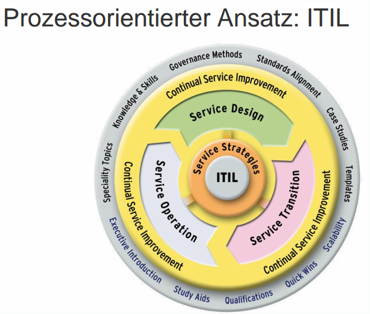

_den prozessorientierten IMAnsätzen zuzuordnen und erweitern den Fokus der aufgabenorientierten Ansätze mit einer
Ablaufperspektive in Form von Aktivitäten._

_Die Information Technology Infrastructure Library (ITIL) ist ein Referenzmodell für das
Management von (internen) IT-Dienstleistungen im Unternehmen._ 

---
## **Ebenenmodell!!!!!**

_Die einzelnen Ebenen sind nach der Art des Managementprozesses in
Planung, Organisation und Kontrolle unterteilt. Somit identifiziert folgende drei Orientierungsschwerpunkte:_
1. Management des Informationseinsatzes,
2. Management der IS und
3. 1Management der Infrastrukturen für Informationsverarbeitung und Kommunikation.

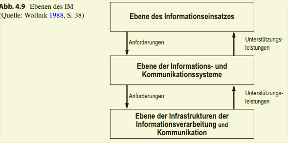
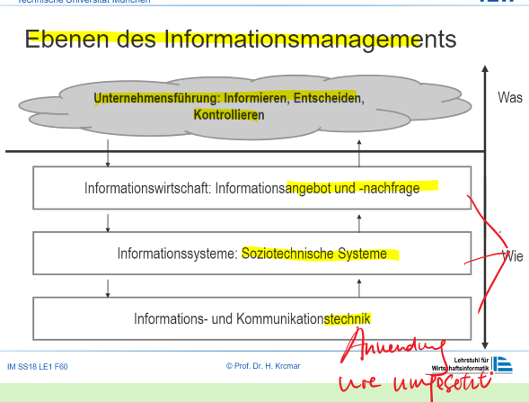
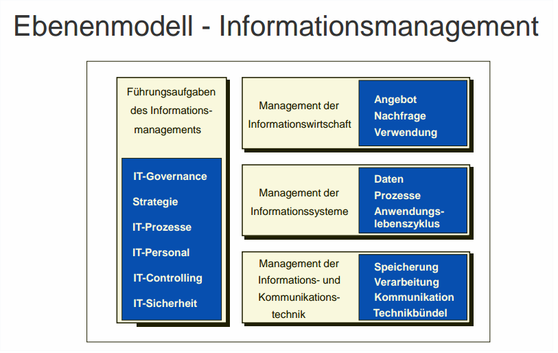

---
## Bewertung der IM-Konzepte
1. Problemorientiert, aufgabenorientiert
- Verzicht auf Struktur und Konzept
- keine technikbezogene und betriebswirtschaftliche Sicht
+ Fülle an Details
  
2. Prozessorientiert
+ Orientierung an betrieblichen Prozessen
+ Zusammenhang zwischen einzelnen Aufgaben
- fehlender Bezug zu übergreifenden Themen
  
3. Ebenenorientiert
- fehlende Unabhängigkeit der Ebenen
  
---
## 
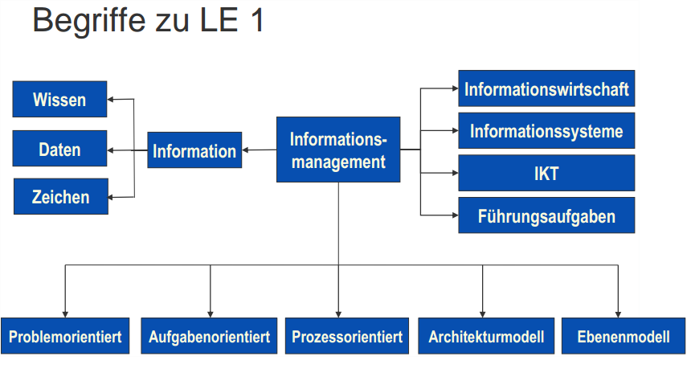
