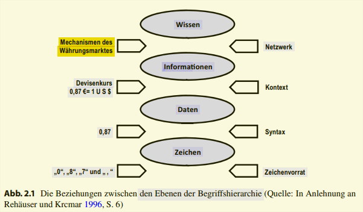
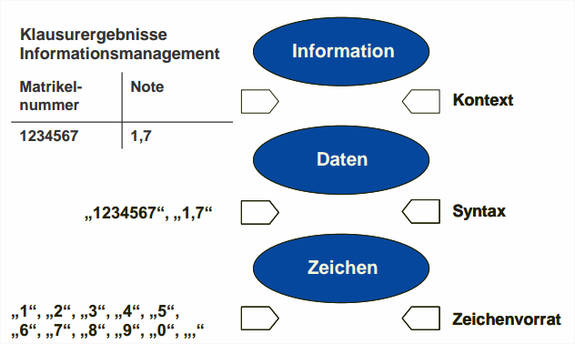

# LE1

## LE1 Lernziele:

* Sie können den Gegenstand des **Informationsmanagement** im Hinblick auf seine **Problemstellungen und Aufgaben** beschreiben
und sind mit den egrifflichen Grundlagen insbesondere mit dem
Begriff der **Information** vertraut.

* Sie kennen verschiedene **Konzepte und Modelle **des
Informationsmanagement und können diese nach ihrer Ausrichtung
beurteilen. Sie können das **Ebenenmodell des
Informationsmanagement** an Beispielen erläutern.

# 1. Informationsmanagement als Managementaufgabe

## Aufgabe/ Ziel：

* „die in Bezug auf die Unternehmensziele **effiziente Versorgung** aller Mitarbeiter und anderer Stakeholder** mit relevanten Informationen** mit Hilfe der Gestaltung
und des Einsatzes von IKT“

* „generelles **Sachziel des Informationsmanagements** ist
es, das **Leistungspotential der Informationsfunktion**
für die Erreichung der strategischen Unternehmensziele
durch die Schaffung und Aufrechterhaltung einer
**geeigneten Informationsinfrastruktur** in
Unternehmenserfolg umzusetzen“

## Information: Definitionen
* Information vermindert Unsicherheit  -> Maß der Überraschung(Informationstheorie nach Shannon)
* Information = Kenntnis von Sachverhalten und Vorgängen (DIN 44300)
* Information = zweckbezogenes Wissen
* Information ist die handlungsbestimmende Kenntnis von vergangenen, gegenwärtigen und zukünftigen Zuständen und/oder Ereignissen in der Realität sowie von handlungs- bzw. entscheidungsbeeinflussenden
* Ansichten und Meinungen maßgeblicher Personen oder Gruppen.

## Begriffshierarchie

**Zeichen als Basis** (in einen regelbasierten Zusammenhang gebracht) -> 

**Daten** (Die Anreicherung mit zusätzlichem Kontext verleiht den Daten eine Bedeutung) -> 

**Information** (mithilfe des Kontexts, dass mit 0,87 der Wert des Dollars in Euro gemeint ist)(Information mit anderen Informationen vernetzt)-> 

**Wissen** 

* Signale： physikalisch wahrnehmbare Tatbestände die Voraussetzung für die Übermittlung und Speicherung von Zeichen. 
* Zwischen Nachricht und Daten
wird anhand der Verwendung so differenziert, dass die Zeichenübertragung zu Nachrichten führt, während ihre Speicherung in Datenform geschieht.

## ** Semiotik!!!!!**

