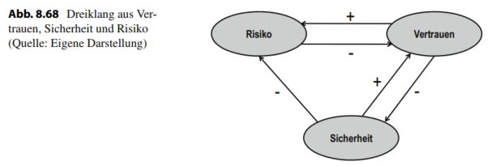

# LE10

## Lernziele LE 10
* vertraut mit dem Management und kennen
wichtige **Standards** und **Rahmenwerke** zur **Informationssicherheit**.
* verstehen das **Ebenenmodell der Sicherung von Informationen** und kennen die **Risikomanagementprozesse** im
Informationsmanagement.
* **IT Grundschutz Rahmenwerk** 
*  **Aufgaben und Entscheidungsräume des
Führungsaufgabenbereichs** des IM

---
## 1. Management der Informationssicherheit

### Sicherheit 
die Freiheit von unvertretbaren Risiken 

Das Wort **“Sicherheit”** besitzt im Englischen zwei Äquivalente:
* **Safety**: Schutz vor **unbeabsichtigte Ereignisse**, wie Feuer- bzw. Wasserschäden,
Naturkatastrophen oder Verarbeitungsfehler.
* **Security**: Schutz vor **beabsichtigte Angriffe**, wie Computer-Viren, Abhören oder Datendiebstahl.

---
### Das Ziel der Informationssicherheit
der Sicherheit im Rahmen
des Informationsmanagements, ist der angemessene **Schutz aller
Informationen** im Unternehmen. Dies umfasst sowohl **elektronisch
gespeicherte Daten als auch Daten auf traditionellen Medien, wie etwa
Papier und Expertenwissen**, das **in den Köpfen der Mitarbeiter** internalisiert
wurde

### Die klassischen Grundwerte der Informationssicherheit:

* **Vertraulichkeit**: Informationen sollen **nur für bestimmten Personenkreis
zugänglich** sein; die **Weitergabe** an Dritte oder der Zugriff unbefugter
Personen muss entsprechend **verhindert** werden.

* **Integrität完整独立自主**: Die **Vollständigkeit, Unverfälschtheit und Konsistenz von
Informationen** muss gewährleistet werden. **Veränderung** von
Informationen können **bewusst, unabsichtlich oder durch
Verarbeitungsfehler verursacht** werden.

* Verfügbarkeit: Informationen müssen zum **richtigen Zeitpunkt** und in der **richtigen
Menge** zur Verfügung gestellt werden. Die **Performanz** und die
**Erreichbarkeit** sind ebenso entscheidend wie Ausfallsicherheit

*Daten sind zum richtigen Zeitpunkt und in der richtigen Menge am
richtigen Ort.*

---
### IT-Sicherheit 
die **Reduzierung** der Informationssicherheit auf den **Schutz der elektronisch** gespeicherten Informationen und deren
**Verarbeitung** -> **Untermenge der
Informationssicherheit**

*Die Unterscheidung zwischen Informationssicherheit und IT-Sicherheit wird zunehmend obsolet过时的, **da heute Daten in der Regel durch Informationssysteme verarbeitet** werden.
Generell hat der Begriff Informationssicherheit einen breiteren Geltungsanspruch, da er
eben nicht nur Daten in Informationssystemen sondern alle Informationen abdeckt*

---
### Risiko 
eine mögliche **Zielabweichung** auf Grund zukünftiger
**Systemzustände** unter Berücksichtigung möglicher **Handlungsoptionen**

**Wesentliche Bestandteile** des Risikobegriffs: 
* Zur Betrachtung zukünftiger **Systemzustände** ist es notwendig, die **Ursache**
zu kennen
* Gleichzeitig muss die **Wirkung** des betrachteten **Systemzustands** auf die
verfolgten Ziele analysiert werden
* Anschließend erfolgt eine kontinuierliche **Bewertung** ~~dieser beiden Aspekte~~ **von Ursache und Wirkung**

---
## Aufwand-Nutzen-Relation für Informationssicherheit 

* Es können **Korrelationen** zwischen den
**Eintrittswahrscheinlichkeiten** der Gefahren auftreten.
    - Stromausfall bei Erdbeben wahrscheinlicher als im Normalfall
    - Bildung von Risikoportfolien
* Als sicher gilt ein Zustand dann, wenn die
Eintrittswahrscheinlichkeit von Risiken oder
Gefahrenpotential gleich Null sind.
    - Gefahr eines Erdbebens der Stärke VI-VII in Garching wurde mit
10-5 / Jahr beziffert

*Die mögliche Zielabweichung wird durch eine Wahrscheinlichkeitsbetrachtung von
unternehmensrelevanten, meist finanziellen, Größen ausgedrückt.*

### Aufwand-Nutzen-Relation für Informationssicherheit

*Ebenso werden bei Risiken die entsprechenden **Handlungsoptionen** (z. B. Sicherungsmaßnahmen) im Rahmen einer **Kosten- und Nutzenbetrachtung bewertet**. Der Aufwand
für den Schutz von Daten sollte nicht den Wert der zu schützenden Daten übersteigen.*

Vollständige Sicherheit, das heißt die Abwesenheit von Risiken existiert nur theoretisch, da die Gesamtheit der möglichen Ereignisse und Handlungsoptionen zu einer
Komplexität führt die niemals gänzlich beherrschbar ist. Der Aufwand für eine **Zunahme an Sicherheit steigt exponentiell und nähert sich asymptotisch an 100 %
an** (Abb. 8.67)

---
### Vertrauen zur Komplexitätsreduktion

*Ein zentrale Handlungsoption zur Reduktion von Komplexität ist Vertrauen*

Um die Maßnahmen des Managements der
Informationssicherheit in einem Dreiklang zwischen
Vertrauen, Sicherheit und Risiko definieren zu können, muss der Begriff Vertrauen verwendet werden.

Vertrauen ist die **freiwillige Erbringung einer riskanten Vorleistung** unter
Verzicht auf explizite vertragliche **Sicherungs- und Kontrollmaßnahmen** […]
in der **Erwartung, dass der Vertrauensnehmer motiviert ist, freiwillig auf
opportunistisches Verhalten zu verzichten”** 

**Vertrauen** reduziert die Komplexität der Umwelt auf ein handhabbares Maß
und stellt eine Vorleistung dar, die Interaktion erst ermöglicht 

### Dreiklang aus Risiko, Vertrauen und Sicherheit

_Die Maßnahmen des Managements der Informationssicherheit sind nun im Dreiklang
aus Vertrauen, Sicherheit und Risiko zu bestimmen. Die Aufgabe des Managements der
Informationssicherheit ist es also zu entscheiden, welche Risiken durch die Etablierung von Sicherungsmaßnahmen auf ein angemessenes Maß reduziert werden das Risiko abbauen oder, auf Grund von Vertrauen, bewusst auf die Berücksichtigung gewisser Risiken verzichten. Ist die Eintrittswahrscheinlichkeit oder die Konsequenz eines Ereignisses
nicht gefährdend für das Unternehmen, so bedarf es weder Vertrauen, noch des Einsatzes von Kontroll- oder Sicherungsmaßnahmen, da das Risiko nicht entscheidend ist. Bei
steigendem Risiko kann entweder Vertrauen als riskante Vorleistung erbracht oder eine
Sicherungsmaßnahme etabliert werden. Der Aufwand für Sicherheitsmaßnahmen steigt
nach Abb. 8.67 exponentiell an, die Grenze zwischen Sicherungsmaßnahmen und Vertrauen ist daher fließend und müssen sich an ökonomischen Gesichtspunkten orientieren,
nach denen die Kosten der Sicherheitsmaßnahmen nicht den zu schützenden Wert übersteigen dürfen. Setzt ein kleines Unternehmen bspw. zur Wahrung der Vertraulichkeit
von Informationen * auf die Vertrauensbasis unter den Mitarbeitern, so reduziert dies die
Komplexität des internen Datenschutzes deutlich. Es hat aber keinen Einfluss auf die Konsequenzen möglicher Ereignisse * durch das Vertrauen sinkt das Risiko nicht. Ein hohes
Maß an Vertrauen kann sogar das Risiko steigern, wenn z. B. die Risikowahrnehmung dadurch schwindet. Nur durch konkrete Sicherungsmaßnahmen kann das Risiko reduziert
werden (Abb. 8.68)_

---
## 2. Ebenen der Sicherung von Informationen

Das Management der Informationssicherheit kann in drei Ebenen gegliedert werden. Oberstes Ziel ist die Sicherung der
Informationswirtschaft.

_Analog zum Ebenenmodell des Informationsmanagements wird das Management der
Informationssicherheit in drei Ebenen gegliedert (Abb. 8.66)._

_Die Sicherung der Informationswirtschaft ist im Allgemeinen die Aufgabe eines Chief
Information Security Officers (CISO). Das oberste Ziel dabei ist die Sicherungstellung
des informationslogistischen Prinzips (vgl. Abschn. 5.1.2). Dazu definiert der CISO in Abstimmung mit dem Management die Sicherheitsziele und formuliert eine Sicherheitsstrategie und Leitlinien (engl.: policies) für die Informationssicherheit im gesamten Unternehmen um ein wirtschaftliches Gleichgewicht zwischen der Risikoreduktion und dem
Aufwand für die Maßnahmen zur Risikoreduktion herzustellen._

_Die Sicherung der Informationssysteme umfasst die Definition von Sicherheitsanforderungen für die Konzeption, Einführung und den Betrieb von Informationssystemen. Die
Gesamtheit der Anforderungen ist die Sicherheitskonzeption. Diese beschreibt die Sicherheitsmaßnahmen, welche für die Absicherung der Unternehmensziele notwendig sind und
definiert Verantwortlichkeiten für die Etablierung und den Betrieb der Sicherheitsmaßnahmen im Unternehmen._

_Die Sicherung der Informations- und Kommunikationstechnik umfasst die Technikbündel, welche notwendig sind, um den Sicherheitsanforderungen hinsichtlich Speicherung,
Verarbeitung und Kommunikation gerecht zu werden. In diese Ebene fällt zum Beispiel
der Einsatz von kryptografischen Methoden zur Sicherung der von Daten aber auch eine
redundante Datenhaltung zum Schutz vor Datenverlust oder Ausfall der Datenspeicherung._

---
## 3. Risikomanagement

### Risiken des Informationsmanagements

Abbildung 8.69 verdeutlicht, dass im Ebenenmodell des IM kann jeder Ebene eine spezifische Risikokategorie zugeordnet werden

_... Deren Wirkung zeigt sich in einer **unzureichenden Verfügbarkeit der IKT, Prozessdisfunktionalitäten, Informationspathologien oder
einer mangelnden Strategieorientierung der Entscheidungen des IM**. Dies führt zu einer unzureichenden Erfüllung der Ziele des IM und gefährdet so die Wettbewerbsfähigkeit
des Unternehmens._

### Beispiele für Risiko

| Subjekt                     | Zielabweichung                                                 | Systemzustände                                  | Alternativen                                 |
| --------------------------- | -------------------------------------------------------------- | ----------------------------------------------- | -------------------------------------------- |
| Kernkraft                   | GAU, Angst, Austritt von Radioaktivität                        | Erdbeben, Stromausfall, Tsunami                 | abschalten, schützen, verlagern              |
| Flugverkehr                 | Absturz, Verspätung, Flugausfall                               | Technische Fehler, Gewitter, Entführung         | Bahnfahren, Autofahren, nicht reisen         |
| Dezentrale Datenspeicherung | Verlust, keine Verfügbarkeit                                   | Ausfall der Festplatte, Diebstahl der HW, Virus | Daten sichern, zentral speichern             |
| Zentrale Datenspeicherung   | Keine Verfügbarkeit, Verlust, Datendiebstahl, Inkompatibilität | Hacker Angriff (DoS), Stromausfall, Erdbeben    | Verschlüsseln, spiegeln, dezentral speichern |

_Die mögliche **Zielabweichung** wird durch eine **Wahrscheinlichkeitsbetrachtung** von
unternehmensrelevanten, meist finanziellen, Größen ausgedrückt. Demnach ist die Gesamtheit der Gefährdungen die Summe über alle (gefährlichen) Ereignisse, d. h., die Summe der Produkte von Eintrittswahrscheinlichkeit und Schadensausmaß und eventuell subjektiven Gewichtungsfaktoren der einzelnen Ereignisse_

---
### Risikomanagementprozess im Informationsmanagement

Der Prozess des Risikomanagements beinhaltet alle Aktivitäten für einen systematischen
Umgang mit den Risiken der Informationssicherheit (vgl. Abb. 8.73). Er basiert auf dem
Prozess des allgemeinen Risikomanagements, der für den Umgang mit sämtlichen unternehmerischen Risiken Gültigkeit hat (Farny 1979, S. 59). Neben den vier Phasen der
Identifikation, Analyse, Steuerung und Überwachung, kommt der Risikostrategie einer
besonderen Bedeutung zu.
Ausgangspunkt der Maßnahmen des Risikomanagements ist die Festlegung einer Risikostrategie für den Bereich der Informationssicherheit. Diese muss unmittelbar an die
unternehmensweite Risikostrategie sowie an die Ziele der Informationswirtschaft angelehnt werden. Nur so kann eine langfristige Erfüllung der Unternehmensziele und die Erreichung einer angestrebten Sicherheitslage sichergestellt werden. Darüber hinaus werden
unkoordinierte und nicht abgestimmte Einzelmaßnahmen vermieden. Die Inhalte dieser
Strategie betreffen das Verhältnis von Chancen und Risiken sowie die Festlegung maximaler Schadenshöhen. Ziel muss eine Sicherung der dauerhaften Existenz des Unternehmens
sein (Zellmer 1990, S. 18 ff.). Darüber hinaus werden grundlegende Maßnahmen zur
Risikobewältigung und die Zuordnung von identifizierten Risikobereichen zu verantwortlichen Aufgabenträgern getroffen. Ebenso gehört zu den Aufgaben die Schaffung einer
gemeinsamen Risikokultur, die Grundlage für den Erfolg eines funktionsfähigen Risikomanagements ist. Wenig förderlich sind hier völlig risikoaverse Rollen, da sie zwar die
Gefährdungen zu minimieren versuchen, dies jedoch auch unter dem Verzicht jeglicher
Chancen. Andererseits kann ein allzu risikofreudiges Verhalten Einzelner zu einer unbeabsichtigten Gefährdung des ganzen Unternehmens führen.
Kritische Verlustgrenzen, die zeitliche Bewertung von Risikowirkungen und ein angestrebtes Konfidenzniveau hinsichtlich der Risikosteuerung sind Ergebnis einer organisationsindividuellen Risikostrategiebildung.

### Risikosteuerung

Für die Umsetzung einer **effektiven** und **effizienten**
Risikosteuerung in Bezug auf die Informationssicherheit
bedarf es
* detaillierter **Kenntnisse** über die Ursachen und
Wirkungen von Risiken der Informationssicherheit
* eines **Prozesses** für die systematische Durchführung der
Aktivitäten des Risikomanagements sowie
* einer **organisatorischen Umsetzung** des
Risikomanagements.

### Strategien zur Risikosteuerung

| Steuerungsstrategie | Maßnahmen                                                                                                                                         | Anwendungsbereiche                                                                                                            | Beispiele                                                                            |
| ------------------- | ------------------------------------------------------------------------------------------------------------------------------------------------- | ----------------------------------------------------------------------------------------------------------------------------- | ------------------------------------------------------------------------------------ |
| Risikovermeidung    | Extremfall der Risikoverminderung auf ein Restrisiko von null                                                                                     | Vorwiegend bei Risikoeinstufung „sehr hoch“ oder „hoch“                                                                     | Abschaffung eines Systems, Abbruch des Projekts                                      |
| Risikoverminderung  | Reduktion der Eintrittsplausibilität und Verringerung der Schadenswirkungen, aktive Beeinflussung der Ursachen sowie antizipatives Handeln des IM | Vorwiegend bei Risikoeinstufung „hoch“ oder „mittel“                                                                        | Einführung von redundanten Systemen, Backup von Daten                                |
| Risikoüberwälzung   | Übertragung möglicher Störungen vor ihrem Eintritt auf andere Wirtschaftssubjekte                                                                 | Anwendung bei allen Risikoeinstufungen möglich. Beschränkung meist auf reine Risiken (bspw. Betriebsrisiken im Rechenzentrum) | Abschluss einer Versicherung , Outsourcing,                                          |
| Risikoselbsttragung | Bewusste Akzeptanz des (Rest-) Risikos, im Rahmen unternehmerischen Handelns nicht eliminierbar                                                   | Management des akzeptierten Restrisikoniveaus („niedrig“, „vernachlässigbar“) nach erfolgter Risikosteuerung                | Versand unverschlüsselter EMails, Bildung von finanziellen oder materiellen Reserven |
| Risikostreuung      | Zerlegung eines Gesamtrisikos in beherrschbare Einzelrisiken                                                                                      | Komplexe Prozess- oder Geschäftsmodellrisiken                                                                                 | Globale Verteilung wichtiger Anwendungssysteme                                       |

_Die aktive Beeinflussung der im Rahmen der Risikoanalyse ermittelten Risiken ist Gegenstand der Risikosteuerung. Diese muss in Einklang mit den Unternehmenszielen, der festgelegten Risikostrategie und dem angestrebten Sicherheitsziel stehen. Die Steuerungsmaßnahmen setzen sowohl bei den Ursachen als auch den Wirkungen der Risiken an und
können anhand der in Tab. 8.16 gezeigten Steuerungsstrategien typisiert werden._

_Aus ökonomischer Sicht ist dasjenige Maßnahmenbündel zur Risikosteuerung zu ergreifen, bei dem die Grenzkosten gleich dem Grenznutzen der Risikoreduktion sind. Hier
spiegelt sich der Nutzen in der Erreichung eines bestimmten Sicherheitsniveaus wider,
während die Risikobewältigungsmaßnahmen zu Kosten führen (Farny 1979, S. 30). Daraus ergibt sich für das Risikomanagement ein Dilemma: Während die Kosten sofort messbar sind, ist die Risikoreduktion, etwa durch Zuwachs an Sicherheit, nur sehr schwer
bezifferbar._

### Risikosteuerung durch Abschreckung, Prävention und Erkennung

---
## Ursachen und Wirkung von Risiken
Für eine effektive Steuerung von Risiken sind Informationen zur Ursachen und Wirkungen von Risiken
notwendig, um Maßnahmen zur Verminderung oder Vermeidung von Risiken zu entwickeln und bewerten.

Kenntnisse über die Wirkung von Maßnahmen erlauben:
* Beurteilung der Relevanz eines bestimmten Risikos
* Untersuchung zur Reduzierung der Risikowirkung
* Wirkung von möglichen Steuerungsmaßnahmen.

_Sind die Ursachen für ein Risiko
bekannt, können Maßnahmen zur Behebung eben dieser Ursachen untersucht werden. Risiken können so vermindert bzw. ganz vermieden werden. So kann bspw. das Risiko eines Serverausfalls auf Grund eines Defekts der Festplatte durch eine redundante Auslegung der Festplatten weitgehend vermieden werden._

_Kenntnisse über die Wirkungen von Maßnahmen erlauben zum einen die Beurteilung
der Relevanz eines bestimmten Risikos. So kann bspw. der Gefährdung der Verfügbarkeit des Produktionssteuerungssystems typischerweise eine höhere betriebswirtschaftliche
Relevanz zugeordnet werden, als der mangelnden Verfügbarkeit eines personalwirtschaftlichen Anwendungssystems. Zum anderen können Maßnahmen zur Reduzierung der Risikowirkung untersucht werden. So adressiert z. B. eine Firewall nicht die Ursache eines Risikos, sondern verhindert lediglich die möglichen Wirkungen durch Zugriffe nicht berechtigter Personen._

---

_Insgesamt muss eine integrierte Betrachtung und Beurteilung von Ursachen und Wirkungen von Risiken sowie der Einfluss entsprechender Maßnahmen der Risikosteuerung
erfolgen. Das Risikothermostat von Adams verdeutlicht dies (vgl. Abb. 8.72).
Im Kern des Risikothermostats steht die Balance zwischen den fünf Elementen des Risikothermostats._

* Ziele bzw. erwartete Ergebnisse: Akteure verfolgen Ziele. Diese Ziele beeinflussen das
Verhalten der Akteure.
* Risikoneigung: Akteure verfolgen ihre Zielen mit einer gewissen Risikoneigung, welche die Einschätzung von Risiken beeinflusst.
* Wissen über mögliche Ursachen: Ebenso wird das Verhalten von Akteuren durch deren
Wissen zu Gefahren und möglichen Sicherheitsmaßnahmen beeinflusst.
* Wahrgenommene Wirkungen: Hier wird das verfügbare Wissen in eine Risikoeinschätzung überführt.
* Ausgleichendes Verhalten: Auf Basis der verfügbaren Informationen wird das ursprüngliche Verhalten angepasst.
  
_Die Betrachtung verdeutlicht, dass die Risiken im Bereich der Informationssicherheit sehr vielschichtig sind und vielfältige Interdependenzen zwischen Risiken und möglichen Maßnahmen zur Risikosteuerung berücksichtigt werden müssen._

---
### Mitarbeiter und Risikomanagement
* Mitarbeiter stellen das schwächste Glied dar:
    - Über die Hälfte der Sicherheitsbrüche werden indirekt oder direkt durch
mangelnde Einhaltung von IT Sicherheitsregeln verursacht (Dhillon
and Moores 2001; Stanton et al. 2005)
    - Beispiele:
        * Unvorsichtiges Öffnen von E-Mail Anhängen
        * Triviale Passwörter
        * Ein Passwort für alle Systeme
        * Update der Rechner wird nur unregelmäßig durchgeführt

Möglichkeit Mitarbeiter zur **Einhaltung von Sicherheitsregeln** zu bewegen:

* Kampanien: Mitarbeiter werden
über die Folgen von Verletzungen
von Sicherheitsregeln informiert

* Sanktionen: Mitarbeiter wissen,
dass sie für die Verletzung von
Sicherheitsregeln Bestraft werden
können

* Partizipation: Mitarbeiter werden
bei der Entwicklung von
Sicherheitsregeln und -systemen
miteinbezogen.

---
## Typen von IT Risikomanagern

---
## 4. Managementsysteme

Sicherheitsmanagement ist ein **kontinuierlicher Prozess**, der die
Sicherheit und die Zuverlässigkeit von IS innerhalb einer Organisation gestaltet.

### Kernaufgaben Managementsysteme:
* Festlegung von Sicherheitsstrategie, -zielen, und -politik der
Organisation,
* Festlegung der Sicherheitsanforderungen,
* Festlegung und Bewertung geeigneter Gegenmaßnahmen (u. a. auch
Grundschutzmaßnahmen),
* Überwachung der Implementierung und des laufenden Betriebes der
ausgewählten Maßnahmen,
* Förderung des Sicherheitsbewusstseins innerhalb der Organisation
* Entdeckung von Reaktionen auf sicherheitsrelevante Ereignisse.

_Für den effektiven Einsatz von Sicherheitsmaßnahmen werden in der Praxis Managementsysteme für die Informationssicherheit eingesetzt._

_Managementsysteme für Informationssicherheit versucht, die mit Hilfe von IT implementierten Geschäftsprozesse und Aufgaben von Unternehmen und Organisationen
systematisch durch strukturierte Maßnahmen zu schützen. Es werden in diesem Kontext etablierte Methoden vorgestellt, die ein Rahmenwerk für das Sicherheitsmanagement darstellen._

_Managementsysteme für Informationssicherheit (engl. Information Security Management
System) (ISMS) unterstützen das Sicherheitsmanagement bei den Planungs- und Lenkungsaufgaben, die „zum sinnvollen Aufbau, zur praktischen Umsetzbarkeit und zur Sicherstellung der Effektivität eines durchdachten und planmäßigen IT-Sicherheitsprozesses
sowie aller dafür erforderlichen IT-Sicherheitsmaßnahmen erforderlich“ sind (Bundesamt
für Sicherheit in der Informationstechnik 2006a). Es umfasst Aufgaben und Aktivitäten,
die darauf gerichtet sind, Beeinträchtigungen bestimmter Prozesse durch ein strukturiertes Rahmenwerk zu vermeiden oder in ihrer Schadenswirkung zu begrenzen. Dies umfasst die Organisation dafür zuständiger Struktureinheiten sowie die erforderlichen Mittel bzw.
Methoden._

---
### Rahmenbedingungen für das Sicherheitsmanagement

* das Regelwerk, das die umzusetzenden Sicherheitsrichtlinien
identifiziert, analysiert und festlegt;
* die Mechanismen, durch die das Regelwerk umgesetzt wird;
* die Zuverlässigkeit der einzelnen Mechanismen;
* die Motivation der Nutzer des Systems (Schutz und
Aufrechterhaltung des sicheren Betriebes) als auch die
Beweggründe potentieller Angreifer.

_Die Initiierung des IT-Sicherheitsprozesses erfolgt in der Regel durch die Geschäfts- bzw.
Behördenleitung, die dabei das Bewusstsein für die Belange der IT-Sicherheit und deren
Bedeutung für die Organisation herausstellt, das Sicherheitsmanagement einrichtet und
ständig kontrolliert._ 

_Die gegenseitige Verflochtenheit dieser Faktoren erschwert deren Untersuchung; ihre
saubere Trennung und separate Evaluation ist daher für das erfolgsversprechende Sicherheitsmanagement von essentieller Bedeutung._

---
## 5. IT-Grundschutz

## IT-Grundschutz
* Das **Ziel** des Grundschutzansatzes ist es, eine **minimale Menge** von **Sicherheitsmaßnahmen** zu errichten, um alle oder einige **IT-Systeme** einer Organisation zu **schützen**.
* Einteilung:
    * **BSI-Standards**: Diese enthalten Empfehlungen des BSI zu Methoden, Prozessen und Verfahren sowie Vorgehensweisen und Maßnahmen mit Bezug zur Informationssicherheit.
    * **IT-Grundschutz-Kataloge**: Es schlägt Sicherheitsmaßnahmen gegen Bedrohungen vor, um ein IT-System zu schützen. Es besteht aus Bausteinen, die jeweils Gefährdungen und geeignete Maßnahmen dagegen enthalten.

* Die Dokumente zum IT-Grundschutz werden vom **Bundesamt für Sicherheit in der Informationstechnik (BSI)**
erstellt.

1. * BSI-Standard 100-1: Managementsysteme für Informationssicherheit
2. * BSI-Standard 100-2: IT-Grundschutz-Vorgehensweise
3. * BSI-Standard 100-3: Risikoanalyse auf der Basis von IT-Grundschutz
4. * BSI-Standard 100-4: Notfallmanagement
5. * IT-Grundschutz-Kataloge

## BSI Standards
* **BSI-Standard 100-1**: Managementsysteme für Informationssicherheit (ISMS):
    * definiert allgemeine Anforderungen an ein ISMS
    * Beispiel – Einbindung der Mitarbeiter in den Sicherheitsprozess: „Werden Mitarbeiter neu eingestellt oder erhalten neue Aufgaben, ist eine gründliche Einarbeitung und Ausbildung notwendig. Die Vermittlung sicherheitsrelevanter Aspekte des jeweiligen Arbeitsplatzes muss dabei berücksichtigt werden. “
  
* **BSI-Standard 100-2**: IT-Grundschutz-Vorgehensweise
    * beschreibt Schritt für Schritt, wie ein Managementsystem für Informationssicherheit in der Praxis aufgebaut und betrieben werden kann
    * Beispiel – Auswahl und Anpassung von Maßnahmen: „Nachdem die notwendigen Informationen aus der Strukturanalyse und derSchutzbedarfsfeststellung vorliegen, besteht die nächste zentrale Aufgabe darin, den betrachteten Informationsverbund mit Hilfe der vorhandenen Bausteine aus den IT-Grundschutz-Katalogen nachzubilden. Als Ergebnis wird ein IT-Grundschutz-Modell des Informationsverbunds erstellt“

* **BSI-Standard 100-3**: Risikoanalyse auf der Basis von IT-Grundschutz
    * erläutert eine Vorgehensweise um Zielobjekte, die einen hohen Schutzbedarf haben oder in den IT-Grundschutz-Katalogen noch nicht behandelt werden, zu schützen.
    * Beispiel – Risiken unter Beobachtung: „Bei der Risikoanalyse können unter Umständen Gefährdungen identifiziert werden, aus denen Risiken resultieren, die zwar derzeit akzeptabel sind, in Zukunft jedoch voraussichtlich steigen werden. Dies bedeutet, dass sich in der weiteren Entwicklung ein Handlungsbedarf ergeben könnte.“
  
* **BSI-Standard 100-4**: Notfallmanagement
    * zeigt einen systematischen Weg auf, ein Notfallmanagement in einer Behörde oder einem Unternehmen aufzubauen, um die Kontinuität des Geschäftsbetriebs sicherzustellen
    * Beispiel – Notfallvorsorgekonzept: „Das Notfallvorsorgekonzept bildet die Grundlage zur Umsetzung der Kontinuitätsstrategien. Es beschreibt die vorliegenden Bedingungen und beinhaltet alle bei der Konzeption anfallenden Informationen.“
  
## Aufbau der IT-Grundschutz-Kataloge

## BSI-Sicherheitsprozess

_Wie zu Beginn dieses Abschnitts erläutert, ist der Einsatz des Grundschutzhandbuches
bei niedrigem bis mittlerem Schutzbedarf vorgesehen. Dies ist jedoch eher als eine Daumenregel zu sehen, bzw. abhängig von der Definition der Schutzbedarfskategorien. Die
Schutzbedarfskategorien sind bei der Grundschutzanalyse individuell für jedes Szenario
festzulegen. Dabei kann es sein, dass bestimmte Informationen einem sehr hohen Schutzbedarf unterliegen, die verarbeitenden IT-Systeme jedoch auf Grund einer sehr geringen
Komplexität nur einem mittleren Schutzbedarf unterliegen. Das Grundschutzbuch sieht eine ergänzende Sicherheitsanalyse vor, wenn eine Komponente einem hohen Schutzbedarf
unterliegt, wenn es keine passenden Bausteine für eine Komponente gibt, oder wenn eine
Komponente auf eine untypische Weise eingesetzt wird. Dieser BSI-Sicherheitsprozess ist
in Abb. 8.77 dargestellt._

