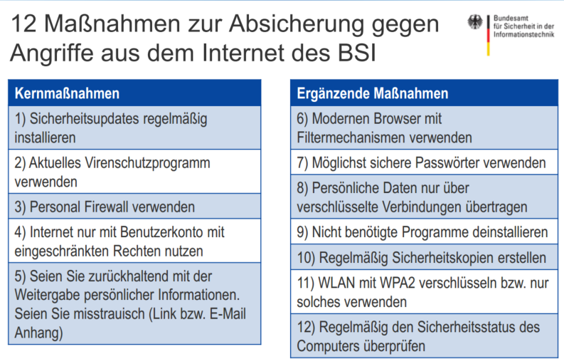
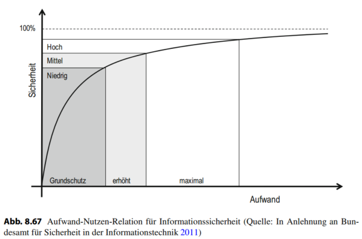

# LE10

## Lernziele LE 10
* vertraut mit dem Management und kennen
wichtige **Standards** und **Rahmenwerke** zur **Informationssicherheit**.
* verstehen das **Ebenenmodell der Sicherung von Informationen** und kennen die **Risikomanagementprozesse** im
Informationsmanagement.
* **IT Grundschutz Rahmenwerk** 
*  **Aufgaben und Entscheidungsräume des
Führungsaufgabenbereichs** des IM

---
## 1. Management der Informationssicherheit

### Sicherheit 
die Freiheit von unvertretbaren Risiken 

Das Wort **“Sicherheit”** besitzt im Englischen zwei Äquivalente:
* **Safety**: Schutz vor **unbeabsichtigte Ereignisse**, wie Feuer- bzw. Wasserschäden,
Naturkatastrophen oder Verarbeitungsfehler.
* **Security**: Schutz vor **beabsichtigte Angriffe**, wie Computer-Viren, Abhören oder Datendiebstahl.

---
### Das Ziel der Informationssicherheit
der Sicherheit im Rahmen
des Informationsmanagements, ist der angemessene **Schutz aller
Informationen** im Unternehmen. Dies umfasst sowohl **elektronisch
gespeicherte Daten als auch Daten auf traditionellen Medien, wie etwa
Papier und Expertenwissen**, das **in den Köpfen der Mitarbeiter** internalisiert
wurde

### Die klassischen Grundwerte der Informationssicherheit:

* **Vertraulichkeit**: Informationen sollen **nur für bestimmten Personenkreis
zugänglich** sein; die **Weitergabe** an Dritte oder der Zugriff unbefugter
Personen muss entsprechend **verhindert** werden.

* **Integrität完整独立自主**: Die **Vollständigkeit, Unverfälschtheit und Konsistenz von
Informationen** muss gewährleistet werden. **Veränderung** von
Informationen können **bewusst, unabsichtlich oder durch
Verarbeitungsfehler verursacht** werden.

* Verfügbarkeit: Informationen müssen zum **richtigen Zeitpunkt** und in der **richtigen
Menge** zur Verfügung gestellt werden. Die **Performanz** und die
**Erreichbarkeit** sind ebenso entscheidend wie Ausfallsicherheit

*Daten sind zum richtigen Zeitpunkt und in der richtigen Menge am
richtigen Ort.*

---
### IT-Sicherheit 
die **Reduzierung** der Informationssicherheit auf den **Schutz der elektronisch** gespeicherten Informationen und deren
**Verarbeitung** -> **Untermenge der
Informationssicherheit**

*Die Unterscheidung zwischen Informationssicherheit und IT-Sicherheit wird zunehmend obsolet过时的, **da heute Daten in der Regel durch Informationssysteme verarbeitet** werden.
Generell hat der Begriff Informationssicherheit einen breiteren Geltungsanspruch, da er
eben nicht nur Daten in Informationssystemen sondern alle Informationen abdeckt*

---
### Risiko 
eine mögliche **Zielabweichung** auf Grund zukünftiger
**Systemzustände** unter Berücksichtigung möglicher **Handlungsoptionen**

**Wesentliche Bestandteile** des Risikobegriffs: 
* Zur Betrachtung zukünftiger **Systemzustände** ist es notwendig, die **Ursache**
zu kennen
* Gleichzeitig muss die **Wirkung** des betrachteten **Systemzustands** auf die
verfolgten Ziele analysiert werden
* Anschließend erfolgt eine kontinuierliche **Bewertung** ~~dieser beiden Aspekte~~ **von Ursache und Wirkung**

---
## Aufwand-Nutzen-Relation für Informationssicherheit 

* Es können **Korrelationen** zwischen den
**Eintrittswahrscheinlichkeiten** der Gefahren auftreten.
    - Stromausfall bei Erdbeben wahrscheinlicher als im Normalfall
    - Bildung von Risikoportfolien
* Als sicher gilt ein Zustand dann, wenn die
Eintrittswahrscheinlichkeit von Risiken oder
Gefahrenpotential gleich Null sind.
    - Gefahr eines Erdbebens der Stärke VI-VII in Garching wurde mit
10-5 / Jahr beziffert

*Die mögliche Zielabweichung wird durch eine Wahrscheinlichkeitsbetrachtung von
unternehmensrelevanten, meist finanziellen, Größen ausgedrückt.*

### Aufwand-Nutzen-Relation für Informationssicherheit

*Ebenso werden bei Risiken die entsprechenden **Handlungsoptionen** (z. B. Sicherungsmaßnahmen) im Rahmen einer **Kosten- und Nutzenbetrachtung bewertet**. Der Aufwand
für den Schutz von Daten sollte nicht den Wert der zu schützenden Daten übersteigen.*

Vollständige Sicherheit, das heißt die Abwesenheit von Risiken existiert nur theoretisch, da die Gesamtheit der möglichen Ereignisse und Handlungsoptionen zu einer
Komplexität führt die niemals gänzlich beherrschbar ist. Der Aufwand für eine **Zunahme an Sicherheit steigt exponentiell und nähert sich asymptotisch an 100 %
an** (Abb. 8.67)

---
### Vertrauen zur Komplexitätsreduktion

*Ein zentrale Handlungsoption zur Reduktion von Komplexität ist Vertrauen*

Um die Maßnahmen des Managements der
Informationssicherheit in einem Dreiklang zwischen
Vertrauen, Sicherheit und Risiko definieren zu können, muss der Begriff Vertrauen verwendet werden.

Vertrauen ist die **freiwillige Erbringung einer riskanten Vorleistung** unter
Verzicht auf explizite vertragliche **Sicherungs- und Kontrollmaßnahmen** […]
in der **Erwartung, dass der Vertrauensnehmer motiviert ist, freiwillig auf
opportunistisches Verhalten zu verzichten”** 

**Vertrauen** reduziert die Komplexität der Umwelt auf ein handhabbares Maß
und stellt eine Vorleistung dar, die Interaktion erst ermöglicht 

### Dreiklang aus Risiko, Vertrauen und Sicherheit
