# LE11

## LE11 Lernziele
* kennen **Aufgaben** und Entscheidungsräume des
Führungsaufgabenbereichs des IM, können den **Governance-Begriff** und die Rolle des **CIO** einordnen.
* können **Sourcing- Alternativen** im Management der Leistungserbringung aufzeigen und Wissen um die **Problematik im IT-Controlling, IT** wertmäßig zu beurteilen.

---
## 1. Aufgaben und Entscheidungen

### Führungsaufgaben des IM
Ausgehend von den **betrieblichen Kernfunktionen Strategiebildung, Produktion, Personal und Controlling**
ergeben sich für das IM folgenden Führungsaufgaben:
* Bestimmung der IT-Strategie
* Management der Leistungserbringung
* Personalmanagement
* Controlling

### Grundsatzentscheidungen der Führungsaufgaben des IM

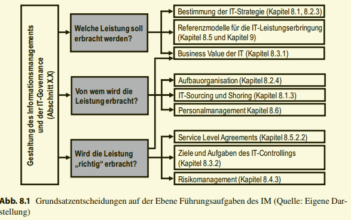

* Welche Leistung soll erbracht werden?
* Von wem wird die Leistung erbracht?
* Wird die Leistung richtig erbracht?

**Welche Leistung soll erbracht werden?**
Am Anfang steht die **betriebswirtschaftliche Entscheidung**, welche (IT-)Leistung erbracht
werden soll. Diese betriebswirtschaftliche Kernfrage muss auf allen Ebenen des Unternehmens beantwortet werden woraus Herausforderung an das IM entsteht, die IT-Strategie
mit der Unternehmensstrategie abzustimmen. Während sich die Unternehmensstrategie
normalerweise im Produkt- und Dienstleistungsportfolio des Unternehmens widerspiegelt, manifestiert sich die IT-Strategie in der IS-Architektur, in der IS-Infrastruktur und
in den angebotenen IT-Services. Abschnitt 8.1 widmet sich deshalb der **Bestimmung der
IT-Strategie**. Prinzipiell lassen sich zwei Wirkungsrichtungen unterscheiden: die Unterstützung der Unternehmensstrategie durch die IS-Architektur (Abschn. 8.1.1) und die
Generierung sowie Identifikation von IKT-ermöglichten (Abschn. 8.1.2). Im Zusammenhang mit der Bestimmung der IT-Strategie werden nachfolgend die Balanced Scorecard
(BSC) und die Methode der kritischen Erfolgsfaktoren (KEF) als Methoden zur Unterstützung des Managements präsentiert. Methoden zur Abstimmung der IT-Strategie mit der
Unternehmensstrategie sind:
* Balanced Scorecard (BSC): Abschn. 8.3.2.7,
* Methode der kritischen Erfolgsfaktoren (KEF): Abschn. 8.1.1.3.
Zur Gestaltung des optimalen Leistungsprogramms ist eine ökonomische Entscheidung
über das Investitionsprogramm notwendig. Hierfür ist eine Bestimmung des Wertes einer
IT-Investition oder eines Investitionsprogramms Voraussetzung. Im Abschn. 8.3.1 wird
die Bestimmung des Wertes einer IT-Investition oder eines Investitionsportfolios diskutiert und Methoden zur Bewertung und Auswahl von IT-Investitionen vorgestellt. Aus der
Vielzahl von vorhandenen Methoden werden die vier Methoden Total Cost of Ownership (TCO), Simple Multi Attribute Rating Technique (SMART), Realoptionen und der
IT Capability Maturity Framework (CMF) herausgegriffen und detailliert beschrieben.
Methoden zur Evaluation und Auswahl von IT-Investitionen sind:
* Total Cost of Ownership (TCO): Abschn. 8.3.1.4,
* Simple Multi Attribute Rating Technique (SMART): Abschn. 8.3.1.5,
* Realoptionen: Abschn. 8.3.1.6,
* IT Capability Maturity Framework (CMF): Abschn. 8.3.1.7

**Von wem wird die Leistung erbracht?**

_Hierzu gehört neben der Gestaltung der internen Aufbauorganisation der IT-Abteilung (Abschn. 8.2.4) und des **ITPersonalmanagements** (Abschn. 8.6) auch die Entscheidung über die Leistungstiefengestaltung, also über das **IT-Sourcing und -Shoring** (Abschn. 8.1.3). Für die Leistungstiefengestaltung wird in der Literatur eine Vielzahl von Entscheidungsmodellen vorgeschlagen.
Diese werden in Abschn. 8.1.3.3 im Überblick dargestellt._

**Wird die Leistung „richtig“ erbracht?**

_Ist das Leistungsprogramm und die Zuordnung der Aufgaben im Rahmen der Leistungserstellung festgelegt, muss in einem permanenten Steuerungsprozess die Frage beantwortet
werden, ob die Leistung „richtig“ erbracht wird. Ob die Leistungserbringung „richtig“
erfolgt, kann letztendlich, wie bei der Auswahlentscheidung, nur aus den Zielvorstellungen des Unternehmens oder der Verwaltung abgeleitet werden. Zwar lassen sich abstrakte
Formalziele, wie z. B. Produktivität, Wirtschaftlichkeit, Effizienz, Effektivität oder abstrakte Sachziele, wie z. B. Qualität oder Termintreue, angeben. Diese müssen aber für
den jeweiligen Fall konkretisiert werden. Damit stellt auch hier die Bestimmung des Wertes von IT-Investitionen eine wesentliche Aufgabe dar. Die Steuerung und Kontrolle der
richtigen Leistungserbringung obliegt dem IT-Controlling, dessen Ziele und Aufgaben
in Abschn. 8.3.2 beschrieben werden. Ein Bestandteil des IT-Controllings ist das Risikomanagement, dessen Aufgaben und Prozesse in Abschn. 8.4.3 dargestellt werden.
Nachfolgend werden Methoden zur Steuerung und Kontrolle der Leistungserbringung,
bspw. Service Level Agreements (SLA) und Kennzahlensysteme, präsentiert. Methoden
zur Steuerung und Kontrolle der Leistungserbringung sind_:
* **Service Level Agreements (SLA)**: Abschn. 8.5.2.2,
* Operational Level Agreements (OLA): Abschn. 8.5.2.2,
* Underpinning Contracts (UC): Abschn. 8.5.2.2,
* Kennzahlensysteme Abschn. 8.3.2.6,
* IT-Servicekataloge: Abschn. 8.5.2.1

---
## 2. Organisation des IM - IT-Governance

### Organisation des IM - IT-Governance
* Wie sollen die Entscheidungsprozesse im IM aussehen und wer trägt die Verantwortlichkeiten für die
Entscheidungen und Ergebnisse?
* → **Meta-Gestaltungsaufgabe** der IT-Governance
  
**IT-Governance**: „specifying the decision rights and
accountability framework to encourage desirable behaviour
in the use of IT“

_Eine wesentliche Gestaltungsfrage des IM ist, wie die Entscheidungsprozesse im IM aussehen sollten und wer die Verantwortung für die Entscheidungen und Ergebnisse im IM
zu tragen hat. **Diese Meta-Gestaltungsaufgabe** wird in der Literatur und Praxis unter dem
Begriff der IT-Governance diskutiert und kann dem IM als Aufgabe zugeordnet werden. Dabei ist es möglich, mit IT-Governance den Nutzen und
die Leistungsfähigkeit von IT-Investition zu beeinflussen_

_IT-Governance bedeutet ein Festsetzen der Entscheidungsrechte und Verantwortlichkeiten, so dass das gewünschte Verhalten beim Einsatz von IT unterstützt wird_

---
### Aufgaben der Metaplanung des IM
 
Die Aufgabe der **Metaplanung** des IM ist es, ein Gestaltungsund Führungssystem für das IM zu entwickeln, einzuführen
und laufend weiterzuentwickeln. Ein solches IMPlanungssystem stellt einen Bezugsrahmen dar, der es
ermöglicht, die Elemente Strukturen und Prozesse der Planung des IM zu beschreiben.

Allgemeine Gestaltungselemente eines Planungssystems
* Planungsträger
* Planungs- und Kontrollfunktionen
* Planungsprozesse
* Pläne
* Eine Informationsbasis und Verteilungsstruktur der Informationen
* Verfahren, Methoden, Modelle
* Struktur, also Beziehungen zwischen Elementen des Planungssystems
* Regelungen

_Im Gegensatz zur operativen und strategischen (Basis-)Planung
wird die Gestaltung des Planungssystems Metaplanung genannt (Gamer 1994, S. 25). Hier
wird festgelegt, welche Pläne mit welchen Zielen auf Basis welcher Informationen in
welchen Prozessen (Steuerung des Basisplanungsprozesses) unter Zuhilfenahme welcher Methoden zu erstellen sind._

---
### Gestaltung des Prozesses des IM durch Festlegung von Rahmenaussagen
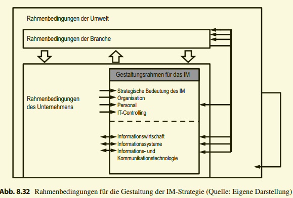
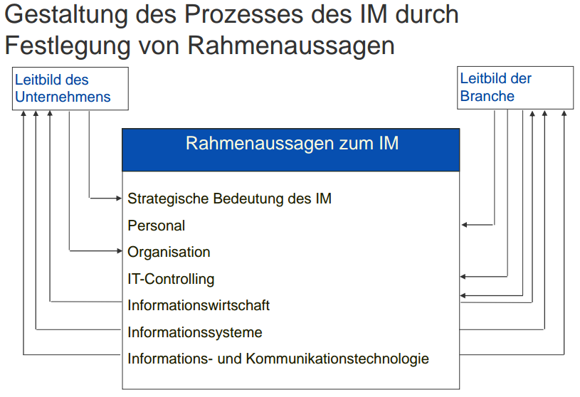

Ein wesentlicher Punkt bei der Gestaltung des IM ist die Festlegung einer IM-Strategie.
Diese wird aus der Unternehmensstrategie abgeleitet. Strategieentscheidungen können
dabei nicht isoliert getroffen werden. Vielmehr müssen verschiedenste Rahmenbedingungen des Kontexts berücksichtigt werden, in den das Gesamtunternehmen und das IM
eingebettet sind. Solche Rahmenbedingungen können aus dem Unternehmen selbst (unternehmensintern) oder aus der Unternehmensumwelt (unternehmensextern) stammen. Die
Gesamtheit der Rahmenbedingungen bestimmt den Gestaltungsrahmen des IM, innerhalb
dessen strategische Entscheidungen getroffen werden können. In einigen Bereichen ist
auch eine Rückkopplung möglich, d. h. strategische Entscheidungen des IM beeinflussen
wiederum einige Rahmenbedingungen.
Externe Rahmenbedingungen entspringen
* der Makroumwelt des Unternehmens: Einfluss auf das IM haben z. B. politische Rahmenbedingungen, gesetzliche Vorschriften wie etwa zum Datenschutz, neue technologische Trends oder Kooperationen mit anderen Unternehmen.
* der Branche: Einfluss auf das IM haben die Branchen- und Wettbewerbsstruktur und
Faktoren, wie z. B. das Selbstverständnis der Branche, das in der und für die Branche
qualifizierte Personal oder neue Informationsbedarfe, die benötigt werden, um mit den
Konkurrenten Schritt zu halten.
Interne Rahmenbedingungen entspringen
* der Unternehmensebene: Eine Rolle spielen hier z. B. unternehmensweite Festlegungen
wie das Leitbild, die Governance-Struktur oder die finanzielle Situation.
* dem IM selbst: In der Vergangenheit getroffene Entscheidungen, z. B. zur Wahl von IS
oder IKT, sind unter Umständen langfristig bindend.
Umgekehrt können Entscheidungen des IM auf die Rahmenbedingungen wirken und
diese eventuell verändern. Beispielsweise können im IM erdachte neue IKT-ermöglichte
Geschäftsmodelle die Ziele eines Unternehmens oder sogar die Geschäftsstrategie einer
ganzen Branche beeinflussen oder neue Wege der Kommunikation können den Umgang
untereinander und damit Arbeitsweise und Leitbild eines Unternehmens verändern. Inwieweit eine solche Rückkoppelung möglich ist, hängt davon ab, inwieweit dem IM im Unternehmen eine strategische Bedeutung zugemessen wird. Abbildung 8.32 zeigt vereinfacht ausgewählte Wechselwirkungen zwischen IM-Strategie und Rahmenbedingungen.
Die zahlreichen Kontextfaktoren, die die IM-Strategie beeinflussen, sind ständigen Änderungen unterworfen, die zum größten Teil schwer vorhersehbar sind: Entscheidungen
finden unter Unsicherheit statt. Hinzu kommt eine Wirkungsverzögerung, d. h. die Wirkungen von in der Gegenwart gewählten Strategien zeigen sich erst in naher oder ferner
Zukunft und bilden wiederum den Rahmen für künftige Entscheidungen. Im folgenden
Abschnitt werden die einzelnen Bereiche des Gestaltungsrahmens aus Abb. 8.32 für das
IM kurz erläutert

---
### Ausgestaltung technologischer Strategien

* Momentumstrategie
  - Annahme, im Einsatz befindliche IS genügen zukünftigen strategischen
Anforderungen
  - Beibehalten der bisherigen Verhaltensweisen bei aufmerksamer
Beobachtung der IKT-Entwicklung
* Aggressive Entwicklungsstrategie
  - IKT-Entwicklung ist für Sicherung der geschäftlichen Erfolgspotenziale
von strategischer Wichtigkeit
  - Gezieltes Streben, als Anwender an der vordersten technologischen
Front zu operieren und Entwicklungen voranzutreiben
* Moderate Entwicklungsstrategie
  - IKT-Entwicklung wird als eine Komponente im Gesamtkontext einer
Unternehmung gesehen
  - Pilotprojekte und begleitende strategische Analysen sowie Wirkungsund Implementierungsstudien
* Defensivstrategie
  - Versuch, sich ganz oder teilweise den IKT-Entwicklungen zu entziehen
oder den IKT-Einfluss zurückzudrängen

_Die Grundhaltung wird für jeden technikbetroffenen Unternehmensbereich für einen gewissen Zeitraum definiert. Sie dient als Leitlinie, auf die Konzepte, Investitionen, Projekte
und operative Pläne gestellt werden._ 

_unterscheidet vier solcher
Grundhaltungen:_

_* Momentumstrategie: Die gegenwärtige Verhaltensweise wird beibehalten, da sich aus IM-Sicht kein akuter Handlungsbedarf ergibt. Die IKT-Entwicklung wird intensiv beobachtet._

_* Moderate Entwicklungsstrategie: Die IKT-Entwicklung ist für das betroffene Unternehmen zwar wichtig, betrifft aber nur Teilaspekte ihrer strategischen Position. Die IKT-Entwicklung wird aufmerksam analysiert. Es werden Studien und Pilotprojekte durchgeführt._

_* Aggressive Entwicklungsstrategie: Die IKT-Entwicklung für die Sicherung der geschäftlichen Erfolgspotenziale ist von strategischer Wichtigkeit. Merkmal dieser Strategie ist das gezielte Streben, als Anwender an der vordersten, technologischen Front zu operieren und Entwicklungen voranzutreiben._

_* Defensivstrategie: Ergebnis dieser Strategie ist der Versuch, sich ganz oder teilweise den IKT-Entwicklungen zu entziehen oder den IKT-Einfluss zurückzudrängen._

---
## Hierarchie der IM Prozesse
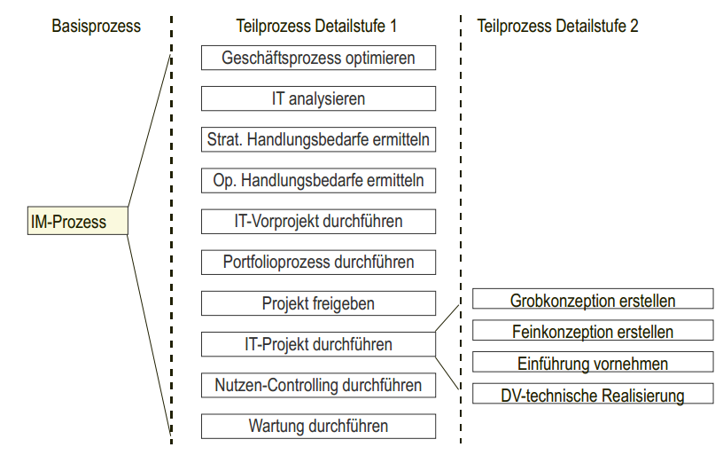

### Definition: Entscheidungspunkte
Ein **Entscheidungspunkt** ist eine Funktion, bei der ein oder
mehrere Entscheidungen getroffen werden und bei dem planend, kontrollierend oder steuernd in den IM-Prozess eingegriffen wird.

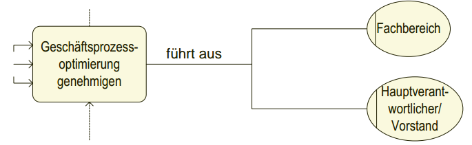
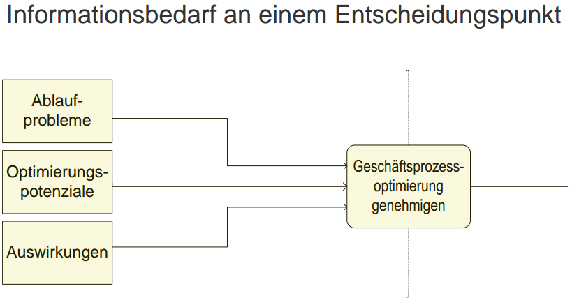

---
### Das IM der Organisationsstruktur des Unternehmens (Organisatorische Einordnung der IM-Funktion im Unternehmen)

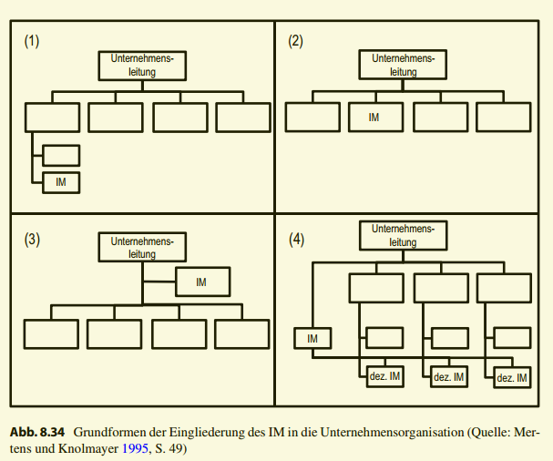

_IM als Linieninstanz in einem Hauptbereich (1) 
Das IM **untersteht einem Fachbereich**. Dies kann sinnvoll sein, wenn der Schwerpunkt des IM beinahe **ausschließlich in einem
Fachbereich liegt**. Sobald jedoch auch andere Fachbereiche betroffen sind, kann dies zu Konflikten führen. Fraglich ist, ob die Fachkompetenz eines Bereichs ausreicht, um IMEntscheidungen anderer Bereiche zu treffen._

_IM als Hauptbereich (2) Das IM ist **eigenständiger Hauptbereich**, gleichbedeutend mit anderen Bereichen, wie z. B. Vertrieb oder Produktion. Dies kommt in Betracht, **wenn das
IM eine sehr hohe Bedeutung hat**, wenn beispielsweise nur Informationsprodukte hergestellt werden. Die Aufnahme der Bedürfnisse anderer Fachbereiche und die Durchsetzung der IM-Aufgaben in den Fachbereichen ist jedoch unter Umständen schwerfällig._

_IM als Stabstelle (3) Das IM ist **außerhalb der Linie in einer übergreifenden Stabsstelle organisiert.** Dadurch entsteht ein enger Kontakt zur Unternehmensleitung. Jedoch hat das IM keine formale Weisungsbefugnis gegenüber den Fachbereichen und kann seine
Entscheidungen unter Umständen schwer durchsetzen und nachverfolgen._

_IM als Querschnittsfunktion in einer Matrixorganisation (4) In den einzelnen Fachbereichen sind dezentrale IM-Funktionen vorhanden, die von einer übergeordneten Instanz,
z. B. einem Lenkungsausschuss, koordiniert werden. Dadurch bestehen sowohl kurze Wege zu den Fachbereichen als auch zur Unternehmensleitung. Diese Form bringt jedoch einen hohen Koordinationsaufwand mit sich._

---
### Der CIO als Aufgabenträger des Informationsmanagements
### Definition und Kernaufgaben des CIO

**Chief Information Officer (CIO)** ist die Berufsbezeichnung für eine Person/Führungskraft, die verantwortlich ist für die **Informationstechnik und Anwendungen**, die die
Unternehmensziele unterstützen.

* **Ausrichtung der IT** auf die Unternehmensstrategie und die Entwicklung einer IT-Infrastruktur
* **Setzen, Implementieren und Aktualisieren** von Software- und Hardware-Architekturen und -standards, um die hohe Vernetzung der IKT im Unternehmen zu akzeptablen Kosten sicherzustellen
* **Regelmäßige Priorisierung neuer Anwendungen**, Steuerungs- und Controllingprozesse sowie übergreifendes Wissen und Erfahrung
* **Übergreifende Hilfe**, wenn einzelne Divisionen auf Probleme stoßen, die sie nicht bewältigen können
* **Unterteilung in strategische, administrative und operative Aufgaben**

### Erfolgsfaktoren für einen CIO 

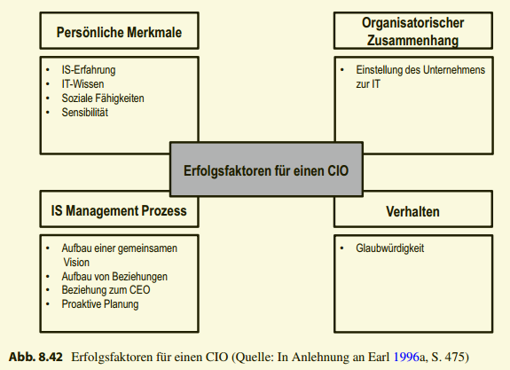

_zehn kritische **Erfolgsfaktoren** für das Überleben des CIO
in seiner Position. Danach ist eine **Mischung von technischen und Managementfähigkeiten nötig**. Insbesondere das Knüpfen von **Beziehungen,
das Verhältnis zum CEO, die Sensibilität, soziale Kompetenz, die proaktive IS-Planung
und das Aufbauen einer gemeinsamen erfordern vom CIO die Fähigkeiten eines Politikers**. Andererseits erfordern die **Glaubwürdigkeit, das IT-Wissen und die Erfahrung, dass der CIO fähig ist**, die benötigten Informationen zu liefern._

###  Selbstverständnis eines CIOs 

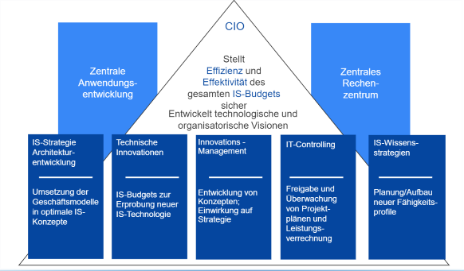

_Abbildung 8.44 veranschaulicht das **Selbstverständnis** des CIOs. Danach stellt der
CIO **die Effizienz und Effektivität des gesamten IS-Budgets sicher und entwickelt technologische und organisatorische Visionen**. Er beaufsichtigt die **IS-Strategie, TechnologieInnovationen, das Innovationsmanagement, das IT-Controlling sowie IS-Wissensstrategien.**
Zur Seite stehen ihm dabei die **zentrale Anwendungsentwicklung und das zentrale Rechenzentrum**._

---
### 3. Management der Leistungserbringung

**Referenzmodelle** als Ausgangspunkt für die
Gestaltung des IT-Managements
* Fragestellungen bei der Organisation der
Leistungserbringung:
  - Wer erbringt die Leistungen?
  - Welche Leistungen sollen erbracht werden?
  - Welche Leistungsprozesse sind erforderlich?
  - Wie sollen die Leistungsprozesse gestaltet werden?
* IT-Referenzmodelle bieten eine systematische und
transparente Darstellung von IT-Managementprozessen als
Grundlage für die (Re)Organisation des IT-Managements

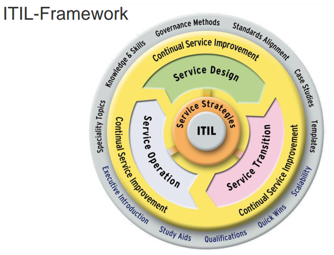
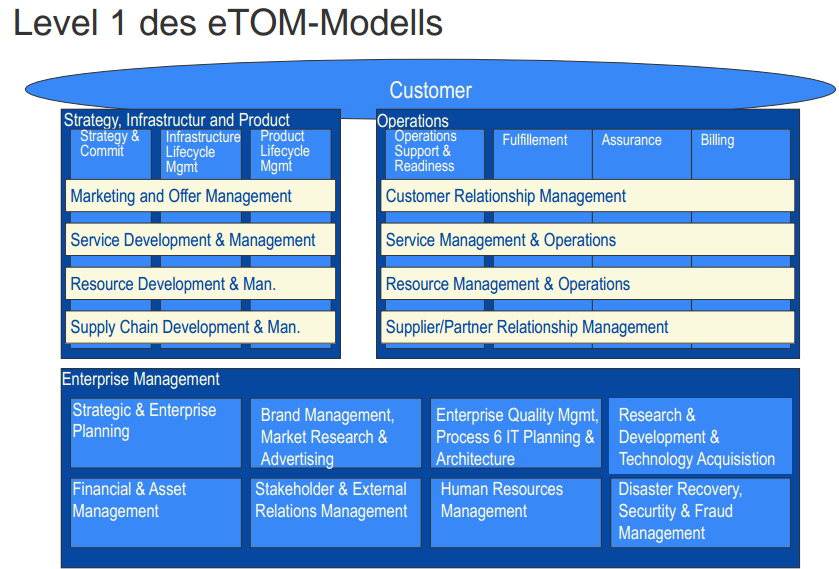

### Level 1 des eTOM-Modells

_Es kann als
Full Enterprise Framework bezeichnen werden, da es nicht nur eine isolierte Prozessbetrachtung zulässt, sondern auch die Zusammenhänge zwischen den Vorgängen innerhalb
des eigenen Unternehmens sowie die Verbindungen zu anderen Unternehmen verdeutlicht. Das Modell ist entsprechend dem Detaillierungsgrad in die Level 0 bis 3 eingeteilt,
wobei Level 0 einen sehr groben Überblick darstellt. Der Detailgrad nimmt mit steigendem Level zu und beschreibt auf Level 3 kurz Maßnahmen, die ergriffen werden müssen,
um einen bestimmten IT-Prozess umzusetzen. Abbildung 9.1 zeigt Level 1 des eTOMModells, das eine Übersicht aller Prozessfelder zeigt und aus der sich die Potenziale des
Konzepts erahnen lassen_

_Es werden drei Hauptgruppen (dunkelgrau unterlegte Kästen in Abb. 9.1) von Prozessen unterschieden. Die Hauptgruppe Operations umfasst die betriebswirtschaftlichen
Funktionen, die direkt mit der Leistungserbringung verbunden sind. Die Hauptgruppe
Strategy, Infrastructure and Product (SIP) beinhaltet die Vorgänge, die mit der Leistungskonzeption und der Überwachung verbunden sind_

---
### Definition: Outsourcing
**Outsourcing** ist eine Zusammensetzung der Wörter
**Outside und Resourcing**. Es bedeutet, dass einzelne
Aufgaben der IT oder die gesamten IT-Aufgaben **an ein
anderes Unternehmen abgegeben** werden. Es umfasst
sowohl die **Auslagerung** (externes Outsourcing), die
**Übertragung** von Aufgaben an ein externes Unternehmen sowie die **Ausgliederung** (internes Outsourcing) an ein rechtlich verbundenes anderes Unternehmen

* _**Finanzielle Motive**, die sich auf **Effizienzsteigerung** und damit verbundene **Kostensenkungen** beziehen._

* _**Strategische Motive**, bei denen die Entwicklung neuer IT-Services und Produkte sowie
langfristige strategische Wettbewerbsvorteile im Vordergrund stehen_

* _**Technologische Motive**, bei denen neueste Systeme und Technologien, die Ablösung
von Legacy-Systemen oder der stabile und zuverlässige Betrieb der Informationssysteme vom Outsourcinganbieter erwartet wird_

### Gründe für Outsourcing 
**Kosten**
  * **Kostenreduktion**
  * Umwandlung von **Fixkosten in variable Kosten**
  * **Verbesserung der Planbarkeit von Kosten** der Informationsverarbeitung

**Personal**
  * Problem der Beschaffung von qualifizierten IT-Kräften wird vermieden
  * Entlastung der internen IT von Routinearbeiten (Anwendungsstau-Vermeidung)
  * **Risikovorsorge** bezüglich einer zukünftigen Verknappung qualifizierter IT-Kräfte
  
**Risiko**
  * **Verringerung/Verlagerung von Risiken** der wachsenden technologischen Dynamik
  * **Verringerung bzw. Verlagerung von Risiken** aus der zunehmenden Komplexität des Einsatzes moderner Informations- und Kommunikationstechnik
  
**Konzentration**
  * **Konzentration von Finanzmitteln** auf das Kerngeschäft eines Unternehmens
  * **Verbesserung der Wettbewerbsfähigkeit** durch eine Konzentration der eigenen IT-Ressourcen
auf die wesentlichen Aufgaben
  * Freisetzung von Kapazitäten für wichtige Aufgaben

**Finanzen**
  * **Erhöhung der Zahlungsfähigkeit** durch Zuführung liquider Mittel aus dem Verkauf von ITAnlagen an den Outsourcing-Anbieter
  * Möglichkeiten zur positiven Beeinflussung des Jahresabschlusses
  
**Technologie/Know-how**
  * **Zugang zu speziellem Know-how** (z. B. CASE-Werkzeuge, Expertenwissen), das selbst nur schwer und teuer aufzubauen oder zu halten ist
  * **Nutzung modernster Technologien ohne eigene Investitionen**

### Risiken des Outsourcing
Kosten
  * **Einmalige Umstellungskosten** (Switching Costs)
  * Risiken der vertraglichen Preisfixierung
  * Intransparenz und Unkontrollierbarkeit der vom Outsourcing-Anbieter verlangten Preise
  
Personal
  * Personalpolitische und arbeitsrechtliche Probleme
  * Verlust von Schlüsselpersonen und deren Know-how
  * Die im Unternehmen verbleibenden Restaufgaben der Informationsverarbeitung schaffen keine ausreichende Motivation mehr für das verbleibende IT-Personal

Technologie
  * Starre Bindung an die Technologie des Outsourcing-Anbieters
  * Gefahr einer zu großen Standardisierung

Datenschutz
  * Gewährleistung des Datenschutzes vertraulicher Daten
  
Know-how
  * Transfer von Know-how und damit verbundenen Wettbewerbsvorteilen an Konkurrenten
  * Zunehmende Auslagerungsaktivitäten ziehen unweigerlich einen Verlust von IT-Kompetenz

Rückkehr zur eigenen Informationsverarbeitung
  * Wiederaufbau von Know-how nach gescheiterten Outsourcing-Projekten
  * Langfristige Bindung an Outsourcing-Verträge
  * Aufwand für den Wiederaufbau einer IT-Abteilung (Rechenzentrum)

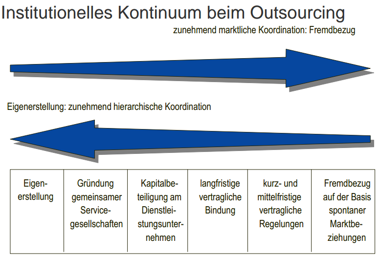

---
## 4. IT-Controlling

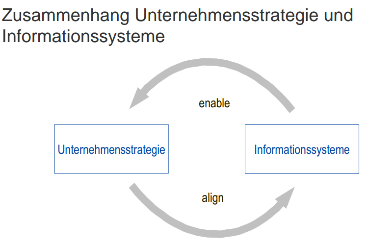
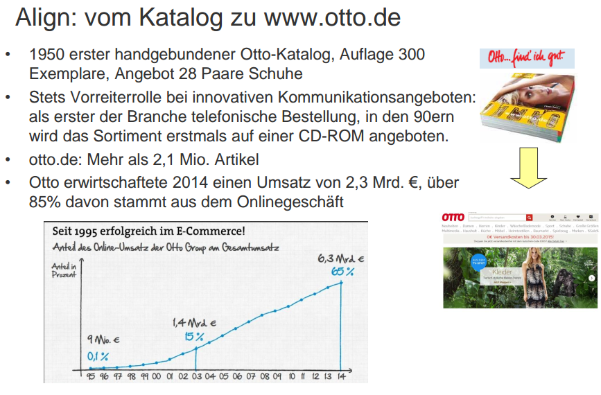

### Wirkungszusammenhänge des Einsatzes von IT und Unternehmenserfolg

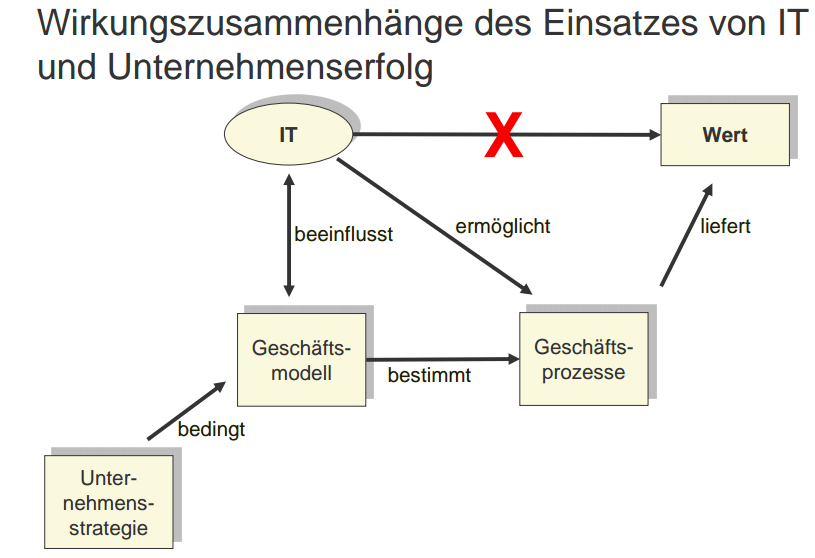

_Folglich muss bei der Untersuchung des **Zusammenhangs zwischen IT-Einsatz, ITInvestition** und daraus resultierender Produktivität eine differenzierte Betrachtung herangezogen werden. Der Nachweis eines **direkten Zusammenhangs zwischen IT-Einsatz und Produktivität** ist in den meisten Fällen problematisch.
Erst die Abstimmung des IT-Einsatzes mit **Unternehmensstrategie** und **Geschäftsprozessen** ist **ausschlaggebend**, um tatsächlich einen IT-Wertbeitrag zum Unternehmenserfolg
zu erzielen. Eine Wirkung des IT-Einsatzes kann daher nur über ihren strategischen Beitrag und die Nutzung ihrer Potenziale bei der Gestaltung von Geschäftsprozessen auf die Produktivität erreicht werden. Die Fragestellung bei der Untersuchung des IT-Wertbeitrags ist daher neu zu formulieren: Welchen Beitrag leistet ein
Geschäftsprozess zum Unternehmenserfolg und welchen Wert- bzw. Nutzenbeitrag kann
der IT-Einsatz für diesen Geschäftsprozess liefern?_

### Nutzenkategorien

_Entscheidungen über IT-Investitionen generieren ebenso wie andere betriebswirtschaftliche Entscheidungen positive und negative Zielbeiträge. Diese gilt es einander gegen-
überzustellen. Während sich einige monetäre Wirkungen noch relativ einfach über die
einzelnen Kostenarten oder Auszahlungen bestimmen lassen, ist ein Großteil der Effekte
nur mit großer Unsicherheit zu ermitteln und kann, abhängig von den Zielvorstellungen,
auch nicht monetärer Art sein. Im letzteren Fall kann eine IT-Investition nur über Kriteriensysteme und Punktebewertung angemessen eingestuft werden. Dies gilt umso mehr, je
strategischer die zu bewertenden IT-Investitionen sind. Das verdeutlicht die Analyse der
Nutzenkategorien in Tab. 8.11. Die Tabelle zeigt, dass die Nutzeneffekte nicht mehr in
vermeintlich leicht berechenbaren Kosteneinsparungen bestehen._

### Total Cost of Ownership (TCO)

* Problemstellung
  
Die Gesamtkosten einer DV gehen über die budgetierten Kosten
hinaus. Der Anteil nicht-budgetierter Kosten beträgt nach
Schätzungen zwischen 23% und 46% der Gesamtkosten

* Ziel TCO

Methode (Gartner Group) zur Ermittlung der tatsächlichen aus einer
DV Investition resultierenden Belastungen durch die Identifikation
nicht-budgetierter Kosten

* Methode

-Ganzheitliche Betrachtung von Investitionsentscheidungen über
den gesamten Lebenszyklus einer DV Investition
-Cost-Assessment

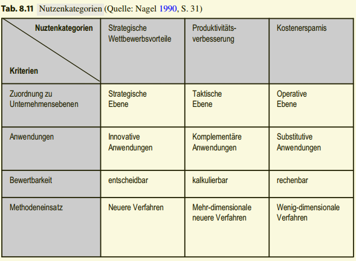
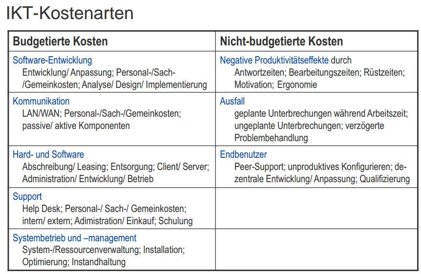
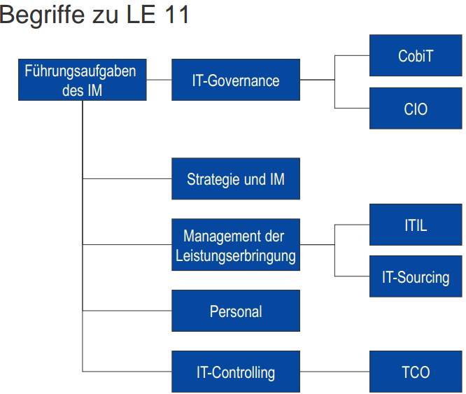