# LE2

## LE2 Lernziele:

* **Lebenszyklus der Informationswirtschaft (IW)** und diesen auf **praktische Anwendungsfälle** übertragen

* die begrifflichen Grundlagen erläutern und unterschiedliche **Perspektiven** auf **Informationsbedarf**
unterscheiden.

* Methoden, um Informationsbedarf zu ermitteln und die **Methoden KEF und Balanced Scorecard** praktisch anwenden.
---
## 1. Informationswirtschaft im Überblick

### Ziel der Informationswirtschaft
**Herstellung des
informationswirtschaftlichen Gleichgewichts** im Unternehmen 

---
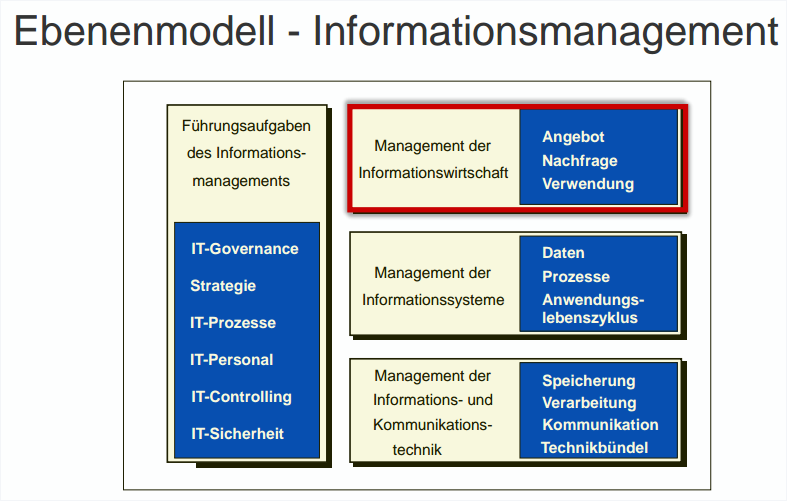

---
## Aufgaben der Informationswirtschaft

* Ausgleich von **Informationsnachfrage und
Informationsangebot**
* Versorgung der **Entscheidungsträger mit relevanten
Informationen**
* Gewährleistung einer hohen **Informationsqualität**
* Dokumentation von **Willensbildungs- und
Willensdurchsetzungsprozessen**
* Gestaltung der Informationswirtschaft als
**Querschnittsfunktion** des Unternehmens
* **Einsatz von IKT** zur Unterstützung der
informationswirtschaftlichen Aufgabenerfüllung
* **Zeitliche Optimierung** der Informationsflüsse
* Beachtung des **Wirtschaftlichkeitsprinzips**

_Die Aufgabe der Informationswirtschaft besteht darin, ein Gleichgewicht **zwischen Informationsangebot und Informationsnachfrage herzustellen**._

---
## Lebebnszyklusmodell der Informationswirtschaft!!!!

_dieses Gleichgewicht **dynamisch, d. h. Angebot und Nachfrage von Informationen müssen immer wieder neu aufeinander eingestellt** werden. 
Der Managementprozess der Informationswirtschaft gehorcht倾听，谛听 daher zyklischen Gesetzmäßigkeiten; ändert sich einer der Ausgangsparameter, bspw. die Informationsnachfrage, so wird ein erneuter Durchlauf der Prozessschritte angestoßen._

### Grundlegende Elemente:
1. Management von Informationsnachfrage und -bedarf,
2. Management der Informationsquellen,
3. Management der Informationsressourcen,
4. Management des Informationsangebots,
5. Management der Informationsverwendung und
6. Management der Infrastrukturen der Informationsverarbeitung und Kommunikation

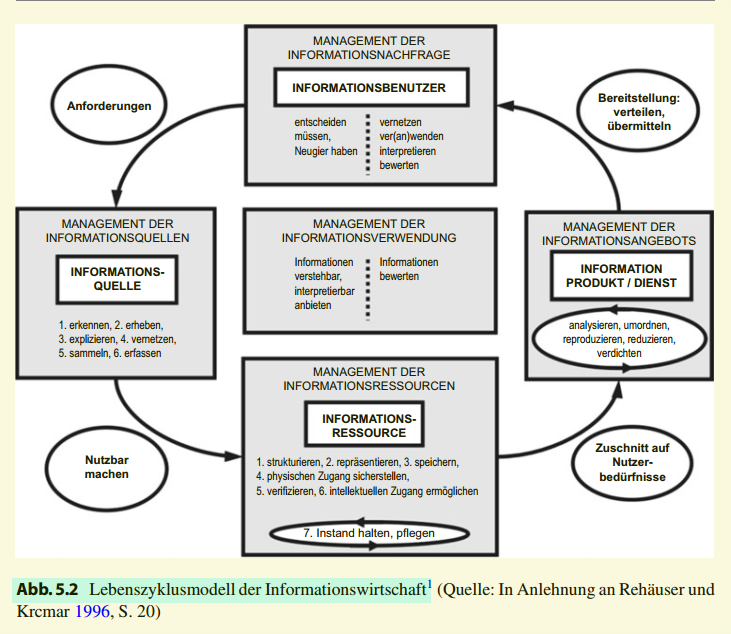

_Stehen die im Rahmen eines informationswirtschaftlichen Zyklus erschlossenen重建的 Informationen **einem Informationsnutzer zur Verfügung, kann Informationsbedarf gedeckt werden.** Der Informationsnutzer **interpretiert die von ihm gewünschten Informationen und die ihm zugegangenen Informationsprodukte und -dienste entsprechend dem von ihm verfolgten Zweck und bringt sie zur Verwendung/Anwendung**._ 

_Dabei **entstehen neue Informationen**, da der Informationsnutzer die ihm vom Informationsangebot bereitgestellten
Informationen interpretiert, bewertet und in seine bereits vorhandenen Informationsstrukturen einbindet. Ergebnis dieser Bewertung ist, dass der Informationsbedarf durch das Informationsangebot befriedigt wurde oder nicht. Dementsprechend muss das Informationsangebot ausgeweitet oder verändert werden. Die einzelnen Elemente des Lebenszyklusmodells dienen als Gliederungsgrundlage für die folgenden Unterkapitel._ 

---

_Zunächst wird dabei auf **das Management der Informationsnachfrage eingegangen**. 
Zwei Methoden zur Informationsbedarfserhebung : **die Methode Bestimmung der Kritischen Erfolgsfaktoren** und **die Balanced Scorecard.**_

_Dem Lebenszyklus folgend gliedert sich das Kapitel weiter in **das Management der Informationsquellen** und **das Management der Informationsressourcen**. In diesem Unterkapitel wird **eine Methode zur Informationsmodellierung, Semantic Web**, beschrieben._ 

_Danach folgen das Management der Informationsqualität , **das Management des Informationsangebots** und der Bereitstellung sowie **das Management der Verwendung**._ 

_~~Das Lebenszyklusmodell der Informationswirtschaft bietet einen~~ umfassenden **Blick auf alle Problemstellungen der Informationswirtschaft**. ~~Um jedoch den prozessualen Charakter des Managements der Informationswirtschaft hervorzuheben, kann der Lebenszyklus auch anhand eines Managementprozesses verdeutlicht werden.~~ **Vorteil ist seine detailliertere Darstellung.** So kann genau aufgezeigt werden, anlässlich welcher Ereignisse die entsprechenden, oben erwähnten Managementaufgaben der Informationswirtschaft einzusetzen haben. Beispielsweise führt das Ereignis „Informationsbedarf aufgetreten“ zu der Funktion bzw. Managementaufgabe „Informationsbedarf erheben/überprüfen“. Abbildung 5.3 zeigt den Managementprozess der Informationswirtschaft als Ereignisgesteuerte
Prozesskette_

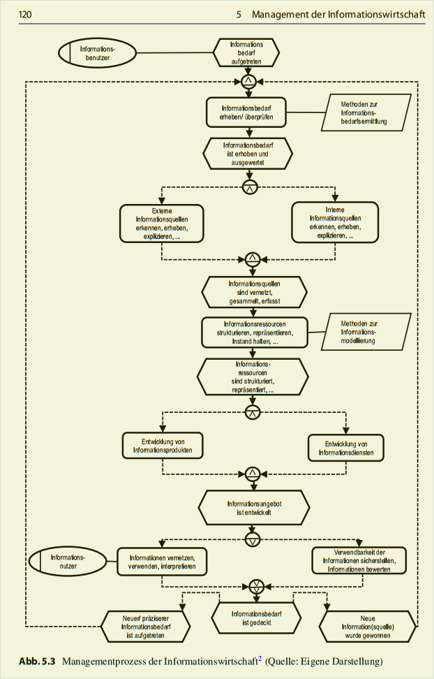

---
# Informationslogistik
_Die **Informationslogistik** ~~ist als Teilbereich des Informationsmanagement anzusehen~~, welcher sich mit der **Logistik des Objektes Informationen** befasst. Die  Informationslogistik erleichtert die konzeptionelle Einbeziehung externer Informationen und Informationsquellen und liefert somit die Grundlagen zur Gestaltung der innerbetrieblichen wie auch
zwischenbetrieblichen und branchenspezifischen Prozesse_

**Beschäftigt sich mit den Problemen des Informationsflusses und der
Informationskanäle**

### Informationslogistisches Grundprinzip: Vorhandensein
oder
_**Ziel des logistischen Prinzips ist die Bereitstellung**_:

| —                                | —                                                        |
| --------------------------------- | --------------------------------------------------------- |
| der richtigen Information         | vom Empfänger verstanden und benötigt                     |
| zum richtigen Zeitpunkt,          | für die Entscheidungsfällung ausreichend                  |
| notwendig in der richtigen Menge, | so viel wie nötig, so wenig wie möglich                   |
| am richtigen Ort                  | beim Empfänger verfügbar                                  |
| in der erforderlichen Qualität.   | ausreichend detailliert und wahr, unmittelbar verwendbar. |

---

**$\color{red}{\text{Aufgabe}}$**

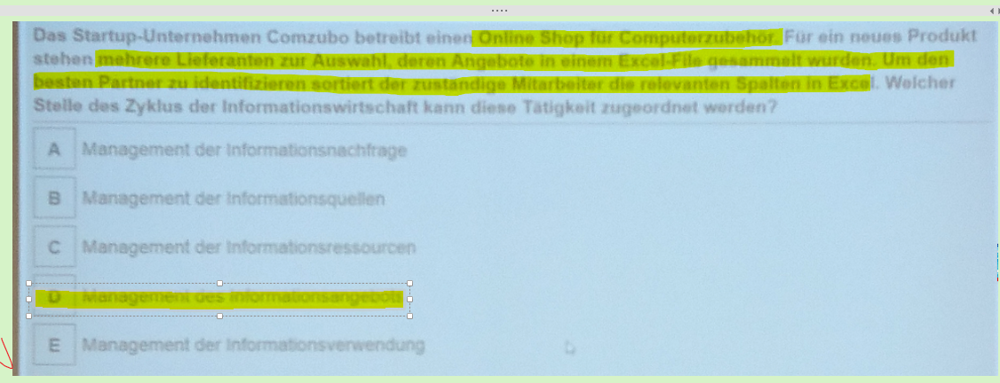
D： Info-Angebot: Nutzer greift die DB zu und filtern Infos, die google breitgestellt hat.

---
## 2.Managementaufgaben im Lebenszyklus der Informationswirtschaft – **Management der Informationsnachfrage**
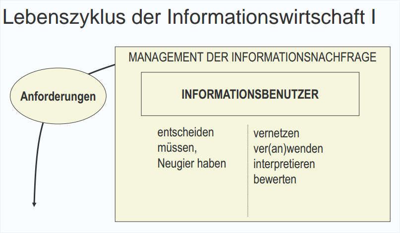
Wichtiges davon: entscheiden, bewerten, interpretieren seine InformationsBedarf

_重复上面Zunächst wird dabei auf **das Management der Informationsnachfrage eingegangen**. 
Zwei Methoden zur Informationsbedarfserhebung : **die Methode Bestimmung der Kritischen Erfolgsfaktoren** und **die Balanced Scorecard.**_

_**Informationsnachfrage bzw. -bedarf** ist der **Auslöser für den Start des Lebenszyklus der
Informationswirtschaft**._ 

---
### Informationsbedarf > Informationsnachfrage

### Informationsbedarf:
Art, Menge und Beschaffenheit von Informationen, ~~die ein Individuum oder eine Gruppe~~ **zur Erfüllung einer Aufgabe benötigt**.

### Informationsnachfrage:
**Teilmenge des !!!subjektiven!!! Informationsbedarfs.** Sie ist
neben dem objektiven Bedarf Ausgangspunkt der Planung des Informationsangebots.

---

### Ermittlung des Informationsstands aus Bedarf, Angebot und Nachfrage

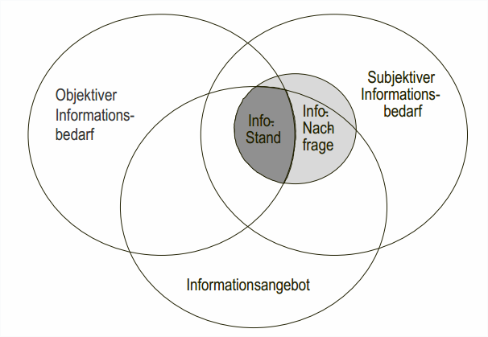

_Die beiden oberen Kreise: objektiven und subjektiven Informationsbedarf._

_**Der objektive Informationsbedarf** ist der für die **Aufgabenerfüllung !!!erforderliche!!! Bedarf**._

_**Der subjektive Informationsbedarf** hingegen definiert sich **aus der Perspektive ~~des handelnden~~ Individuums**, d.h. des Aufgabenträgers, und wird auch „Bedürfnis“ genannt. Der tatsächlich geäußerte Informationsbedarf, die Informationsnachfrage des Aufgabenträgers, stellt
eine Teilmenge des subjektiven Bedarfs dar._

_Subjektiver und objektiver Informationsbedarf **sind nicht identisch** oder müssen es
zumindest nicht sein._

_Die **Informationsnachfrage** ist **eine Teilmenge des subjektiven Informationsbedarfes**._

_Das **Informationsangebot**: alle **verfügbaren** ~~unternehmensinternen und unternehmensexternen~~ Informationen, welche **zur Deckung des Informationsbedarfs zur Verfügung stehen**_

_**Selten wird der Fall auftreten, dass das Informationsangebot den subjektiven oder objektiven Informationsbedarf !!!komplett!!! deckt**, weshalb nur die **Schnittmenge** aus Angebot, Nachfrage und objektivem Informationsbedarf **den Informationsstand信息的状况** bestimmt._ 

_~~**Ziel** der Informationswirtschaft ist es, **die Mengen der Bedarfe zur Deckungsgleichheit zu bringen und dadurch das Angebot zu decken**.~~_ 

_Die Basis der Informationsnachfrage ist der Informationsbedarf._

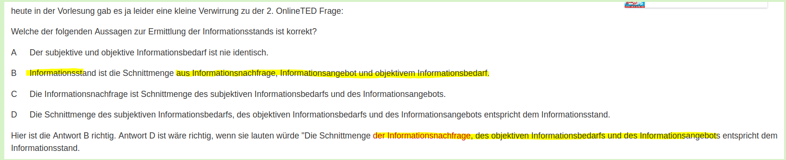

---
## Modell des Informationsverhaltens
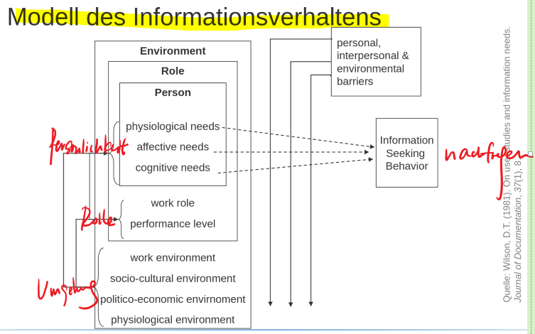

_In der Realität ist der menschliche **Informationsbedarf** sehr stark durch **den ！！！！！subjektiven Informationsbedarf！！！** bedingt._
_Ein Modell, welches die Person, die **einen Informationsbedarf wahrnimmt sowie den Kontext**, in welchem der Informationsbedarf entsteht, als **Ausgangspunkte** beschreibt._
Demnach wird das **menschliche Informationssuchverhalten** stark von **Umgebung**, **Rolle** sowie **Personlichkeit** eines Individuums bestimmt. 

In anderen Worten: **bei der gleichen Aufgabe haben unterschiedliche Personen ganz unterschiedliche Informationsbedarfe.** 

_Die äußerste Ebene des Modells **„Umgebung“** umfasst Dimensionen wie **Arbeitsumgebung, soziokulturelle Umwelt sowie politisch-wirtschaftliche und physiologische Umgebung**. ~~Das politische System kann Einfluss auf die Zugangsmöglichkeiten unterschiedlicher Personen auf bestimmte Informationen haben. Die physiologische Umwelt hingegen kann wesentlichen Einfluss auf die Arbeitsbedingungen und somit auf den Informationsbedarf einer Person haben.~~_ 

_Die mittlere Ebene **„Arbeitsrolle“** wird als das einer Person zugewiesene Bündel an **Aufgaben und Verantwortlichkeiten** definiert, **welche den Informationsbedarf bestimmen**._

_Im Zentrum des Modells als Ursprung des Informationsbedarfs und Informationsverhaltens eines Menschen befindet sich wie Abb verdeutlicht die Person mit ihren **physiologischen, affektiven感情(上)的 und kognitiven Bedürfnissen -> Persönlichkeit**._

---

## Modell der Informationsrecherche

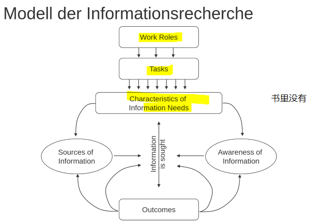

---

## Informationsbenutzer

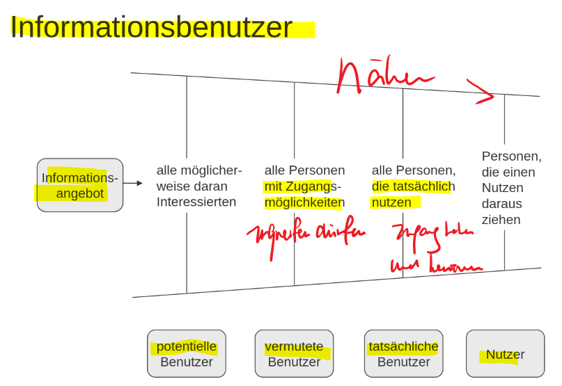

**Klassifizierung von Informationsbenutzern**: die Unterscheidung in **potentielle Benutzer, vermutete Benutzer, tatsächliche Benutzer und Nutzer**. 

**potentiellen Benutzern**: die **Interesse** an einer Information haben könnten; 

**vermutete Benutzer**: Personen mit **Zugangsmöglichkeiten**

**tatsächliche Benutzer**: die eine Information **tatsächlich nutzen**

~~die Benutzerklasse~~ **„Nutzer“**
**profitiert von der Nutzung** einer Information

---

## Verfahren zur Ermittlung des Informationsbedarfs

Die Verfahren zur Ermittlung des Informationsbedarfs lassen sich in **subjektive, objektive und gemischte Verfahren** einteilen.

Subjektive Verfahren |Objektive Verfahren |Gemischte Verfahren
---------|----------|---------
 Ableitung aus einer **subjektiven Interpretation** der Aufgabe | Ableitung aus **einer intersubjektiv validierten Interpretation** der Aufgabe | Vorgabe theoretischer Raster, die subjektiv interpretiert werden
 Offene Befragung | Strategieanalyse | Strukturierte Befragung
 Wunschkataloge | Prozessanalyse | Methode der kritischen Erfolgsfaktoren
  Befragung der Mitarbeiter im Tätigkeitsumfeld | Input-Prozess-Output-Analyse | Balanced Scorecard
   || Entscheidungsanalyse | Weiterentwicklung aus dem Kontext (Evolution)
   | ||  Entwicklung aus dem Bestehenden (Ist-Situation bzw. Tätigkeitsanalysen)

### **Subjektive Verfahren**
1. **Offene Befragung:** 
  _Der Befragte wird aufgefordert, seinen **Informationsbedarf zu beschreiben**, u. U. unterstützt durch Beispielsituationen seines Arbeitsalltags, während der Interviewer ergänzende oder klärende Fragen stellt._

2. **Wunschkataloge:**:
  _Den zukünftigen Informationsnutzern wird ein **„Katalog“ von möglichen oder bereits entwickelten Informationsprodukten** vorgelegt, aus dem Elemente ausgewählt werden sollen, die der Deckung des Informationsbedarfs dienen._

3. _**Befragung der Mitarbeiter im Tätigkeitsumfeld:** 
   **Die Interviews zur Charakterisierung des Informationsbedarfs** werden auf Mitarbeiter im Umfeld des eigentlichen Adressaten ausgeweitet, da hier u. U. noch weitere ergänzende Merkmale erhoben werden können._

### Objektive Verfahren

_1. **Strategieanalyse**:  **Informationsbedarf aus den strategischen Zielsetzungen** des Unternehmens heraus von der betreffenden Führungskraft abgeleitet._

_2. **Prozessanalyse** als Erhebungsinstrument geht auf Unternehmensmodellebene von
den **Entscheidungsabläufen** aus, die für die Ressourcensteuerung erforderlich sind. Die
für die **Entscheidungsabläufe erforderlichen Informationen lassen auf den Informationsbedarf der Prozessbeteiligten schließen.**_

_3. **Input-Prozess-OutputAnalyse**: Informationsbedarf und -stand werden hier im Sinne von **Input, Output und Informationsverarbeitung** entlang von Prozessschritten ermittelt_

_4. **Entscheidungsanalyse** geht von gut **strukturierten Entscheidungsprozessen** aus, von denen sich, gegliedert nach **Entscheidungsschritten, der Informationsbedarf in der jeweiligen Phase ableiten lässt**_

### Gemischte Verfahren

_**strukturierte Befragungen** ~~werden auf der Basis einer objektiven Methodik, bspw.
der **Prozessanalyse oder der Strategieanalyse**, Vorgaben für die Interviewgestaltung
(Fragestellungen, Themen etc.) gemacht, die dann aber im Laufe des Interviews vom Befragten ergänzt oder kommentiert werden können.~~_

_**Weiterentwicklung aus dem Kontext** ~~handelt es sich um einen **evolutiven** Ansatz. Hierbei wird davon ausgegangen, was aktuell von einem Unternehmensmitarbeiter an Informationen genutzt wird. Ausgehend von diesem Informationsbestand wird dann unter Berücksichtigung seines Kontextes abgeschätzt und „hochgerechnet“, was dieser Mitarbeiter in Zukunft an Informationen benötigt.~~_

_**Entwicklung aus dem Bestehenden** ~~werden Informationsbedarfe aus
den Ergebnissen einer Analyse des Arbeitsumfeldes und der Tätigkeiten eines Mitarbeiters abgeleitet (Erfassung einer IST-Situation und Tätigkeitsanalysen).~~_

---

## Methode: Bestimmung der Kritischen Erfolgsfaktoren

_um die Informationsbedürfnisse ~~des
Topmanagements~~ zu ermitteln._

**Kritische Erfolgsfaktoren:** eine **begrenzte Anzahl** von **Arbeitsbereichen**. ~~Gute Resultate in diesen Arbeitsbereichen sind
ausschlaggebend决定性的 für ein Individuum, eine Abteilung oder eine
Organisation, um erfolgreich im Wettbewerb zu bestehen~~.

_Die Methode **Bestimmung der Kritischen Erfolgsfaktoren** ist **ein Ansatz zur Ermittlung des Informationsbedarfs von Führungskräften**. Über **！！！Interviews！！！** werden die für die Arbeit der Führungskräfte als besonders wichtig eingestuften **Themen ermittelt und
Indikatoren zu deren Überwachung identifiziert**._

_Nach der Methode der kritischen Erfolgsfaktoren wird der **Informationsbedarf daraus
bestimmt, ！！！welche Faktoren！！！ für das Geschäft und den wirtschaftlichen Erfolg tatsächlich wichtig sind.** Der Informationsbedarf der Entscheider lässt sich somit aus diesen
für den Unternehmenserfolg kritischen Faktoren ableiten. ~~Die Anwendung der Methode der kritischen Erfolgsfaktoren für die Ermittlung
von Informationsbedarf beruht auf der Hypothese, dass Führungskräfte notwendigerweise
Informationen zum Status bzw. der Entwicklung ihrer kritischen Erfolgsfaktoren für ihre
Entscheidungen benötigen.~~_

**Quellen für KEFs**
1. Branche
2. Wettbewerbsstrategie und Positionierung
3. Umweltfaktoren
4. Temporäre临时的 Faktoren
5. Spezielle Anforderungen des Managements

_Die **Branche**, in der ein Unternehmen tätig ist, weist **charakteristische Erfolgsfaktoren**
auf, die von allen Unternehmen der Branche beachtet werden._

_Durch die **Wettbewerbsstrategie bspw. Marktführerschaft und die Position eines Unternehmens** innerhalb seiner Branche werden weitere KEF festgelegt_.

_Auf die **Umweltfaktoren** wie **Politik und Konjunktur** hat ein Unternehmen naturgemäß
wenig Einfluss, aber auch sie generieren kritische Erfolgsfaktoren._

_**Temporäre Faktoren** sind **nur für einen bestimmten Zeitraum in einer Ausnahmesituation erfolgskritisch.** Als Beispiel die Situation, dass viel zu viel oder viel zu wenig Lagerbestände vorhanden sind. In diesem Fall wird die Bestandskontrolle des Lagers zum kritischen Erfolgsfaktor, während diese ansonsten nicht von Interesse für das Top-Management sind._

_Auch die Managementposition und der damit einhergehende Aufgabenrahmen eines
Managers bringt in Abhängigkeit ihrer inhaltlichen Ausrichtung bestimmte charakteristische KEF mit sich._

~~_**Ziel**_
_Die Methode der kritischen Erfolgsfaktoren hat Ziel zum  nur den wesentlichen Informationsbedarf zu ermitteln. Unwesentliche Informationen sollen eliminiert werden und
somit der Informationsproliferation entgegengewirkt werden_~~

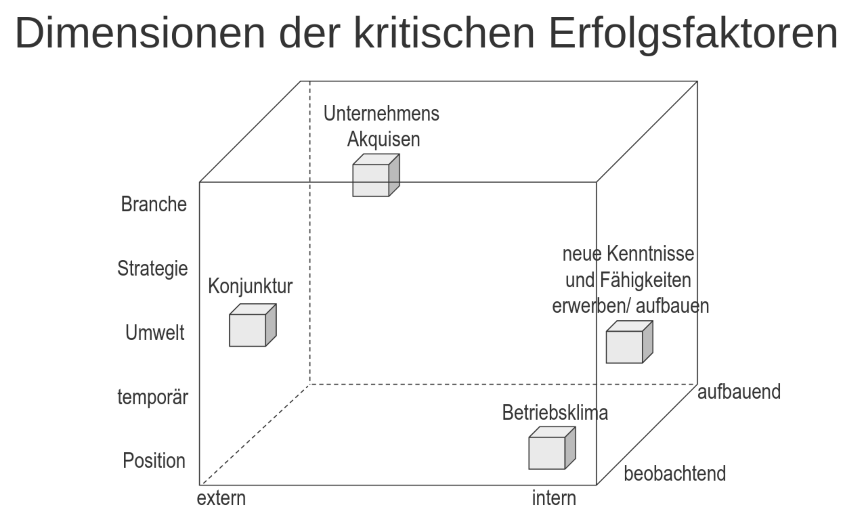
---

### Welche Schritte sind zur Erhebung der KEF per Interviews notwendig?

Gemäß KEF-**Interviewprozess** Befragung von 10-20 TopManagern eines Unternehmensbereichs
1. **KEF** und **zugehörige Indikatoren指示器 erheben**
2. **Verständnis** für die Organisation der Interviewpartner und deren Rolle aus ihrem Blickwinkel **entwickeln**
3. **Ziele und Motive** der interviewten Manager für ihre Arbeit **verstehen**
4. Den Managern helfen, ihren eigenen **Informationsbedarf besser zu verstehen**
5. **Priorisierung der ermittelten KEFs und Indikatoren** zu ihrer Überwachung festlegen

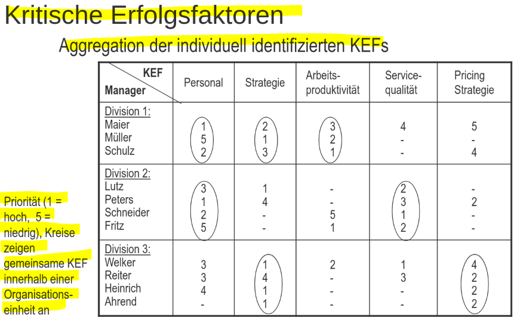   

---

## Methode: Balanced Scorecard

_Die Methode **Balanced Scorecard** ist ein Verfahren zur **Ermittlung des Informationsbedarfs**, das die **Leistung** ~~eines Unternehmens~~ **als** ~~ausgewogenes~~ **Verhältnis (Balanced) zwischen Finanzwirtschaft, Kunden, Geschäftsprozessen und der Mitarbeiterentwicklung auf einer übersichtlichen Tafel (Scorecard) darstellt** und diese Dimensionen mit der Vision und Strategie des Unternehmens verbindet._

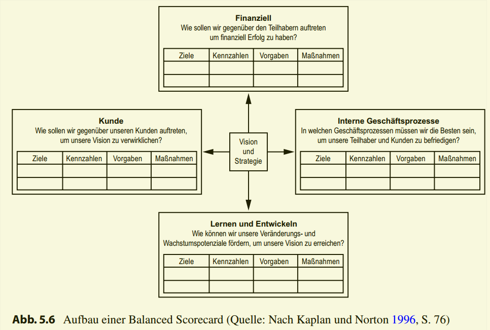

_Die Balanced Scorecard verfolgt einen **Ausgleich von unternehmensinternen und
-externen, monetären und nicht monetären sowie von vorlaufenden und nachlaufenden
Messgrößen**. Angewandt auf das Management der Informationen gibt sie Antworten auf
folgende Fragen_ 

1. _Wie kann die **finanzielle Unternehmenssituation** durch das Informationsmanagement
**verbessert** werden (**Finanzielle Perspektive**)? Die finanzielle Perspektive konzentriert
sich auf den **langfristig wirtschaftlichen Erfolg** und beschäftigt sich mit der Frage, wie
durch die Implementierung der Strategie auf der Ebene des Informationsmanagements
das finanzielle Ergebnis verbessert werden soll._

2. _Wie sehen uns die **Kunden (Kundenperspektive)**? In dieser Perspektive werden
Messgrößen bezogen auf den Produkterwerb bzw. auf die Inanspruchnahme einer angebotenen Dienstleistung erhoben. Die zentrale Frage ist dabei, inwiefern die Informationsmanagement-Strategie dazu beiträgt, die Konkurrenzfähigkeit der Unternehmung auf dem entsprechenden Markt zu erhöhen. Als Messgrößen können z. B. der Marktanteil oder die Kundenabwanderungsrate dienen._

3. _Wie können **interne Prozesse** optimiert werden **(interne Prozessperspektive)**? In Bezug auf die Informationsmanagement-Strategie werden die internen Prozesse und Abläufe
eines Unternehmens untersucht. Dabei sollen sowohl die Kernkompetenzen als auch
kritische Techniken identifiziert werden. Mögliche Messgrößen sind dabei z. B. die
Prozesskosten, die Systemverfügbarkeit oder die Erreichbarkeit des Help Desk._

4. _Können wir uns weiter verbessern und Werte schaffen **(Innovations- und Wissensperspektive)** ? Mit der Innovations- und Wissensperspektive soll langfristig die Entwicklung innerhalb des Unternehmens gesichert werden. Es werden Anforderungen aus dem Unternehmensumfeld oder aus den anderen Perspektiven an die Organisation, Management oder Mitarbeiter erhoben. Als Messgrößen bieten sich dabei die Qualifikation der Mitarbeiter, die aufgebaute Wissensbasis und die Leistungsfähigkeit des Informationssystems an._

---
## Entwicklung einer Balanced Scorecard (mehrstufigen Prozess)

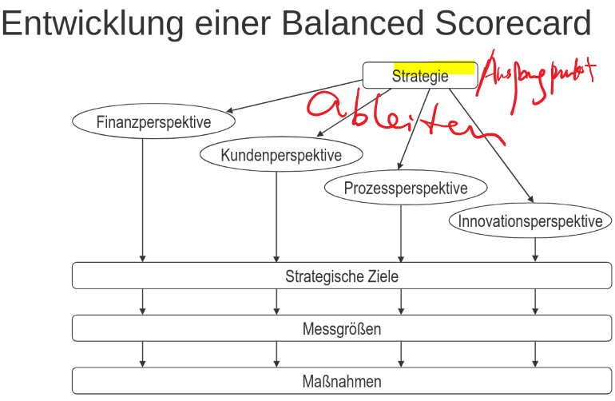

_Den Ausgangspunkt: **Strategie** des Unternehmens ~~, die umgesetzt werden soll.~~_

_Danach werden für **jede der vier Perspektiven strategische Ziele** abgeleitet._ 

_Daran anschließend sind **Messgrößen zu definieren**, mit denen der **Grad der Zielerreichung gemessen** werden kann._

_Abschließend sind geeignete **Maßnahmen zu entwickeln und durchzuführen**, die zu einer Verbesserung der Messgrößen führen._

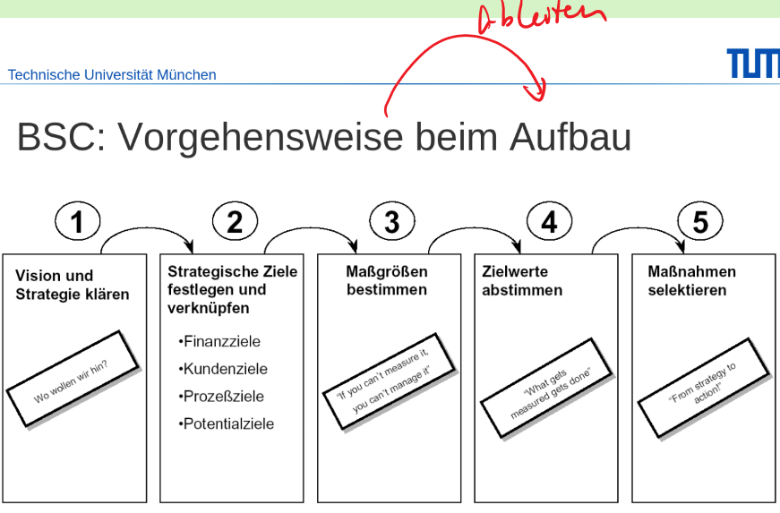

---

## Verfahren zur Erhebung des Informationsbedarfs: Beispiel

* Informationsbedarfsermittlung eines Sachbearbeiters in
der Schadenregulierung einer Versicherung

* Subjektives Verfahren： 
  offene Befragung：Was müssen Sie denn wissen um den Schaden zu regulieren调整?

* Objektives Verfahren: Prozessanalyse: Wie sieht der Prozess der Schadenregulierung aus und welche Informationen werden benötigt?
  
* Gemischtes Verfahren
  KEF: Interviews führen, Quellen einbringen: Branche,
Strategie,

---

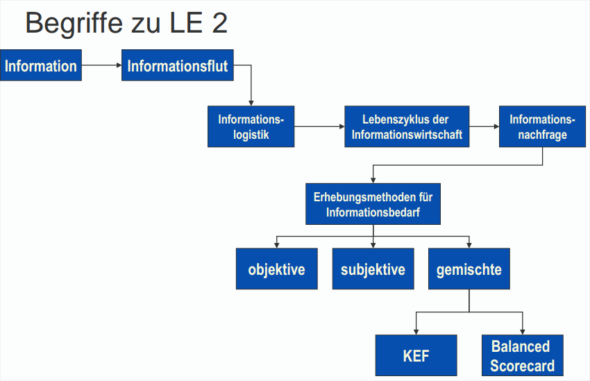

---

### Eine typische Klausurfrage:
Nennnen und erläuten Lebenzyklus der Informationswirtschaft und mit einem Beispiel?