# LE3

## LE3 Lernziele:

* kennen die **Aufgaben**, die mit dem **Management der
Informationsquellen/ -ressourcen/**　-angebots und der Verwendung verbunden sind und können diese in den **Lebenszyklus** der
**Informationswirtschaft** einordnen.

* **Methoden** zur **Informationsorganisation und
-modellierung** 

* **Kriterien und Konzepte für das Management der
Informationsqualität** und kritisch mit dem **Konzept des
Wertes von Informationen** auseinandersetzen.

---
## Management der Informationsquellen

_上一ＬＥ　Dem Lebenszyklus folgend gliedert sich das Kapitel weiter in **das Management der Informationsquellen** und **das Management der Informationsressourcen**. In diesem Unterkapitel wird **eine Methode zur Informationsmodellierung, Semantic Web**, beschrieben._ 

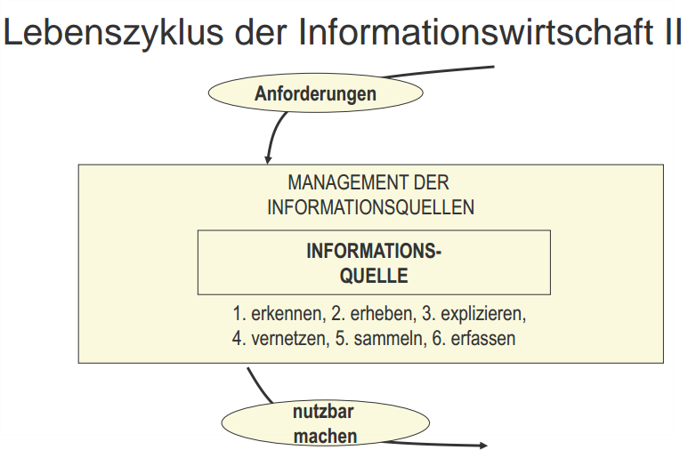

Wichtig davon: erkennen, erheben, sammeln, erfassen

_**Informationsquellen**: identifizierte Quellen von Informationen. Informationen
von Informationsquellen **werden expliziert und vernetzt erfasst.**_

## Aufgaben des Management der Informationsquellen

Externe Quellen:  Print Medien, Broadcast-Medien, Bücher, Persönlicher Kontakt, Internet, Analysten.

**Interne Quellen:
Berichtssysteme, Controlling, Team-Meeting, Datenbanken** , Transaktionssysteme ,Kaffee-Ecken

* **Erkennen und Erheben von Informationen**, die noch
nicht zu den Informationsressourcen gehören: Neubewertung vorhandener Information, Schaffung neuer Information

* **Sammeln und Erfassen der Informationen**: Entstehungsnah dezentral, um Aktualität zu gewährleisten

---
## Management der Informationsressourcen

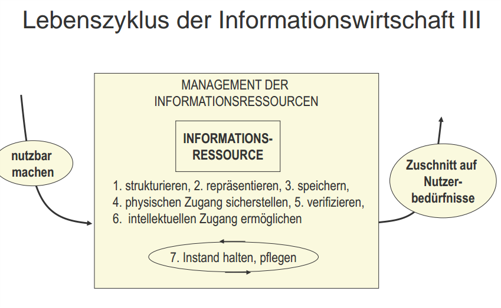

**Mehrfach verwendbare Informationsquellen werden zu Informationsressourcen.**

* Mehrfach verwendbare Informationsquellen,:
  * die unter Berücksichtigung von **organisatorischen,
ökonomischen, Datensicherheits- und DatenschutzGesichtspunkten** **verifiziert** und **gespeichert** werden
  * Einen geschaffenem **physischen Zugang** (durch Vernetzung der Informationsträger untereinander und Einbindung der Nutzer in das Netzwerk) und einen geschaffenen **intellektuellen Zugang** (Deskriptorensysteme, Metainformationen, Auswahlund Navigationshilfen) haben

_Die Überführung geschieht, indem die **Informationsquelle zunächst verifiziert** wird und anschließend die Informationen auf Informationsträgern **gespeichert** werden. **Spätestens dann sind organisatorische, ökonomische, Datensicherheits und Datenschutz-Gesichtspunkte zu berücksichtigen.** Zusätzlich muss ein **physischer und  intellektueller Zugang zu den gespeicherten Informationen geschaffen werden.** Der physische Zugang wird idealerweise durch eine Vernetzung der Informationsträger untereinander und durch eine Einbindung der Nutzer in das Netzwerk der Informationsträger realisiert. Eine Unterstützung für den intellektuellen Zugang kann im Sinne von Informationsorganisation und -modellierung durch Deskriptorensysteme, Erfassung und
Verwaltung von Metainformationen sowie Auswahl- und Navigationshilfen geschaffen
werden._ 

* …werden zu Informationsressourcen,
  * die im Rahmen eines Managements der Informationsqualität zu **pflegen** (verändern, löschen) und **instand** zu halten sind
  
_Schließlich sind die Informationen im Rahmen eines Managements der **Informationsqualität zu pflegen (Verändern, Löschen)** und** die Informationsträger sind instand
zu halten**. ~~Das Management der Informationsressourcen muss für die Darstellung und Speicherung der Informationen, die Bereitstellung geeigneter Informationsträger und Zugriffsmöglichkeiten sowie deren Pflege und Instandhaltung sorgen~~_

---

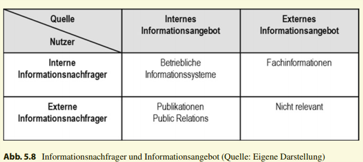
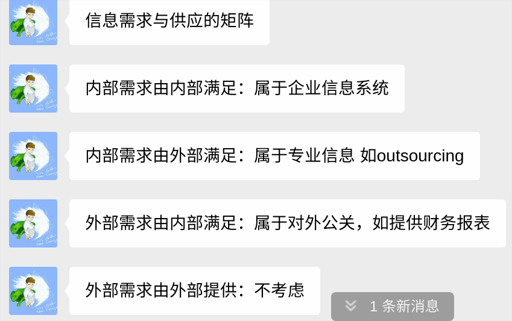

_~~kann sowohl für die Informationsnachfrager als auch für
das Informationsangebot zwischen internen und externen Quellen differenziert werden, woraus sich unterschiedliche Konstellationen形势，局面，情况，状况 für die Zusammenführung von Nachfrage und Angebot ergeben.~~_

_Während das Angebot externer Quellen für externe Nachfrager für die unternehmerische Informationswirtschaft nicht relevant ist, trifft es in Form von Fachinformationen auf
unternehmensinterne Nachfrage. Außerdem wird das Angebot interner Informationen von externen Institutionen wie Fachpresse, Informationsdiensten, Kapitalanlegern und Unternehmen aus der Branche nachgefragt. Ergebnisse dieser Nachfrage sind zum Beispiel Publikationen oder im Allgemein die Gestaltung der Public Relations des Unternehmens.
Das Hauptaugenmerk einer unternehmerischen Informationswirtschaft liegt jedoch auf der Zusammenführung interner Nachfrager mit dem internen Informationsangebot über
die betrieblichen Informationssysteme._

---

## Informationsstrukturierung mit Hilfe von Metadaten

_Die Strukturierung und Organisation von Informationen ~~stellt somit für die Entwicklung von Informationsressourcen eine wesentliche Aufgabe dar~~._ 

**Metadaten** ermöglichen die **Beschreibung und Entdeckung von
Informationsobjekten** _(z. B. durch Angaben zu Inhalten und Erstellern)_, ihre Nutzung _(z. B.
durch Angaben zum verwendeten Datenformat)_  sowie ihr Management _(z. B. durch Angaben zu Zugriffs- und Nutzungsrechten)._
Man unterscheidet zwischen **formalen und inhaltlichen Metadaten.**

| Element     | Beschreibung                                                                                                                                                                 |
| ----------- | ---------------------------------------------------------------------------------------------------------------------------------------------------------------------------- |
| Title       | Titel der Quelle; der vom Verfasser, Urheber oder Verleger出版商 vergebene Name der Ressource                                                                                |
| Creator     | Die Person(en) oder Organisation(en), die den intellektuellen Inhalt verantworten, z.B. Autoren                                                                              |
| Subject     | Thema, Schlagwort, Stichwort                                                                                                                                                 |
| Description | Eine textliche Beschreibung des Ressourceninhalts inklusive eines Referats (Abstract) bei dokumentähnlichen Ressourcen oder Inhaltsbeschreibungen bei graphischen Ressourcen |

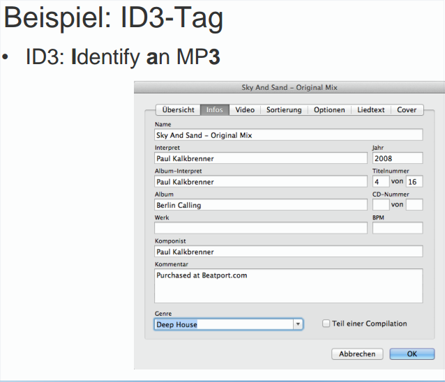

---
## Methoden zur Informationsstrukturierung

| Beschreibung                             | Ausprägung             |
| ---------------------------------------- | ---------------------- |
| Hierarchische Klassifikation             | Taxonomie              |
| Indizierung nach   **Schlagwortverfahren**   | Thesaurus大型词典      |
| **Assoziative** Repräsentation durch **Graphen** | Semantic Web Topic Map |

_Zur Informationsstrukturierung auf der **Basis von Metadaten** kommen verschiedene Methoden zum Einsatz_

---
## Taxonomie
* **Hierarchische Klasseneinteilung** eines Themenbereichs
* Bilden **Über- und Unterordnungsbeziehungen** ab
* Können **Vererbungen** darstellen
* beispielsweise biologische Einteilung von **Pflanzen, Tiere => Familien, Gattungen, Arten**
* Systematische Einteilung in Taxa (Gruppen) => Ergebnis sind alle
Dokumente, die den Suchbegriff enthalten
* Unterscheidung zwischen monohierarchischen und polyhierarchischen
Taxonomien

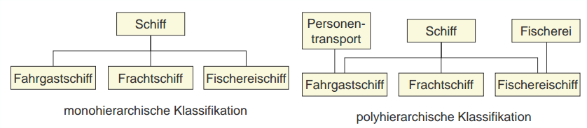

_**Taxonomien** sind **hierarchische Klasseneinteilungen eines Themenbereichs**. Sie bilden **Über- und Unterordnungsbeziehungen**
ab und können so **Vererbungen** darstellen. Ein Beispiel für eine Taxonomie ist die biologische Einteilung von Pflanzen und Tieren in Familien, Gattungen und Arten. ~~Taxonomien basieren zumeist auf der Analyse von quantitativen empirischem Daten. Basierend auf den Daten werden die Taxonomien durch statistische Clusterung erstellt und können dadurch
unproblematisch durch andere repliziert werden.~~ Taxonomien finden häufig Verwendung
in den biologischen Wissenschaften._ 

---
## Semantic Web / Topic Maps
* Assoziative Repräsentation
* **Knoten** (reale Entitäten) und **Kanten** (inhaltliche
Beziehungen)
* Modell von Begriffen und ihren Beziehungen => Ergebnis:
verwandte Begriffe plus alle definierten, benannten
Assoziationen, Netz

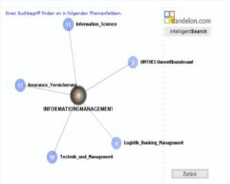

_Assoziative Repräsentationen wie Semantic Webs oder Topic Maps bestehen aus Knoten, die für reale Entitäten stehen und Kanten, die die inhaltlichen Beziehungen der Entitäten untereinander darstellen_

---

## Semantic Web

### Das Konzept des Semantic Web

**Vision**: Umfangreiche Bestände von Dokumenten und Informationen
im **Internet** werden dadurch **handhabbar**, dass **maschinenlesbare Metainformationen über 
Web-Ressourcen und ihre Beziehungen zu einander verfügbar sind und genutzt werden.**

* maschinenlesbare **Semantik von Web-Ressourcen:**
  - Vereinbarungen über die Elemente und Begriffe von Semantik und deren Verwendung müssen getroffen werden,
  - Konzepte für die Modellierung und Kodierung von Semantik sind erforderlich
  - Konzepte für die Architektur und die Werkzeuge zur semantischen Modellierung müssen entwickelt werden

* konkrete **Anwendungen** für das Semantic Web müssen entwickelt werden, **Semantic Services**
---
## Semantic Web: Ontologien实体学，本体论 als Modell von Semantik

* **Formale Beschreibungen** der Semantik von Informationsobjekten
* **Beziehungen** der Begriffe eines **Gegenstands**- oder
**Anwendungsbereichs**
* Typischerweise setzt sich eine Ontologie aus einer Taxonomie und
einer Reihe von **Ableitungsregeln** zusammen

Beispiel
* Begriff „Post-Impressionismus“ ist eine historische Phase der Malerei
* Van Gogh steht in Beziehung mit dem Post-Impressionismus, da er als
Maler dieser Epoche zuzurechnen ist.
* Ableitungsregel wäre: Eine Ausstellung zu Künstlern des PostImpressionismus zeigt mit hoher Wahrscheinlichkeit auch Bilder von Van Gogh

_Eine **Ontologie** in der Informatik ist **eine formale Beschreibung der Semantik von Informationsobjekten**. Sie modelliert, wie Begriffe eines **Gegenstands- oder Anwendungsbereichs zueinander in Beziehung** stehen_

_Beispielsweise wird in einer Ontologie festgelegt, dass es einen Begriff „Betriebliche
Anwendungssysteme“ gibt. Diesem Begriff werden die Begriffe „Produktionsplanungsund Steuerungssysteme“ sowie „Finanzbuchführungssysteme“ zugeordnet_

---
_Semantic Web Methoden und Konzepte erlauben es, **Informationen und Dienste im Internet auf der Grundlage ihrer Bedeutungen zu finden und zu nutzen.按照Bedeutung去找和使用** Ein anschauliches Beispiel ist die Suche nach
einem Experten zu Post-Impressionistischer Kunst. Hierfür müssen Informationen kombiniert werden, die über **verschiedene internetbasierte Informationsquellen verteilt** sind und sich bspw. mit Kunstsammlungen, Künstlerbiographien und Kunstgeschichte beschäftigen. Um den Autor eines Buches über Van Gogh als Experten für Post-Impressionismus zu identifizieren, muss Van Gogh als Künstler dieser Ära bekannt
sein, auch wenn dazu nichts auf der Seite des Autors erwähnt wird._

_Semantische Technologien zielen darauf Daten **nicht nur syntaktisch, sondern auch semantisch**, d. h. in Bezug auf **ihre Bedeutung zu erschließen.** Eine maschinenlesbare Repräsentation der Semantik erlaubt es, **Inhalte besser zu finden, auszutauschen und Informationen leichter zu integrieren**. Diese Entwicklungsrichtung verdeutlicht sich insbesondere in der **!Vision! des Semantic Web**, ~~dessen **Ziel** es ist, ein Rahmenwerk von Technologien zu
schaffen, durch das Daten leichter über Anwendungs-, Organisations- und CommunityGrenzen hinweg ausgetauscht und wiederverwendet werden können (World Wide Web
Consortium (W3C) o.J.).~~ Die Verwendung des Begriffs semantische Technologie verweist eigentlich auf die (erhofften) Anwendungsmöglichkeiten dieser Forschungsergebnisse über das Semantic Web selbst hinaus. Da sich aber viele Forschungsergebnisse
bislang an der Vision eines Semantic Web orientiert haben, werden diese im Folgenden
auch auf das Semantic Web bezogen dargestellt._

---

## Semantic Web: Beschreibungssprache RDF

Resource Description Framework

RDF-Tripel (Subjekt, Prädikat, Objekt)
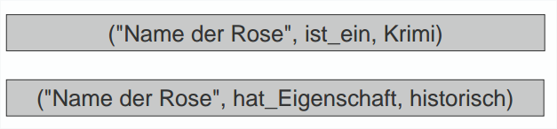
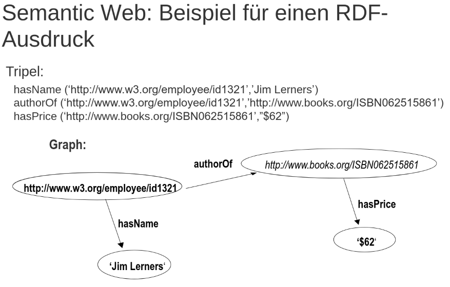

_Teile der für das Semantic Web entwickelten Technologien stehen bereits als standardisierte, formale Spezifikationen zur Verfügung. Darunter fällt das **Ressource Description
Framework (RDF)**. Das RDF ist ein **Metadatenmodell zur formalen Repräsentation von Ressourcen (d. h. Objekten der realen Welt oder Informationsressourcen wie Webseiten)** in Form einer Subjekt-Prädikat-Objekt Dreiergruppe. ~~Als Erweiterung
des RDF stellt die Web Ontology Language (OWL) eine formale Sprache zur Beschreibung von Ontologien dar, mit der Ressourcen, Attribute, Instanzen von Ressourcen und deren Beziehungen untereinander dargestellt werden können. OWL und RDF basieren auf
XML.~~_

---

## Management der Informationsqualität

### Informationsqualität

* Gewünscht: **hohe Informationsqualität** gewährleisten
* Keine allgemein verbindlichen Standards oder Vorgaben
* **Qualität** wird definiert
  - Gemäß ISO Norm zu Qualitätsmanagement
  - Aus Sicht des Kunden eines Produktes
  - Durch gesetzliche Vorgaben
* „**Fitness for use**“ - Ausschlaggebend für Beurteilung der
Informationsqualität ist die Eignung für den jeweiligen Einsatzzweck

_Informationsqualität bezeichnet den Grad Nutzbarkeit einer Information für den jeweiligen Einsatzzweck. Die Nutzbarkeit kann dabei im Hinblick auf mehrere Dimensionen der Datenqualität beurteilt werden. Diese Dimensionen sind intrinsische Datenqualität, kontextuelle Datenqualität, darstellungsbezogene Datenqualität und zugangsbezogene
Datenqualität._

### Modell des Managements der Informationsqualität

_Es unterscheidet **vier verschiedene Perspektiven der Informationsqualität**, die das Gliederungsraster für **die Kriterien für Informationsqualität**
darstellen:_

_Perspektiven und Kriterien werden überlagert von **vier Phasen der Informationsverwendung**:_

_1. **Identifizieren** der gesuchten Information,_

_2. Evaluieren, **bewerten** und vergleichen von Quelle und Information,_

_3. Anpassen von Format, Bezugsrahmen und Kontext der Information und_

_4. **Anwenden** der Information zur Problemlösung und Routinisierung der Informationsverwendung._
   
_noch **vier Managementprinzipien,** ~~die die Implementierung des Modells und die Umsetzung der Qualitätskriterien unterstützen sowie zu einer Wertsteigerung des Informationsproduktes beitragen sollen.~~_

_**„Integration“**: Informationen zugänglich zu machen, indem diese
grafisch und inhaltlich aufbereitet werden._

_**„Überprüfung“**: Ziel: **die Kontrolle und Verbesserung der Informationsqualität.**_

_Das Prinzip der **„Kontext“** subsumiert Maßnahmen zur **Anreicherung mit Kontextinformationen**, die über
Entstehungsprozesse oder Autorenschaft von Informationen informieren._

_**„Aktivierung“** sollen dafür sorgen, dass **Informationen auch genutzt werden, bspw. indem diese
zum richtigen Zeitpunkt geliefert** oder hervorgehoben werden oder auch Maßnahmen getroffen werden, um sicher zu stellen, dass der Inhalt der Informationen von Informationsnutzern verstanden wurde._

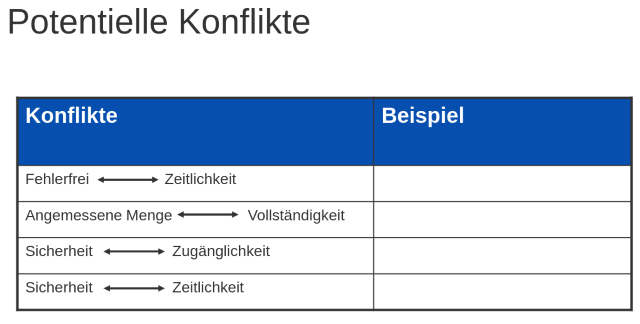
_Einzelne **Kriterien der Informationsqualität** können **mit mehreren Kriterien im Zielkonflikt** stehen. Hierzu zählen vor allem die Kriterien **Vollständigkeit, Genauigkeit, Detaillierung oder Sicherheit.**_

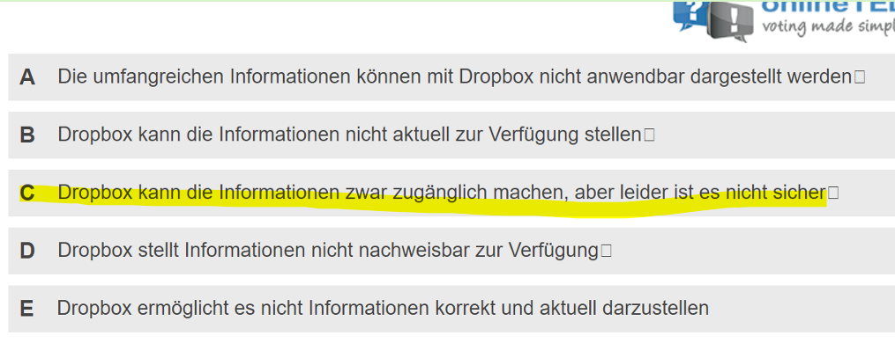

---
## Management des Informationsangebots

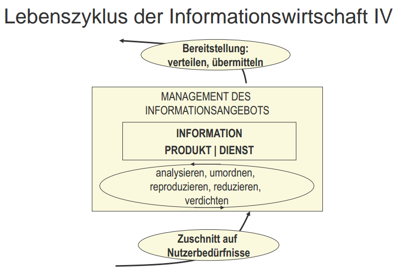

### Aufgaben des Managements des Informationsangebots und der Bereitstellung

**Ziel**: benötigte Informationen anforderungsgerecht bereitstellen
  - Aufzubauende **Informationsressourcen**
  - Unternehmensweit zur Verfügung stehende **Daten-, Methoden- und Modellbanken** sowie Information (Data) Warehouses
    - Verfahren: Datenmustererkennung **(Data Mining**) zur automatischen Klassifizierung und Analyse der Daten

_Beim Management des Informationsangebots und der Bereitstellung geht es darum, **die
benötigten Informationen anforderungsgerecht bereitzustellen**. Zum einen können solche
Informationsressourcen eigens aufzubauen sein. Andererseits können Informationsressourcen als unternehmensweit zur Verfügung stehende Daten-, Methoden- und Modellbanken sowie Information (Data) Warehouses nicht auf bestimmte Bereiche und Teilbereiche zugeschnitten und deshalb universeller verwendbar sein. Umfangreiche, weitgehend unverdichtete Daten und Informationen führen zu einer Informationsüberflutung
und überfordern die Analysefähigkeiten der Informationsnutzer. Verfahren wie die Datenmustererkennung (Data Mining) können Daten automatisch klassifizieren und analysieren_

**Informationsressourcen**
  - **Passiv**: nur auf Initiative und Betreiben eines Informationsbenutzers verwendet 
  - **Aktiv**: Inhalte der Ressource werden **in Informationsprodukte und –dienste überführt**, die an die Informationsbenutzer distribuiert werden, wobei diese durch Analysieren, Umordnen, Reproduzieren, Reduzieren und Verdichten eine **Wertsteigerung** erfahren (-> Einhaltung des inform. Log. Prinzips!)

**Informationsressourcen sind entweder passiv oder aktiv.** 

_Passive Ressourcen werden
nur auf Initiative und Betreiben eines Informationsnutzers verwendet._

_Aktiv bedeutet, dass
die Inhalte der Informationsressourcen in Informationsprodukte und -dienste überführt werden, die an die Informationsnutzer distribuiert werden. Die Informationen werden bei der Weitergabe aufbereitet und erfahren eine Wertsteigerung durch Analysieren, Umordnen, Reproduzieren, Reduzieren und Verdichten. Insbesondere ist auf die Einhaltung der
informationslogistischen Prinzipien zu achten, da sich hier die unmittelbare Schnittstelle
zu den Informationsnutzern befindet._

---
## Benutzermodellierung
Unter **Benutzermodellierung** sind Mechanismen zu
verstehen, die es dem Computer erlauben, sich
möglichst gut **auf den Menschen einzustellen 适应人类**. Sie
dienen Anwendungssystemen dazu,
**Problemlösungsstrategien und Dialogverhalten**
individuell an den Empfänger **anzupassen**

Auf Benutzermodellen aufbauend werden die
**Benutzerschnittstellen** gestaltet, die sowohl die
benutzerorientierte **Integration der Subsysteme als auch die menschengerechte Aufbereitung der
Bedieneroberfläche verantworten**

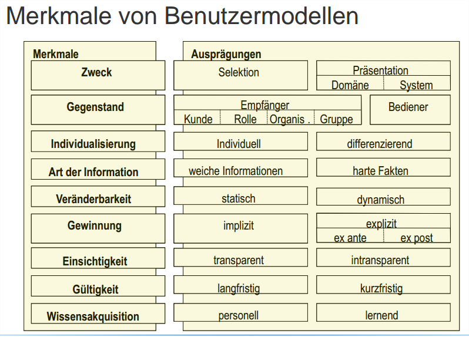

~~_Gegenstand der Benutzermodellierung kann entweder der Empfänger der Information oder der Bediener des Systems sein. Weiterhin kann unterschieden werden, ob sich das Modell auf die Präferenzen von Gruppen oder Individuen bezieht und ob es statisch, d. h. unveränderlich, ist oder sich dynamisch den Aktivitäten und Erfordernissen des Benutzers anpasst_.~~ 

_**Merkmale**, die die Gestaltung des Benutzermodells beeinflussen, können harte Fakten, wie das Geschlecht oder das Alter der Benutzer, bzw. weiche Informationen
wie Ziele oder Pläne sein. Die für die Entwicklung von Benutzermodellen herangezogenen Informationen werden entweder durch implizite Beobachtungen bei der Benutzung des Systems oder explizit durch Befragung erhoben. In transparenten Benutzermodellen
kann der Benutzer nachverfolgen, welche Merkmale über ihn gespeichert sind, was bei intransparenten Modellen nicht oder nur teilweise möglich ist. Darüber hinaus erfolgt eine
Differenzierung hinsichtlich einer langfristigen und einer kurzfristigen Modellierung, die
bei jeder Nutzung neu erstellt wird. Dies kann automatisch im Sinne eines lernenden Systems oder personell durch Befragung und personelle Auswertung der gewonnenen Daten erfolgen_

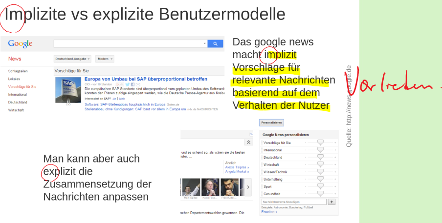

---

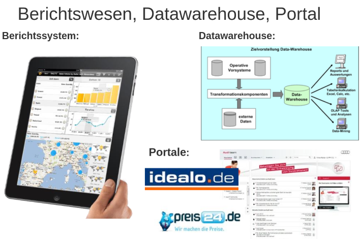

## Berichtswesen 汇报制度，报表制度

Das **Berichtswesen** versorgt die betrieblichen **Entscheidungsträger**
mit den notwendigen **unternehmensinternen Informationen**.
Die **Berichte** sind entweder auf Papier, auf dem Bildschirm und
teilweise auch auf Tafeln und als speziell eingerichtete Räume
(„Kontrollräume“) darstellbar

## **Gestaltungsregeln** zur besseren Informationsdarstellung
* Ein **Berichtssystem** soll einen formal **einheitlichen Aufbau** besitzen
* **Informationen** sollen **nicht isoliert** dargestellt, sondern durch **Vergleichsgrößen relativiert** werden
* Berichtssysteme gewinnen dann an Aussagekraft, wenn die darin
enthaltenen Informationen in **Relation zu Planwerten,
Vergangenheitsdaten, Trends** usw. dargeboten werden
* **Überblick und Detail** in der Darstellung sind deutlich voneinander zu **trennen**
* **Außergewöhnliche Datenkonstellationen** sind **hervorzuheben**
* Falls ein Bericht nicht routinemäßig erstellt wird, sollen die verwendeten Methoden der Datenerhebung, die **Vorgehensweise**
beim Auswerten und exemplarische Rechenprozeduren erläutert
werden
* **Grafische Darstellungen** sollen tabellarischen vorgezogen werden
* -> Wirtschaftlichkeit

~~_Auf einzelne Berichte bezogen ist die Betrachtung der Wirtschaftlichkeit von großem
Interesse. In der Praxis orientiert sich die Wirtschaftlichkeit eines auswirkungsorientierten
Berichtswesens auf der Leistungsseite an dem tatsächlich beeinflussbaren Kostenvolumen
bzw. an seiner Wirksamkeit für Verbesserungen der Kostenstruktur eines Bereiches_~~

---
## Data Warehouse数据仓库

Ein **Data Warehouse** ist eine subjektorientierte, integrierte,
beständige und zeitabhängige Datensammlung um
Managemententscheidungen zu unterstützen

_Die tatsächliche Übersetzung von Warehouse bedeutet jedoch Lagerhaus
oder Speicher._

Die **vier Hauptmerkmale**:

* **Subjektorientiert** = Themenausrichtung an **Sachverhalten** des Unternehmens

_z. B. Kunden- oder Produktkriterien, wird im Data Warehouse durch das konsequente Einordnen aller Daten in Fachbereiche und durch die Bezugnahme auf Geschäftsprozesse
realisiert Im Gegensatz dazu sind operative Daten immer auf einzelne betriebliche Funktionen bezogen_

* **integriert** = angestrebte unternehmensweite Integration von Daten in einem einheitlich gestalteten System

_Mit dem Data Warehouse-Konzept wird eine **unternehmensweite Integration von Daten in einem einheitlich gestalteten System angestrebt.** Vereinheitlichung und
Integration externer und interner Daten bedeutet weniger die physische Zentralisierung
der Daten in einem einzigen Datenpool, sondern deren logische Verbindung. **Integration bedeutet konsistente Datenhaltung im Sinne einer Struktur- und Formatvereinheitlichung** durch Maßnahmen wie Vergabe eindeutiger Bezeichnungen, Anpassung der
Datenformate und Herstellung einer semantischen Integrität.~~Ebenso tragen Elemente wie einheitliche Merkmale und standardisierte Kennzahlen zu einer  atenintegration bei~~_

* **beständig** = dauerhafte Sammlung von Informationen

* **Zeitabhängig** = Zeitraumbetrachtung, Zeitraumbezug daher impliziter oder expliziter Bestandteil

_Während bei operativen Systemen eine zeitpunktgenaue Betrachtung der Daten im Mittelpunkt steht, liegt das Interesse bei Auswertungen im Data Warehouse eher in einer Zeitraumbetrachtung, z. B. einer Trendanalyse. Der Zeitraumbezug ist daher impliziter oder expliziter Bestandteil der Daten in einem Data Warehouse. Ein
Ansatz zur Herstellung dieses Zeitraumbezugs im Data Warehouse ist die obligatorische Verwendung einer Zeitdimension in jedem Informationsspeicher_

---
## Portale

**Portal**: ein **zentralen** Einstiegs- und Navigationspunkt, der dem Anwender **Zugang zu einem virtuellen Angebotsraum** bietet und ihn auf weiterführende Informationen – entsprechend seiner jeweiligen Interessen – lenkt.

_Neben dem Data Warehouse bietet das **Internet** als **externe Informationsquelle** eine Fülle
an Informationen, die sich der Anwender allerdings selbst beschaffen muss. Dabei helfen Web-Portale in dem sie Informationen benutzerspezifisch zusammenstellen und über
Suchfunktionen auffindbar machen._

_Portale stellen leicht bedienbare, sichere und personalisierbare Zugangssysteme dar, über die
Anwender mit Rücksicht auf ihre Zugriffsberechtigungen einen Zugang zu Informationen,
Anwendungen, Prozessen und Personen erhalten, die auf den durch das Portal erschlossenen
Systemen verfügbar sind_

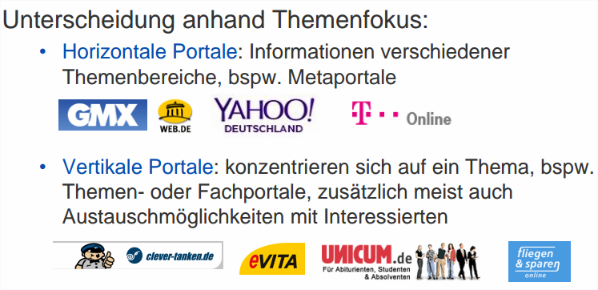
_Horizontale Portale bieten Informationen über verschiedene Themenbereiche an. Dies sind zum Beispiel Metaportale, die Anwendern
Informationen und Services zu allen Themenbereichen bieten. Vertikale Portale hingegen
konzentrieren sich auf ein Thema. Hierunter fallen Themen- oder Fachportale, in denen
der Anwender nicht nur Inhalte über ein Thema, sondern zumeist auch Austauschmöglichkeiten mit Interessierten findet. Heutzutage dominieren vertikale Portale, die sich mit bestimmten Nischen (z. B. Börseninformationen) befassen. Grundsätzlich unterscheidet
man zwischen dem Inhalt des Portals und der Portalsoftware, die den Inhalt mithilfe von
Portlets zur Verfügung stellt._

**Portale: Funktionen**
* **Personalisierung**: Benutzer kann Inhalt und Layout seinen Bedürfnissen **anpassen**

* **Suchfunktion und Navigation**: mit Hilfe von **Suchmaschinen** im Web oder in Datenbanken suchen und Aufbereitung in ansprechende Form

* **Push**-Technologie: Benutzer auf neues Informationen **aufmerksam machen**

* Kollaborations- und Groupwarekomponenten: Abstimmung und Austausch zwischen den Beschäftigten untereinander, Kunden und Lieferanten

* Workflowkomponenten: Automatisierung von Abläufen

* **Integration von Anwendungen**: bspw. Externe **Webanwendungen** und
Unternehmensanwendungen über das Portal zugreifbar

* Integration von Informationsquellen: unterschiedliche Informationsquellen in eine Portal eingebunden und dynamisch angezeigt

* Benutzerverwaltung und Sicherheitsservice: Daten der Benutzer werden verwaltet und ihre Sicherheit gewährleistet

---
## Management der Informationsverwendung
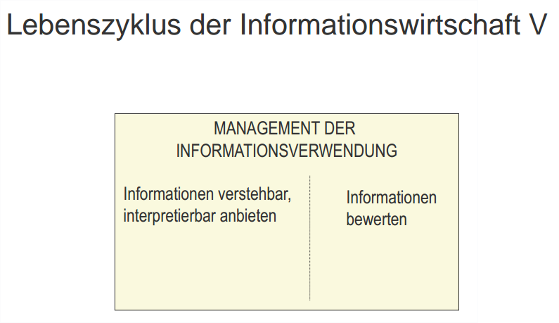

_Danach folgen das Management der Informationsqualität , **das Management des Informationsangebots** und der Bereitstellung sowie **das Management der Verwendung**._ 

### Informationsverarbeitung
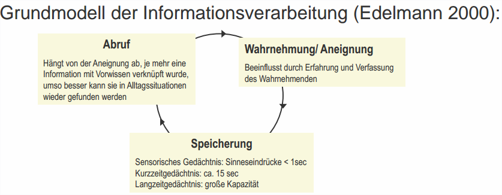

_~~Anknüpfungspunkte im Feld der **kognitiven Psychologie** finden.~~
Grundmodell der Informationsverarbeitung **die Phasen Wahrnehmung Aneignung获得, Speicherung und Abruf**._

_Am Anfang steht die **Wahrnehmung der Reize** über sensorische Kanäle. ~~Die aufgenommenen Reize werden als kodierte Signale durch Milliarden von Neuronen auf elektrochemischem Weg in das zentrale Nervensystem, das aus Rückenmark und Gehirn besteht, gesendet.~~ Im Gehirn werden
die eintreffenden Informationen zuerst **selektiert** und anschließend **verarbeitet**._ 

_Die **Informationsverarbeitung** ist kein passiver Prozess, sondern er wird **durch Erfahrungen und die derzeitige Verfassung状态，状况 des Wahrnehmenden beeinflusst**._

_Die **Speicherung der Informationen** erfolgt im **Gedächtnis**. Bevor die Information im Langzeitgedächtnis
gespeichert wird, durchläuft sie einen **mehrere Stufen umfassenden Speicherprozess**. Im sensorischen Gedächtnis werden Sinneseindrücke nur weniger als eine Sekunde gespeichert. Im Kurzzeitgedächtnis, auch als Arbeitsspeicher bezeichnet, werden die Informationen ca. 15 Sekunden gehalten, ehe sie vergessen werden oder durch eine ausreichende Verarbeitungstiefe in das Langzeitgedächtnis gelangen. Das Langzeitgedächtnis weist
gegenüber dem Kurzeitgedächtnis eine sehr große Kapazität auf._

_Der **Abruf** der Informationen **hängt von der Wahrnehmung ab**. Je mehr eine Information mit Vorwissen verknüpft
wurde, umso besser kann sie in Alltagssituationen wieder gefunden werden._

---
In der **kognitiven Psychologie** bezeichnet man **Informationsverarbeitung**
als eine **Zerlegung von kognitiven Prozessen in eine Reihe von**
**Einzelschritten**, in denen eine abstrakte Größe, die **Information,
verarbeitet wird**

_Informationsverarbeitung i. e.S. umfasst **die Translation翻译 der Information in eine andere Form, ohne dabei ihren Inhalt zu verändern,** sowie die Transformation, bei der beschaffte Information mit vorhandenem Wissen verbunden wird. Informationsverarbeitung i. w. S. umfasst zusätzlich zu diesen Vorgängen die **drei Phasen der Informationsbeschaffung, -speicherung und -weitergabe,** welche der Informationsverarbeitung
i. e. S. jeweils vor- und nachgelagert sind._

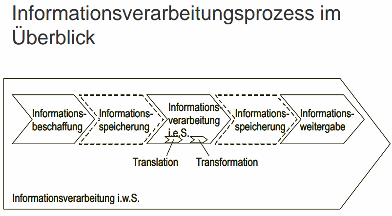

---
## Bewertbarkeit von Informationen

Durch die **Verwendung** von Informationen wird der
**Wert der Informationen** festgelegt. Im Rahmen dieser
kontextspezifischen und zeitlichen Verwendung kann
durch das **Hinzufügen, Weglassen, Konkretisieren, Selektieren und Aggregieren** der Wert der Information verändert werden.

_Informationen haben **also keinen absoluten Wert** – er ist immer in **Abhängigkeit vom Gebrauch** zu sehen: Wer nutzt eine Information, wann und in welcher Situation_

_Ein Beispiel verdeutlicht diesen Sachverhalt: Ein Student bekommt die Lösung einer Klausur von einem vertrauenswürdigen Kommilitonen angeboten. In diesem Fall ist der
Wert der Information (Lösungsskizze) von folgenden Determinanten abhängig:
Schreibt der Student diese Klausur oder kennt er jemand, der diese Klausur schreibt? Bekommt er die Lösungsskizze vor oder nach der Klausur? Hat der Student die Möglichkeit, die Lösungsskizze noch zu lesen oder in einem Buch
weitere Informationen zu dem Thema nachzuschlagen?_

Um den Wert dieser Information messen zu können, **unterscheidet man den normativen, realistischen und subjektiven Wert der Information**

### Normativer标准 Wert der Information

_Der normative Informationswert, wird bestimmt, indem folgende Alternativen miteinander verglichen werden_

* Bestimmung durch **Vergleich Sachentscheidung ohne
zusätzliche Informationsbeschaffung**, d.h. das
„Entscheidungsfeld vor Information“ und die Sachentscheidung
nach Beschaffung zusätzlicher Information, d.h. das
„Entscheidungsfeld nach Information“
* **Opportunitätskostenprinzip**: Informationswert ergibt sich aus
**Differenz zwischen dem Wert der optimalen Alternative** nach
Information und dem Wert der vor der Informationsbeschaffung
optimalen Alternative
* Vorteilhaft bei vorliegen vollständiger Information

_Durch die Beschaffung von Informationen können zusätzliche Handlungsalternativen gefunden bzw. bisherige Alternativen ausgeschlossen werden. Nach dem
**Opportunitätskostenprinzip** ergibt sich der Informationswert aus der Differenz zwischen
dem Wert der optimalen Alternative nach Informationsbeschaffung und dem Wert der vor der Informationsbeschaffung optimalen Alternative. „Die Opportunitätskosten geben an,
welche Nutzeneinbußen vermieden werden konnten, indem mit der Informationsbeschaffung eine bessere Alternative gewählt werden konnte als ohne Informationsbeschaffung“
. So wird bspw. eine **Entscheidung** für ein Informationssystem auf Grundlage von Produktinformationen getroffen. ~~Wenn man wüsste, dass ein Produkt fehlerhaft ist und sein Einsatz zu Ausfällen im Unternehmen führen wird, ein anderes Produkt diese(n) Fehler jedoch nicht hat, so wäre der erwartete Gewinn des Unternehmens mit dem ersten Produkt geringer.~~ Der **normative Wert ist gut nutzbar**, wenn **vollständige Informationen vorliegen**. Da dies in der Realität meist nicht der Fall ist, wird er selten angewandt. Außerdem beruht die Berechnung des Wertes meist auf einer ex post-Betrachtung, was
bei Entscheidungen, die im Augenblick der Handlung getroffen werden müssen, nicht hilfreich ist._

**Realistischer Wert der Information**
* Empirisch **messbarer Gewinn**, der bei Nutzung der Information
durch Entscheider entsteht
* Wert der Information berechnet aus dem **Wert von Handlungen**,
die dadurch veranlasst werden, z.B. Gewinn, Antwortzeiten,
Genauigkeit
_(Der Wert von Handlungen
wird zum Beispiel durch den entstandenen Gewinn, Antwortzeiten oder Genauigkeit abgeleitet.)_
* Um diesen Wert zu berechnen müssen alle die **anderen
Variablen**, die den Wert der Handlung beeinflussen **konstant**
gehalten werden -> kaum möglich
(weshalb sich der realistische Wert für Alltagsentscheidungen im Unternehmen nur schwer erheben lässt.) 

_In der Regel werden Entscheidungen für Informationssysteme in
Unternehmen nicht dadurch getroffen, dass man zum Beispiel fünf verschiedene Systeme
installiert und ihre Performance misst. Allerdings gibt es Anhaltspunkte, dass zum Beispiel mit Rapid Prototyping die Wahrscheinlichkeit, sich für ein ungeeignetes System zu
entscheiden, vermindert wird. Der realistische Wert sollte deshalb ermittelt werden, wenn
sich die Kosten der Ermittlung in Grenzen halten und wenn die Simulationsumgebung möglichst realitätsnah ist._

**Subjektiver Wert der Information**
* **Unsicherheit und Dynamik**, Entscheidungen häufig unter
Zeitdruck
* Subjektiver Wert an ein **Individuum** gebunden

---

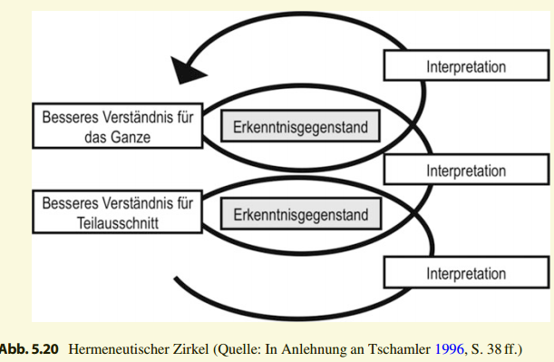
_Unter **Hermeneutik注释学** versteht man die Auslegung oder Interpretation der Lebenswirklichkeit
in der Zeit (**Vergangenheit – Gegenwart – Zukunft**)._

_Hermeneutischen Zirkel: Grundlage für die **immer neue Initiierung eines Zyklusdurchlaufs**_

_Der hermeneutische Zirkel bildet den engen Zusammenhang zwischen Interpretation und Verständnis der Lebenswelt in Teilen und als Ganzes ab. Das Verständnis eines Teils des Erkenntnisgegenstandes erlaubt eine Interpretation des Ganzen. Dies wiederum erlaubt ein vertieftes Verständnis einzelner Bereiche oder Strukturen usw_

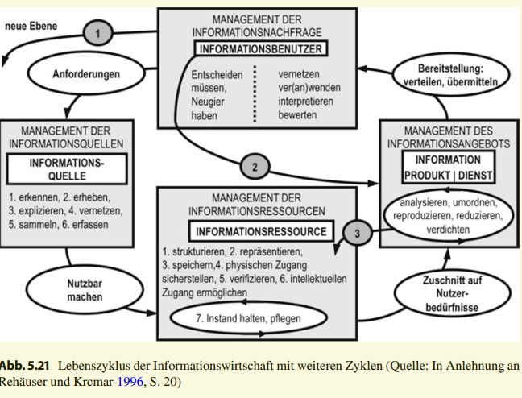

_Durch die Anwendung des hermeneutischen Zirkels auf das Lebenszyklusmodell der
Informationswirtschaft wird die Darstellung des  ebenszyklusmodells **um drei
Pfeile erweitert**. Die Dynamik der Pfeile wird im Folgenden beschrieben._

_Führt bspw. die Erhebung der Informationsnachfrage zur Feststellung einer Lücke im
Informationsangebot, **wird ein neuer Zyklus initiiert (Pfeil 1)**, der qualitativ neue Informationen schafft und die Deckung des Informationsbedarfs zum Ziel hat. **Ein neuer Zyklus kann aber auch bei der Verwendung/Anwendung des Informationsangebots eingeleitet
werden.** Die dabei neu entstandenen Informationen werden dann als Informationsquelle erfasst. Jeder neu eingeleitete Zyklusprozess **bewegt sich auf einer höheren Informationsebene**, wenn die Informationsressourcen mit neuen Informationen angereichert werden
und kein Vergessen vorliegt._

_Hat die Prüfung der Informationsressourcen ergeben, dass die Informationsnachfrage
mit den vorhandenen Ressourcen voraussichtlich gedeckt werden kann, sind die Informationen von den Informationsressourcen solange abzurufen und aufzubereiten, bis sich die Lücke zwischen Informationsangebot und Informationsnachfrage auf eine akzeptable Größenordnung reduziert hat, wobei vermutet werden kann, dass eine vollständige Deckung selten zustande kommt. Dieser Ablauf wird durch die Pfeile 2 und 3 verdeutlicht_

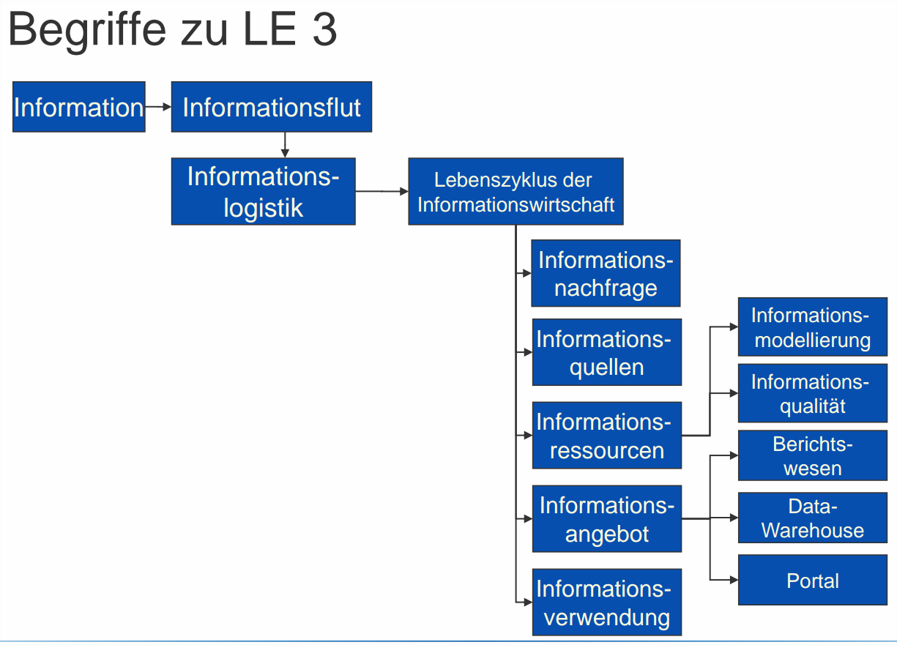
