# LE4

## LE4 Lernziele:

* Gegenstandsbereich und die Aufgaben des Managements der Informationssysteme.

* die Begriffe Modell, Referenzmodell und Metamodell erläutern und von einander abgrenzen.

* die Konzepte Datenarchitektur, Datenbanksystem, Datenbanktechnik in die Aufgaben des Datenmanagements
einordnen.

---
## 1. Managementprozess der Informationssysteme

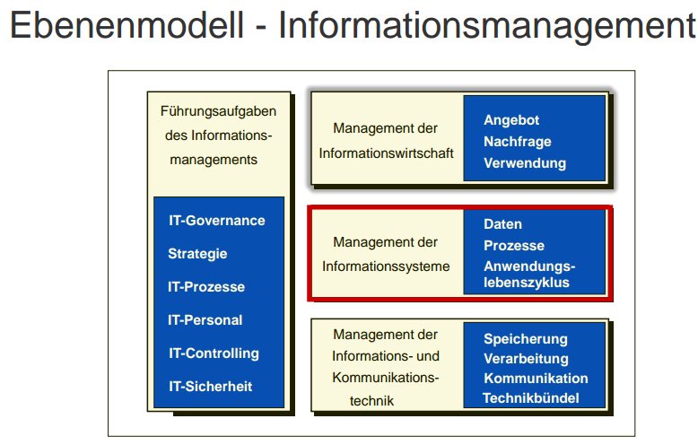
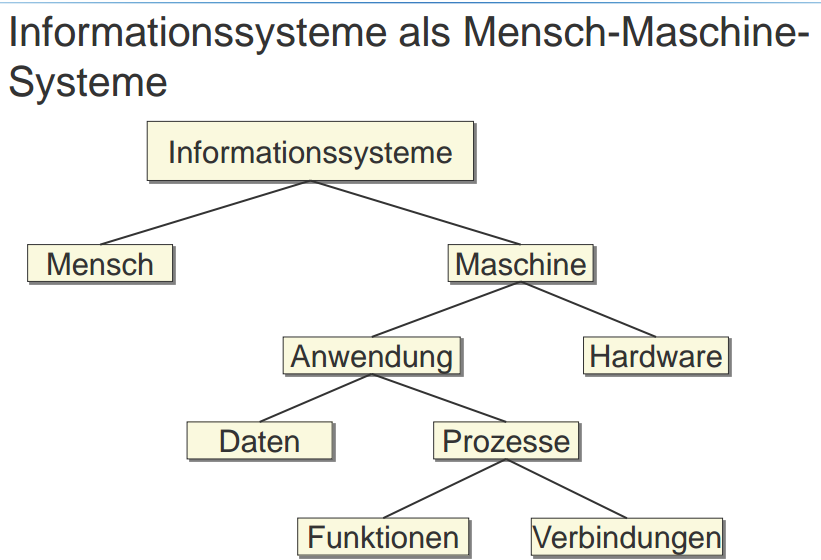
Informationssysteme sind **soziotechnische („Mensch-Maschinen-“)Systeme**, die menschliche und maschinelle Komponenten (Teilsysteme) umfassen und zum **Ziel der
optimalen Bereitstellung von Information und Kommunikation nach wirtschaftlichen Kriterien eingesetzt werden**

**Herausforderungen und Aufgaben des
Managements der Informationssysteme**
* Wie soll das **Management** eines der grundlegenden Bausteine von
Informationssystemen, den **Daten**, gestaltet werden?
* Wie soll das **Management** eines der grundlegenden Bausteine von
Informationssystemen, der **Prozesse**, gestaltet werden?
* Wie wird der **Lebenszyklus** einer einzelnen Anwendung so begleitet, dass
er die **Unternehmensstrategie** sowohl **unterstützt als auch umsetzt**? Wie kann die **gesamte Systemlandschaft** im Unternehmen harmonisch gestaltet
werden?

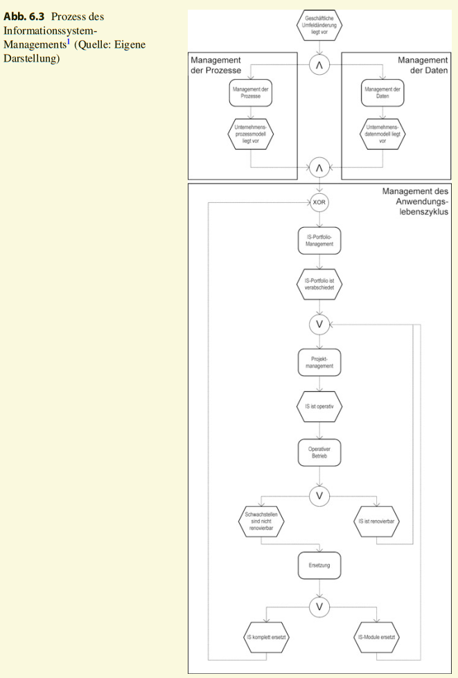

---
## 2. Modellbegriff
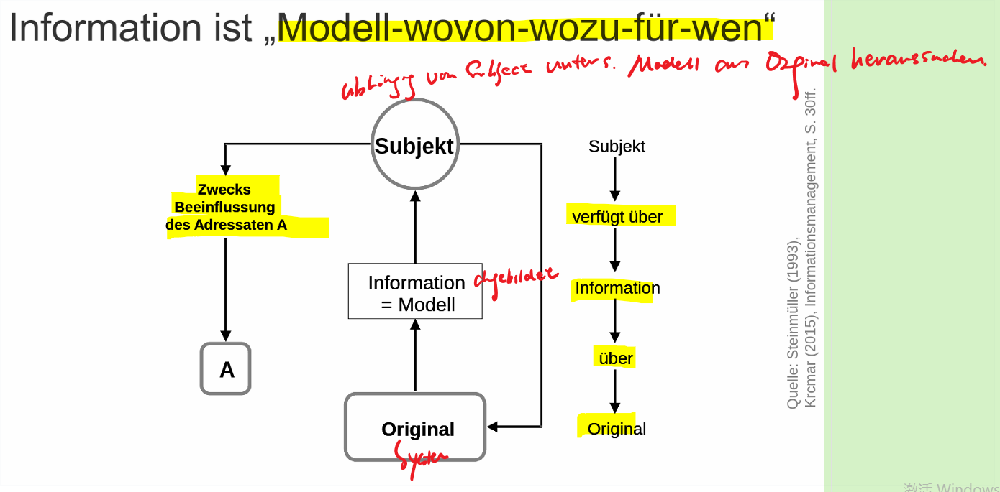
„Modell“ ist stets „Modell-wovon-wozu-für wen“

Modelle sind
* subjektrelativ, da Auswahl des Originals und der Abbildungsregeln auf den Erzeuger zugeschnitten,
* zweckrelativ, da auf Belange des Erzeugers ausgerichtet, und
* perspektivisch, da der Blickwinkel des Erzeugers eingeht

## Modellbegriff
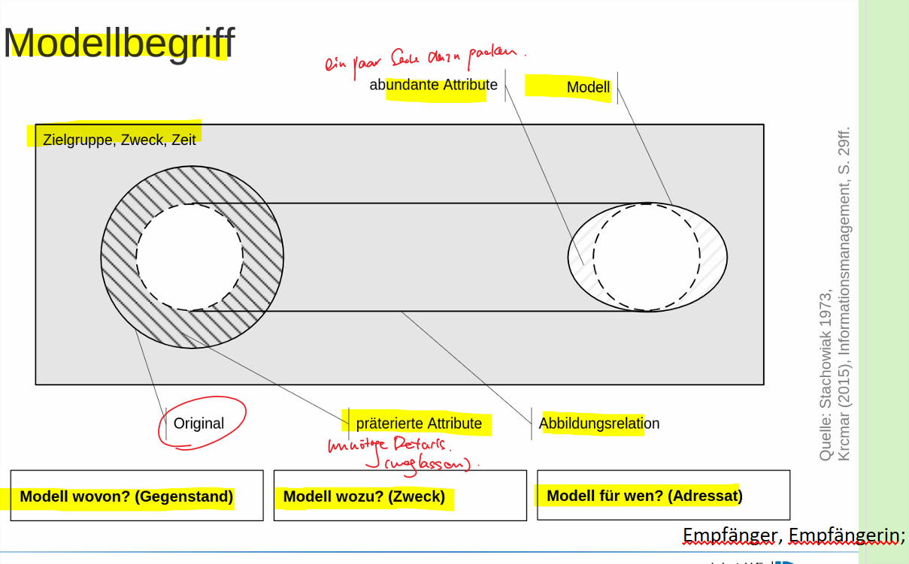

_Danach wird **ein Original mittels einer Abbildungsrelation auf ein Modell abgebildet**. Dies geschieht im
Hinblick auf **Zielgruppe, Zweck und Zeit**. Präterierte (also ausgelassene bzw. übergangene) Attribute des Originals sind solche, die vom Modell nicht abgebildet werden. Auf
der anderen Seite existieren auch **abundante (von lat. abundare: „reichlich vorhanden sein“)** Attribute des Modells._

_Der Modellbegriff beinhaltet daher im Wesentlichen vier Elemente: die Abbildungsregeln, das Modellsubjekt, die abzubildende Realität und den Adressaten der Modellbetrachtung. Abbildungsregeln schreiben vor, wie die Realität abzubilden ist, um Objektivität und Intersubjektivität zu gewährleisten. Das Modellsubjekt ist der Erzeuger eines Modells. Die Realität stellt das Original oder die Vorlage für das zu erstellende Modell dar und der Adressat sollte mit Kenntnis der Abbildungsregeln in der Lage sein, das Modell zu verstehen und richtig zu interpretieren._

## Systemischer Modellbegriff
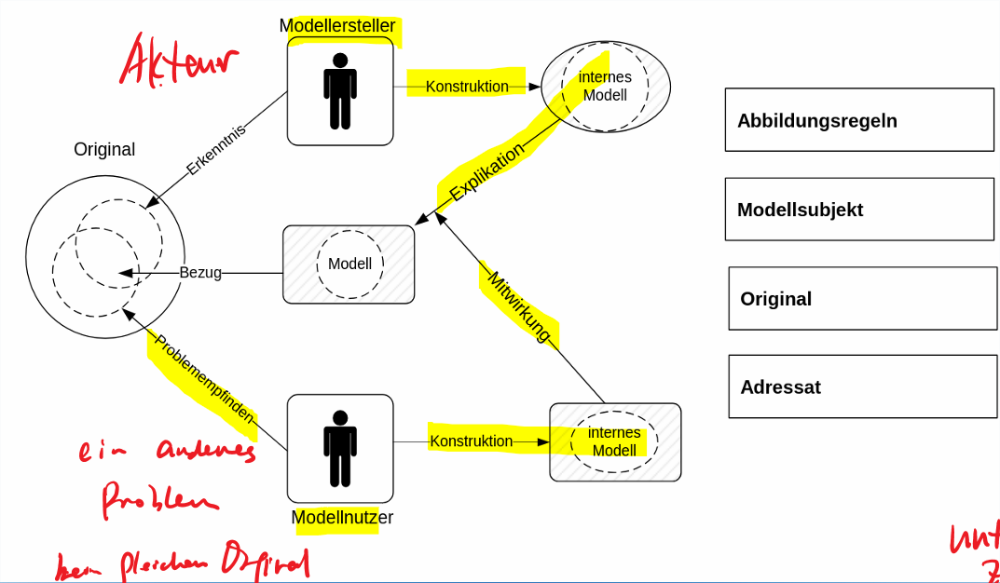

_Bei der Erstellung eines Modells sind in der Regel sowohl Modellersteller wie auch die späteren Modellnutzer beteiligt. Beide Parteien haben bei der Erstellung des Modells eine eigene Sichtweise auf die Problematik beziehungsweise eine sich unterscheidende Sichtweise auf die für ein Modell relevanten Informationen aus dem Original bzw. der Wirklichkeit. Zudem bereichern beide Parteien für sich das Modell durch abundante Informationen. Der Modellersteller etwa durch sein Fachwissen und der Modellnutzer durch seine Erfahrungen. Sowohl Modellersteller wie auch Modellnutzer gelangen auf diese Weise zu einer eigenen Vorstellung des fertigen Modells. Um zu einem korrekten Ergebnis zu gelangen, gilt es nun für den Modellersteller unter Einbezug des Modellnutzers das fertige Modell zu konstruieren und gegebenenfalls Anpassungen an der eigenen Sichtweise auf die Problematik vorzunehmen. Er bezieht dabei die abundanten Informationen des Modellnutzers mit ein und ergänzt seine eigenen, falls sich deren Relevanz bestätigt. Das Ergebnis dieses Prozesses ist schließlich das fertige Modell, welches sich auf die Schnittmenge der Ansichten beider Beteiligten Gruppen bezieht._

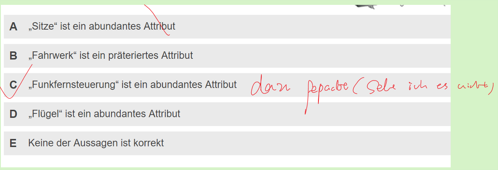

---
## 3. Referenzmodelle

**Referenzmodell** = für eine Branche oder einen ganzen Wirtschaftszweig
erstelltes Modell, das **allgemeingültigen Charakter** haben soll. Es dient als** Ausgangslösung zur Entwicklung unternehmens-spezifischer
Modelle**

### Einsatz von Referenzmodellen:
*  **Referenzmodelle**, die durch **Software-Hersteller** bereit gestellt
werden: Dokumentation, Schulung
* **ISO/OSI-Referenzmodell** beschreibt die Kommunikation
zwischen offenen Rechnernetzwerken
* Referenzmodell der **Workflow Management Coalition** zur
Beschreibung von Konzepten, Bestandteilen und Struktur von
Workflow-Management-Systemen

_Die **Eigenschaft** der Allgemeingültigkeit fordert, dass Referenzmodelle für eine Klasse sogenannter unternehmensspezifischer Modelle zum Einsatz kommen sollen. Ihre Entwicklung erfolgt dementsprechend nicht basierend auf den Anforderungen eines speziellen
Falls (Gültigkeitsbereich), **sondern es werden in mehreren Anforderungen wiederkehrende bzw. ähnliche Fälle zusammengefasst und verallgemeinert.**_

_Eine besondere Rolle für das IM spielt die zunehmende Bereitstellung von Referenzmodellen durch **Software-Hersteller**. Sie sind vor dem Hintergrund des **Einsatzes einer bestimmten Software zu sehen. Solche Referenzmodelle erfüllen eine Dokumentationsfunktion für den Interessenten oder Kunden.** ~~Vor dem Kauf kann er prüfen, ob die betrachtete Software seine
Anforderungen hinsichtlich der Funktionalität und der Abläufe erfüllt. Nach dem Kauf
dient das Referenzmodell zur Schulung der Mitarbeiter und der Dokumentation der betrieblichen Abläufe, die durch die Software unterstützt wird~~_ 

_**ISO/OSI-Referenzmodell**, das die Kommunikation zwischen offenen Rechnernetzwerken beschreibt. Dies wird später im Rahmen der Diskussion der Kommunikationsnormen näher erläutert._

_Ein weiteres Referenzmodell definierte die **Workflow Management Coalition**. Hierin wird die Terminologie der Workflow Management Coalition festgelegt sowie Konzepte, Bestandteile und Struktur von
Workflowmanagement-Systemen beschrieben._

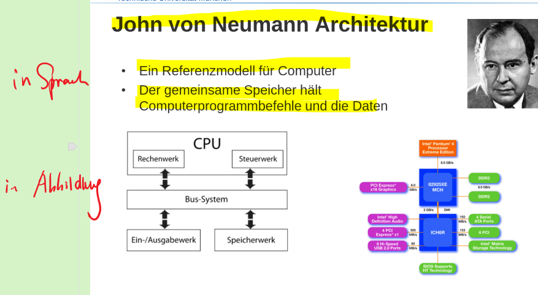

---
## Vor- und Nachteile von Referenzmodellen

| Vorteile                                                                           | Nachteile                                                     |
| ---------------------------------------------------------------------------------- | ------------------------------------------------------------- |
| Modellerstellung wird beschleunigt                                                 | Verlust strategischer Wettbewerbsvorteile und Kernkompetenzen |
| Modellierung von Prozessen ist nicht einfach                                       | Problem der Geheimhaltung                                     |
| Nur wenige Betriebe können sich einen von Grund auf eigenständigen Ansatz leisten. | -                                                             |
| Geringeres Risiko ein nicht geeignetes Softwareprodukt zu finden                   | -                                                             |
| Schnittstellen zwischen Anwendungssystemen können identifiziert werden.            | -                                                             |
| Hilft bei der Automatisierung von Prozessbestandteilen                             | -                                                             |
| Modellqualität                                                                     | -                                                             |
| bessere Verständigung                                                              | -                                                             |
| Kostenminimierung                                                                  | -                                                             |

_Vorteil_

_**Kostenminimierung** entsteht durch die Nutzung von Vorlagen zur Modellerstellung. So erleichtern Referenzmodelle die Strukturierung von Projekten, sie vereinfachen die Identifikation und Diskussion von Prozessen, beschleunigen den Modellerstellungsprozesses und führen zu einer schnelleren Aneignung von Modellierungsmethoden. Durch den nutzenbringenden Einsatz der in den Referenzmodellen enthaltenen betriebswirtschaftlichen Lösungen ergeben sich zusätzlich auch Erlöswirkungen._

_**Risikominimierung**. Diese
wird generiert durch das einfachere Erkennen bestehender Schwachstellen in bisherigen Abläufen, eine Qualitätserhöhung der erstellten unternehmensspezifischen Modelle, eine
Mehrfachvalidierung der Modelle zur Vermeidung einer fehlerhaften Entwicklung sowie das in Referenzmodellen enthaltene Know-how (z. B. branchenabhängiges Wissen)_

_Nachteil_

_**Verlust strategischer Wettbewerbsvorteile und Kernkompetenzen**, wenn die Anpassung der Referenzmodelle oder Erstellung individueller Modelle unterbleibt, die strategische Wettbewerbsvorteile beinhalten. Bei der
Modellierung von Prozessen ist es nicht einfach den optimalen Abstraktionsgrad zu bestimmen. Die Modellanpassung wird noch als schlecht gelöstes Problem empfunden,
welches oftmals Kontakt zu Fachspezialisten notwendig macht. Detaillierte Modelle müssen zwar kaum angepasst werden, sie passen aber auch nicht zu den Anforderungen vieler
Unternehmen, so dass sie keine Verbreitung finden. Sind die Modelle hingegen zu allgemein gehalten, dann müssen sie zu stark und damit kostenaufwändig angepasst werden,
so dass ihr Einsatz ebenso in Frage gestellt wird. Daher ist eine kontinuierliche Weiterentwicklung erforderlich. Weiterhin können sich nur wenige Betriebe einen von Grund auf
eigenständigen Ansatz leisten, da die Entwicklung dieser Modelle in der Regel aufwändig und damit kostenintensiv ist. Auch die Geheimhaltung von Unternehmensinformationen,
welche als Grundlage für Geschäftstätigkeit und Erfolg angesehen wird, erschwert die
Veröffentlichung des in den Referenzmodellen befindlichen Wissens. Letztlich bleibt bei der Nutzung immer ein Risiko, da die geforderten Eigenschaften Allgemeingültigkeit und
Empfehlungscharakter nur subjektiv bewertbar sind._

---
## Klausurfrage:
Nennen Sie die Vorteile und Nachtele von Referenzmodell?

---
## Charakterisierung Modell und Metamodell

Modelle sind **Systeme**, deren Elemente von einem **Betrachter** aus einem **Objektsystem** zu einem **Zweck** ausgewählt wurde.

Metamodelle beschreiben den
**Sprachvorrat** und die **Regeln**,
nach denen die Elemente Eines Modells verwendet werden können

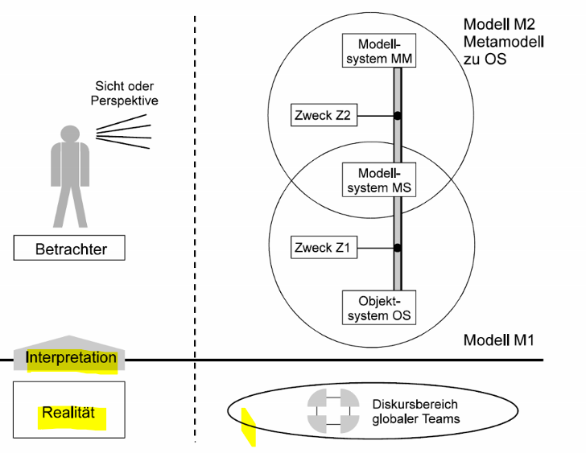
# ?

## UML als objektorientiertes Metamodell
* Funktionsmodell: Anwendungsdiagramme
* Objektmodell: Klassendiagramme
* Dynamisches Modell: Aktivitäts-, Sequenz- und Zustandsdiagramm

---
## Kontext der Referenzmodellierung

## Prozesse der Referenzmodellierung
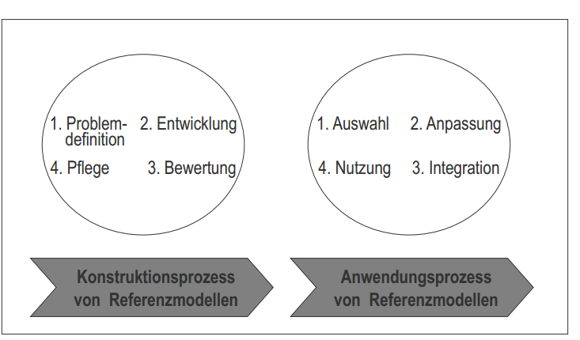

## Bestandteile des R/3 Referenzmodells
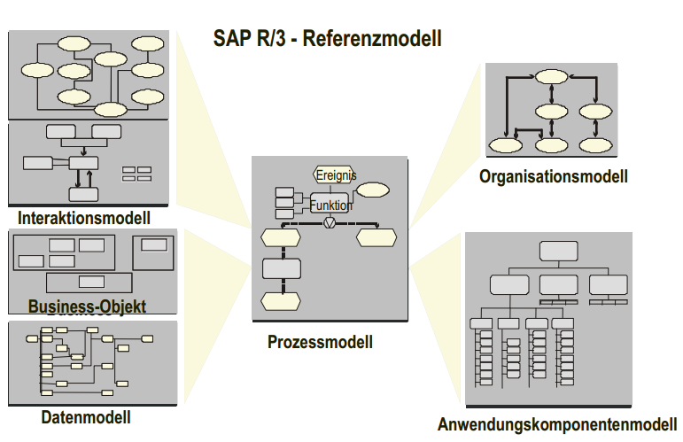

_Das SAP R/3 Referenzmodell ist in Abb. 3.10 dargestellt. Das Interaktionsmodell zeigt die wichtigsten Organisationseinheiten, die am Informationsaustausch für Geschäftsvorgänge beteiligt sind. Das Datenmodell zeigt, welche Informationen Unternehmen benötigen, und welche Möglichkeiten der Informationsverarbeitung durch R/3 unterstützt werden. Das Organisationsmodell veranschaulicht den Aufbau des Unternehmens und
die Wechselwirkungen zwischen den Unternehmenseinheiten. Schließlich gibt das Anwendungskomponentenmodell dem Anwender einen Überblick über die im R/3-System verfügbaren Hauptfunktionen. Das R/3-Referenzprozessmodell veranschaulicht, wie verschiedene Modelle zusammenhängen und zeigt die wichtigsten Informationen im Rahmen
des Business Engineerings_

## Referenzmodelle in der Wirtschaftsinformatik I
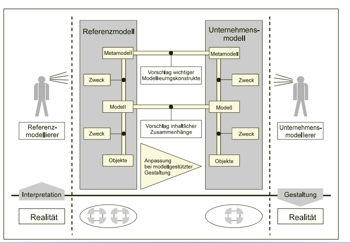

## Referenzmodelle in der Wirtschaftsinformatik II
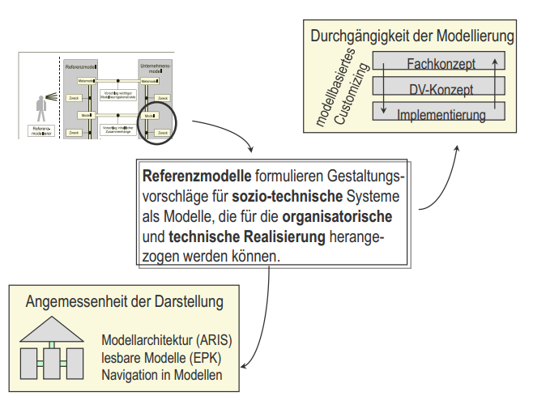

## Beispiel für Referenzmodelle
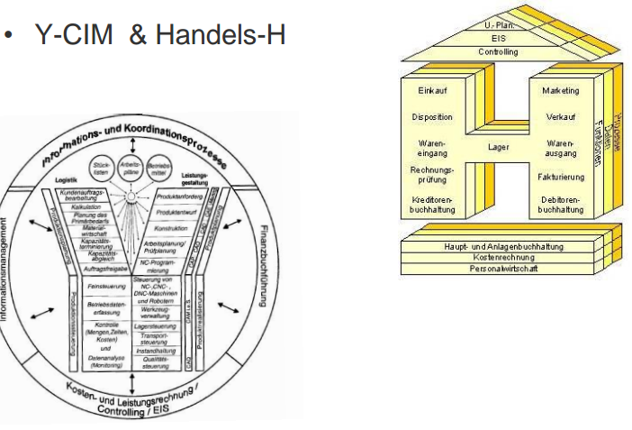

---
## 3. Management der Daten

### Ebenenmodell des Datenmanagements
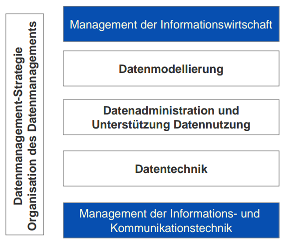

### Aufgaben des Datenmanagements
**Datenmodellierung, Datenadministration, Datentechnik, Datensicherheit, Datenkonsistenz, Sicherung von Daten (z.B. Backup), datenbezogener Benutzerservice**

### Ziele des DM

* optimale Nutzung der Daten im Unternehmen unter Beachtung von Richtigkeit, Konsistenz, Aktualität,
Aufgabenbezogenheit und Zusammenhang der Daten, also Verbesserung der Informationsqualität, aber auch eine
produktive Anwendungssystementwicklung

* Definition einer DM Strategie, d.h. Festlegung, welche Daten für welche Systeme und Aufgaben zur Verfügung zu stellen sind, die Festlegung der organisatorischen Verantwortung für Pflege und Erfassung der Daten sowie die Bereitstellung der Daten in
exakt definierter und untereinander abgestimmter Form

_Das Datenmanagement (DM) betrifft alle betrieblichen und technischen Aspekte der Datenmodellierung, -administration, -technik, -sicherheit, -konsistenz, Sicherung von Daten (z. B. Backup) und des datenbezogenen Benutzerservices. Ziel des DM ist die Bereitstellung und Nutzung der Daten im Unternehmen. Dazu gehört die Beachtung von Richtigkeit, Konsistenz, Aktualität,  Aufgabenbezogenheit und Zusammenhang der Daten, also die Verbesserung der Informationsqualität, aber auch eine produktive Anwendungssystementwicklung durch den Einsatz von Datenbanken und geeigneten Modellierungstechniken_

### Datenmodellierung

* Unternehmensweites Datenmodell
* Schnittstelle zur Strategie
* -> Modell ist stets Modell wovon-wozu-für wen
* Ziele
  - Verminderung Redundanz
  - höhere Transparenz
  - verbesserte Dokumentation
* dadurch:
 - höhere Produktivität
 - verbesserte Kommunikation
 - ganzheitliches Denken und Vorgehen
* Unternehmensmodell =
Unternehmensdatenmodell + Unternehmensfunktionsmodell

_Um Lücken und redundante Bausteine in der Informationsstruktur eines Unternehmens erkennen zu können, werden Integrationsmodelle angewandt. Abhängig davon, ob die Daten- oder Funktionsintegration Betrachtungsgegenstand ist, werden Unternehmensdaten- und Unternehmensfunktionsmodelle unterschieden._

_Durch das Unternehmensdatenmodell sollen die Zusammenhänge zwischen den fachlichen Aufgaben in einem Unternehmen und den dafür erforderlichen Daten verdeutlicht
werden. Gleichzeitig werden für verschiedene Aufgaben gemeinsam verwendete Daten
identifiziert und die Voraussetzungen für eine datenorientierte Integration verschiedener
Systemkomponenten geschaffen. Der Verwendungskontext der im Unternehmensdatenmodell spezifizierten Daten wird im Unternehmensfunktionsmodell beschrieben_

---
## Relationale Datenmodellierung
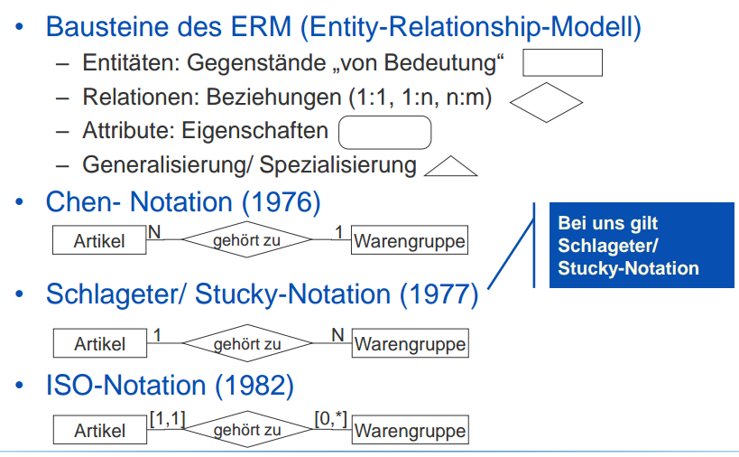

---
## ABC-Klassifizierung der Daten- und Funktionsmodelle
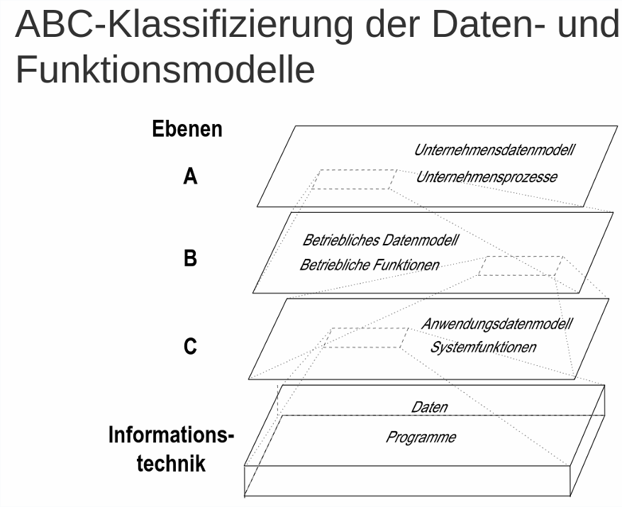

_Je nach **Verwendungsebene** und Aggregation werden **Daten- und Funktionsmodelle** der Ebenen A, B und C sowie der Informationstechnik Ebene unterschieden._

**Unternehmensdaten- und -funktionsmodell sind Entitäten der Ebene A.** Diese Ebene enthält weniger – jedoch abstraktere – Entitäten als Ebene B, auf der
betriebsspezifische Entitäten definiert sind. Auf Ebene C werden den Entitäten der Ebene B noch Informationen für einzelne Anwendungen hinzugefügt

---
## Objektorientierte Datenmodellierung

* UML (Unified Modeling Language)
* Kombination unterschiedlicher Modelle und Notationen (Booch, Jacobson, Rumbaugh), standardisiert durch OMG
* Verwendet in Prozessmodellierung, Analyse, Spezifikation, Entwurf
* 12 Diagrammtypen
  - Structural Diagrams
    * Class Diagram, Object Diagram, Component Diagram, Deployment Diagram
  - Behavior Diagrams
    * Use Case Diagram, Sequence Diagram, Activity Diagram, Collaboration Diagram, Statechart Diagram
  -  Model Management Diagrams
      * Packages, Subsystems, Models

---
## Definition und Aufgaben DBMS

Ein **Datenbankmanagementsystem (DBMS)** besteht zum einen aus **einer Menge
von Daten (Datenbasis)**. Diese Datenbasis wird auch als **permanenter oder materialisierter Speicher** bezeichnet. 

_Sie enthält Informationseinheiten, die miteinander in Beziehung stehen und zur Steuerung und Kontrolle eines Aufgabenbereichs notwendig sind_

Zum anderen besteht es aus der Gesamtheit der **Programme** zum **Zugriff**, zur **Kontrolle** und **Modifikation der Daten.** Die Einheit von Programmen zur Verwaltung der Datenbasis bezeichnet man auch als **Datenbankverwaltungssysteme oder DBMS**.

_Ein Datenbanksystem besteht aus einer Menge von Daten (der eigentlichen Datenbasis oder auch Datenbank) sowie einer Menge von Programmen (genannt Datenbankverwaltungssystem oder auch Datenbankmanagementsystem), die den Zugriff und die Modifikation der Daten auf kontrolliere Weise ermöglichen._

### Aufgaben:
* Datenadministration
(Data-DictionarySysteme: passiv, aktiv, abhängig,
unabhängig, primär, sekundär)
* Datennutzung, bzw. –manipulation
(Auswertungs- und Reportfunktionen,
Datenschutz!)
* Datensicherheit bzw. Datenintegrität
(Hardware und Software, Internet)
* Anwendungsunterstützung
(Tuning, Statistikprogramme)

### Drei Ebenen Architektur nach ANSI/SPARC

• Externe Ebene
  - Sicht auf die Datenstruktur des Datenbestandes anwendungsspezifisch
  - Beschreibung mit Data Markup Language (DML)

_Die externe Ebene beschreibt die **benutzer- sowie anwendungsspezifischen Sichten auf die Datenstruktur des Datenbestands.** Eine Anwendung arbeitet in der Regel nicht mit dem gesamten Datenbestand, sondern interagiert lediglich mit einem spezifischen Teilausschnitt. Beispiele hierfür sind bestimmte Sichten (Views) auf den Datenbestand
die durch Formulare, Listen oder Masken einer Anwendung impliziert sind. Die Beschreibung der Daten dieser Ebene erfolgt bspw. über die Data Manipulation Language (DML)._

• Konzeptuelle Ebene
  - Alle Objekte und Entitäten sowie deren Beziehungen
  - Alle Daten im Zusammenhang mit
Datenbankmanagementsystem und der Gesamtheit der darauf aufbauenden Anwendungen
  - Data Description Language (DDL)

_Auf der konzeptuellen Ebene wird beschrieben, **welche Daten in der Datenbank abgelegt werden und wie diese zueinander in Relation stehen.** Diese Ebene enthält die Beschreibung aller notwendigen Daten, die im Zusammenhang mit dem Datenbankmanagementsystem und der Gesamtheit der darauf aufbauenden Anwendungen benötigt werden. Die Beschreibung der Daten und Relationen erfolgt mittels der Data Description Language (DDL). Ziel ist vor allem eine redundanzfreie sowie vollständige
Darstellung der zu speichernden Informationen_

• Interne Ebene
  - Physische Behandlung der Daten, Speicherung und Zugriff
  - Data Storage Definition Language (DSDL)

_Auf interner Ebene wird beschrieben, wie die Daten physisch behandelt werden, d. h. wie und wo diese abzuspeichern sind und wie auf diese zugegriffen wird. Zur Beschreibung dieses physischen Modells dient die Data Storage Definition Language (DSDL). Ziel ist ein möglichst performanter Zugriff auf die in der Datenbank abgelegten Daten._

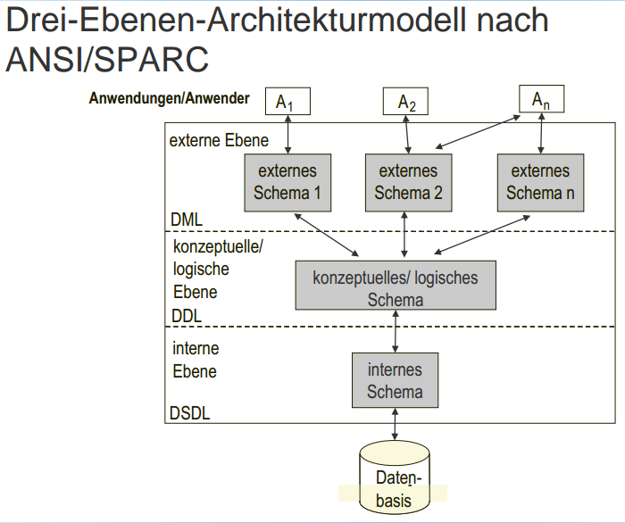

---
## Datentechnik
• Unterstützt das Datenmanagement
• Ziele:
  - Installation und Sicherstellung von Datenbanken
  - Durchführen von Datenbankrestaurierungen im Fehlerfall
• Werkzeuge:
  - Datenbankverwaltungssysteme
(relational, objektorientiert, objektrelational)
  - Datenbank-Administrationshilfen (Teilsysteme des Datenbankverwaltungssystems)

---
## Big Data

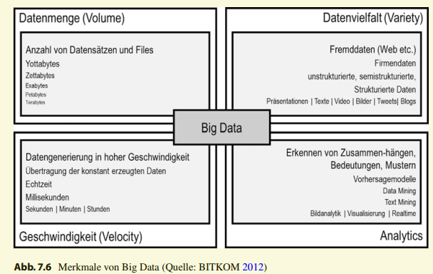

* Datenmenge: Datenberge von einigen Terabytes bis hin zu Petabytes.
* Datenvielfalt: Zunehmende Vielfalt von Datenquellen und Datenformaten führt zu unstrukturierten, semistrukturierten und strukturierten Daten. Unternehmeninterne Daten
werden zunehmend um externe Daten ergänzt.
* Geschwindigkeit: Immer schnellere Auswertung riesiger Datenmengen wird benötigt. Analysen großer Datenmengen in Sekunden wird benötigt, ebenso Datengenerierung und Datenübertragung in hoher Geschwindigkeit.

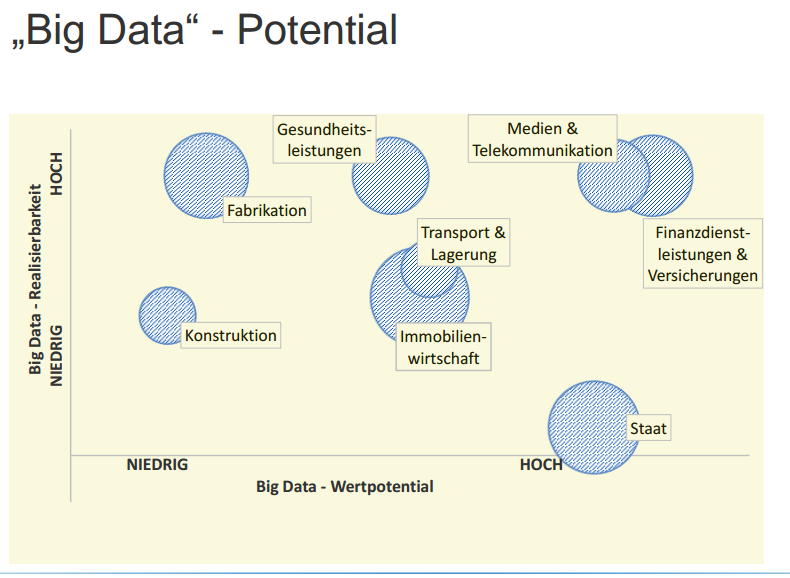