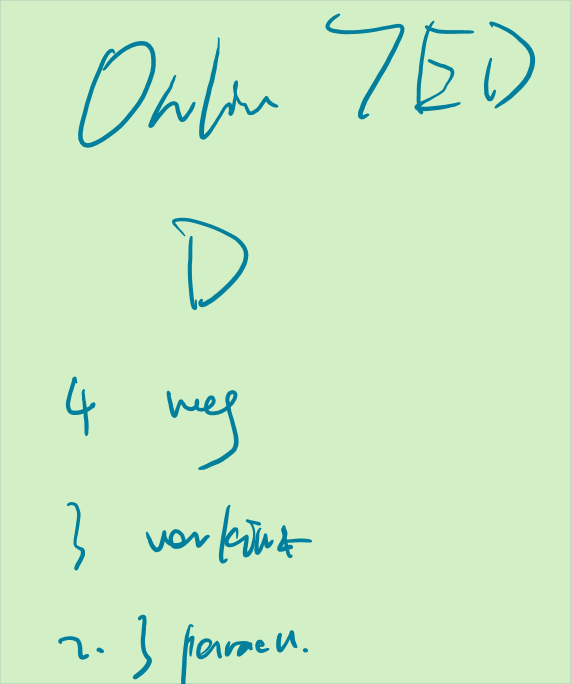
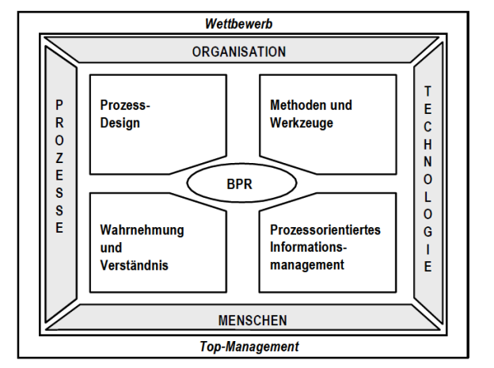
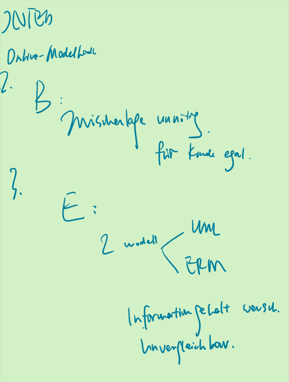
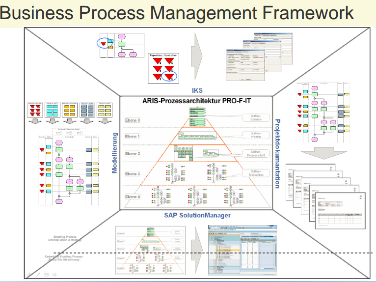
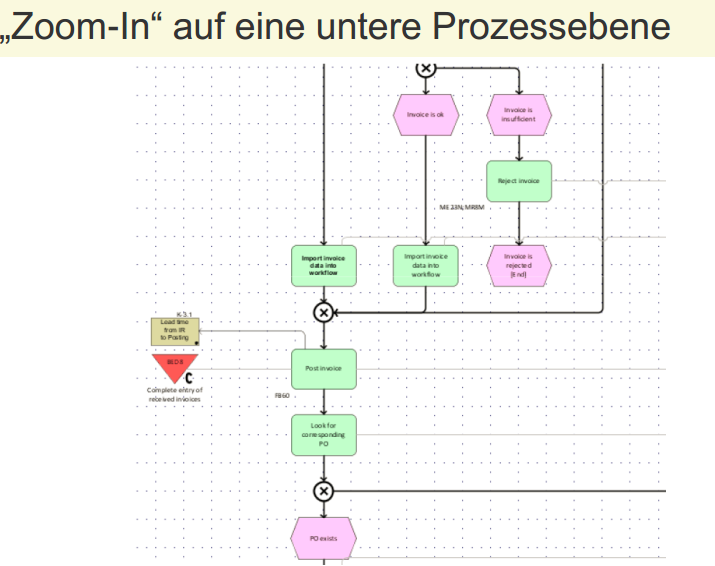
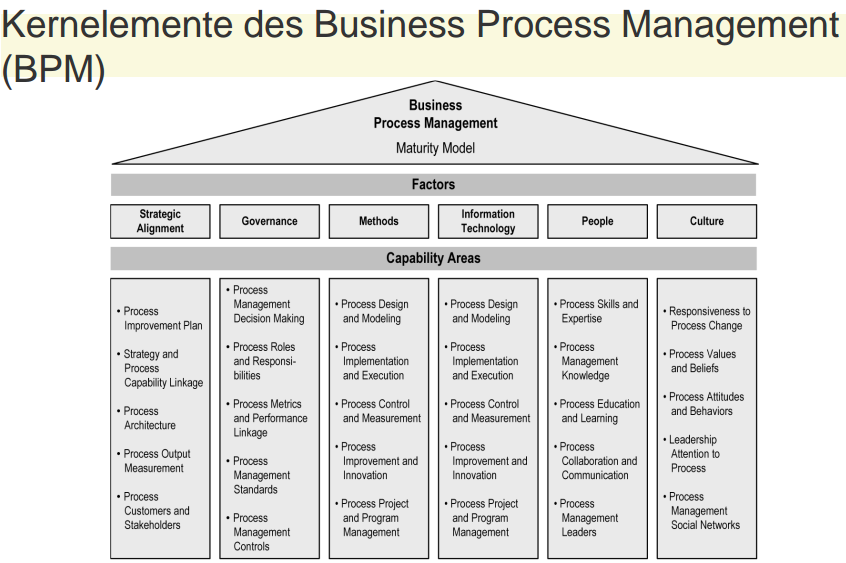
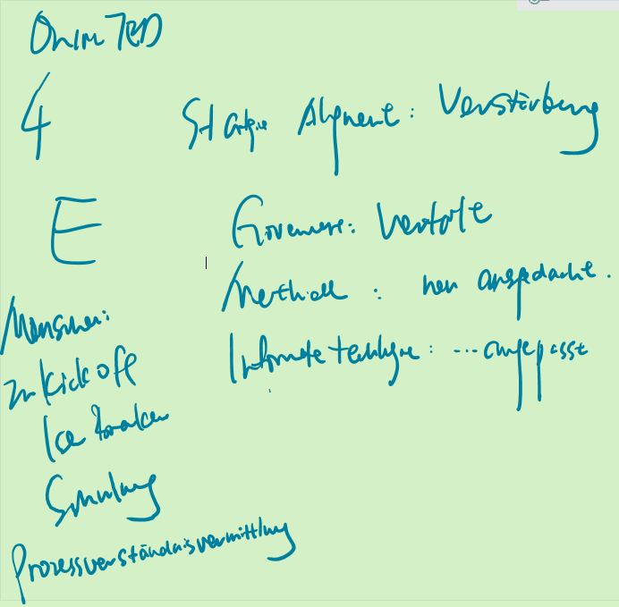
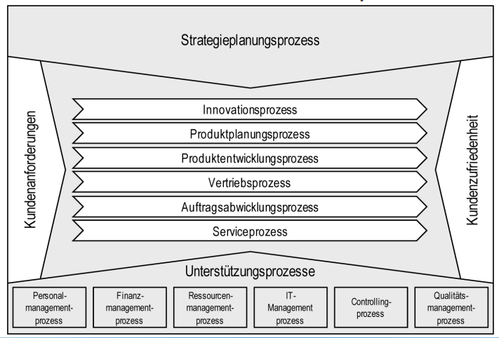

# LE5

## LE5 Lernziele:
• was **Prozesse** sind und **wie diese modelliert werden.**
• **Ziele, Aufgaben** und **Methoden** beim Management
der Geschäftsprozesse.
• die Ansätze zum **Business Process Management**

---
# 1. Management der Prozesse

## A. Grundlagen der Prozessorientierung

### Management der Prozesse

**Prozess**: Eine Folge von logischen Einzelfunktionen, zwischen denen Verbindungen
bestehen

**Prozessmanagement**:
Gestaltung, Ausführung und Beurteilung von Funktionsfolgen (=Prozesse)

**Process Reengineering**
“The fundamental rethinking and radical redesign of business processes to
achieve dramatic improvements in critical, contemporary measures of
performance, such as cost, quality, service, and speed.

Synonyme: Core Process Redesign, Geschäftsprozessorientierung

---
## Schematische Darstellung eines Prozesses

_**Prozesse transformieren einen oder mehrere Inputfaktoren durch die
Ausführung verschiedener Funktionen zu einem oder mehreren Output-Faktoren.** Deshalb kann von einem **Transformationsprozess** gesprochen werden, **der entweder Materie
(materielle Prozesse) und/oder Informationen verarbeitet (informatorische Prozesse).** Das Management der Prozesse in Anwendungssystemen beschäftigt sich mit informatorischen
Prozessen, weshalb auf die weitere Betrachtung materieller Prozesse verzichtet wird._ 

_Es zeigt **schematischen Aufbau eines Prozesses**. Zum Zeitpunkt t0 wird der
Prozess durch einen Trigger angestoßen und beginnt mit der Ausführung der Funktion F1. **Trigger sind Startereignisse, die durch Anwender des IS, durch Funktionen der Software oder durch externe Ereignisse angestoßen werden.** Nach Ende der Ausführung einer
Funktion wird die darauf folgende Funktion angestoßen, bis das Prozessende in t1 erreicht
ist.
Das Ergebnis des Prozesses ist ein Output, der in informatorischen Prozessen als Informationsprodukt bezeichnet werden kann. Der in Abb. 3.19 dargestellte Prozessablauf
zeigt eine sequentielle Folge von Funktionen, die um Verzweigungen erweitert werden kann, um komplexere und parallele Prozessabläufe darzustellen._

---
## Prozessauflösung

_**Die Prozessauflösung erlaubt die Gliederung eines Prozesses nach verschiedenen Kriterien.** Die **vertikale Prozessauflösung**
führt zur **Identifikation übergeordneter und untergeordneter Prozesselemente (Prozesshierarchisierung)**. In Abb. 6.6 wird jeder der Hauptprozesse in Untermengen gegliedert.
Diese werden als Subprozesse bezeichnet. Auch Subprozesse können ihrerseits in weitere
Subprozesse unterteilt werden, der Detaillierungsgrad lässt sich somit an die Anforderungen der Darstellung anpassen. Die unterste Ebene kann einzelne Tätigkeiten darstellen.Auf einem hohen Aggregationsgrad wird der Untersuchungsgegenstand häufig als Geschäftsprozess bezeichnet, wenn dieser der Erfüllung der obersten Ziele der Unternehmung (Geschäftsziele) dient und das zentrale Geschäftsfeld beschreibt. Die horizontale Prozessauflösung zielt auf die inhaltliche Trennung von Prozessen
auf der gleichen Abstraktionsebene hin. Durch die Prozessabgrenzung werden Funktionen
zu Funktionsfolgen bzw. Prozessen zusammengefasst.
Als Ergebnis der Prozessauflösung entsteht die Menge aller Prozesselemente, der Überund Unterordnungsbeziehungen sowie der Vorgänger- und Nachfolgerbeziehungen zwischen den Elementen._

---
## B. ARIS Konzept
_Das Modell der Architektur integrierter Informationssysteme (ARIS)_

_ist die ARIS-Architektur
zunächst **auf die Gestaltung eines einzelnen IS gerichtet.** Ausgangspunkt der Entwicklung
der ARIS sind Vorgangskettenmodelle für betriebliche Bereiche. Der Ausgangspunkt Vorgangskette trägt dem Prozessgedanken Rechnung und berücksichtigt, dass der IT-Einsatz
der Unterstützung von Informationsprozessen dient. Der Ausgangspunkt bereichsorientierte Vorgangsmodelle wirkt allerdings einem bereichsübergreifenden Prozessgedanken
entgegen._

_In der ARIS kommt die Schichtung nach Techniknähe deutlich zum Ausdruck. Die
Unterscheidung von Fachkonzept, DV-Konzept und Implementierung betont die Notwendigkeit einer Abstimmung zwischen IT und den fachlichen Aufgabenerfüllungsprozessen.
Die Interpretation als Stufen eines Vorgehensmodells stellt eine Beziehung zwischen den Ebenen her. Die Anforderungen aus der fachlichen Aufgabenerfüllung werden systematisch der Gestaltung des IS zugeführt und durch IT unterstützt. Im Gegensatz zur ganzheitlichen Betrachtung der ISA bleibt bei ARIS die Einbettung des entworfenen IS in den Gesamtzusammenhang des Unternehmens unklar, da der Bezug zur Unternehmensstrategie nur implizit über die Vorgangsketten hergestellt wird._

---
## C. Prozessmodellierung mit EPKs und anderen Methoden

---
## D. Gestaltungsalternativen bei der Prozessmodellierung

### Gestaltungsalternativen bei der Modellierung

**Gestaltungsalternativen bei der Modellierung von Prozessen**
beziehen sich in erster Linie auf die Gestaltung des Ablaufs einer
Funktionsfolge
- Sequentielle Reihung
  - Reihung von Funktionen, Folgefunktion darf erst dann begonnen werden, wenn Vorgängerfunktion beendet ist
- Parallelisierung
  - Möglich, wenn Funktionen unabhängig voneinander ausgeführt werden können, Durchlaufzeitverkürzung
- Verzweigung
  - Bei alternativ unterschiedlichen Prozessabläufen
-  Wiederholungen
    - Mehrfache Ausführung einer Funktion/ Funktionsfolge unter festzulegender Bedingung

_**Sequentielle Reihung** Bei der Reihung von Funktionen wird zu einer Zeit stets nur eine Funktion ausgeführt. Eine Folgefunktion darf erst dann begonnen werden, wenn die
Vorgängerfunktion beendet ist. Sequentielle Reihungen finden dann Anwendung, wenn in eine Funktion F2 als Input eine Vorleistung eingeht, die erst durch eine zeitlich vorgelagerte Funktion F1 entsteht. Der Start von F2 ist somit abhängig von der erfolgreichen, d. h. korrekten, Ausführung von F1._

_**Parallelisierung** Die Parallelisierung von Funktionen ist dann möglich, wenn Funktionen
unabhängig voneinander ausgeführt werden können. Eine gleichzeitige Ausführung, d. h. Parallelisierung, ist dann notwendig, wenn zwei oder mehr Zustände, die von verschiedenen Funktionen erzeugt werden,  gleichzeitig eintreten sollen. Im Rahmen der Prozessoptimierung wird die Parallelisierung eingesetzt, um die Durchlaufzeit eines Prozesses zu
reduzieren._

_**Verzweigung** Die Verzweigung eines Prozesses ist dann notwendig, wenn alternativ unterschiedliche Prozessabläufe beschritten werden sollen. Welcher Prozessablauf ausgeführt wird, ist abhängig vom Eintreten einer bestimmten Bedingung._

_**Wiederholungen** Wiederholungen werden eingesetzt, wenn eine Funktion oder eine Funktionsfolge mehrfach auszuführen ist. Dazu muss der Start- und Endpunkt einer Wiederholstrecke markiert werden. Zusätzlich ist festzulegen, unter welcher Bedingung die Wiederholung erfolgen soll bzw. wann auf eine weitere Wiederholung der Funktionsfolge verzichtet werden kann._

### Prozessbezogene Lösungsansätze zur Durchlaufzeit-Verkürzung

_Ein wesentliches **Ziel bei der Neugestaltung von Prozessen ist die Verkürzung der Durchlaufzeit.** In Abb. 3.24 werden dazu sechs Lösungsansätze dargestellt und anhand
von Beispielen erläutert. Von den bereits vorgestellten Gestaltungselementen **finden sich
die Sequenz, Parallelisierung und Verzweigung in den Lösungsansätzen wieder. Die Wiederholung wird in der Darstellung nicht erwähnt, da in den Lösungsansätzen keine Zyklen
enthalten sind.**_

_Neben der Gestaltung des Prozessablaufs kann das Prozessmodell je nach Modellierungszweck um unterschiedliche Informationen ergänzt werden. Häufig werden Prozessmodellen Informationen über die Verantwortlichkeit der Prozessausführung (Process
Owner), die verwendeten IS, die benötigten Ressourcen und zusätzliche Indikatoren zur quantitativen Beurteilung eines Prozesses (Durchlaufzeiten, Kostensätze etc.) hinzugefügt._

---
### IKT Potenziale und organisatorische Auswirkungen

| IT-Potenzial     | Organisatorischer Einfluss/Nutzen                                  |
| ---------------- | ------------------------------------------------------------------ |
| Automatisch      | Reduktion manueller Eingriffe und Standardisierung der Prozesse    |
| Informativ       | Verfügbarkeit großer Mengen detaillierter Informationen            |
| Sequenziell      | „natürliche“ Reihenfolge der Aktivitäten bis zur Parallelisierung |
| Zielorientiert   | Kontinuierliche Verfolgung des Prozessstatus                       |
| Analytisch       | komplexe Auswertung vorhandener Informationen                      |
| Geographisch     | Unabhängigkeit von räumlichen Gegebenheiten                        |
| Integrierend     | Zusammenfassung auch heterogener Aufgaben                          |
| Wissen schaffend | flächendeckende Verfügbarkeit von Wissen und Expertise             |
| Vereinfachend    | Entfernung von Intermediären aus dem Prozess                       |

_ein breit einsetzbarer Ansatz auf Basis von neun generischen IT-Potenzialen. Diese Potenziale können direkt mit organisatorischen Auswirkungen verbunden werden. Ein
weiterer Vorzug ist, dass die Potenziale in realen Systemen umsetzbar sind._

---
## Gesamtkonzept für **Business Process Reengineering**

~~_Business Process Reengineering (BPR) ist ein radikaler彻底的 Prozessverbesserungsansatz,
der mittels sprunghafter, innovativer Veränderungen ganzer Unternehmensprozesse versucht deren Leistung erheblich zu verbessern.
~~Hier werden Veränderungen nicht kontinuierlich vollzogen, sondern einmalig.~~ Das Ziel des BPR ist es, nachhaltige Produktivitätssteigerungen – im Gegensatz zu leichten, stetigen Produktivitätsverbesserungen – durch wesentliche Veränderungen der Prozesse zu erreichen, die typischerweise erst durch den Einsatz von IKT möglich werden. Der Ansatz lässt sich grundlegend mit drei Schlüsselwörtern :fundamental, radikal und Verbesserung_~~

_Gesamtkonzept für das Business Process Reengineering (BPR), welches **ausgehend von den Faktoren Organisation, Technologie, Menschen und Prozesse** die Teilbereiche Prozessdesign, Methoden und Werkzeuge, Wahrnehmung und Verständnis und Prozessorientiertes Informationsmanagement als relevante Bestandteile sieht. ~~Diese und andere Arbeiten dienten als Grundlage für die Weiterentwicklung der Konzepte zum Business Process Management (BPM).~~_

_Die **Kernaktivität** des BPR ist das **Prozess-Design (Prozessgestaltung)**, bei der nicht nur die Aktivitäten selbst, sondern auch die Schnittstellen zwischen den Prozessen gestaltet werden müssen. Hierzu ist eine Analyse der Daten- und Informationsflüsse zwischen den Akteuren und Aktivitäten, aber auch zwischen den Prozessen notwendig. Die verschiedenen Möglichkeiten der Modellierung der Prozesse zwischen den Akteuren (organisatorische Einheiten) und den Aktivitäten wurde im Abschn. 3.3 beschrieben_. 

---
## Grundsätze ordnungsgemäßer Modellierung
1. GRUNDSATZ DER RICHTIGKEIT: Das Modell ist semantisch und syntaktisch korrekt
2. GRUNDSATZ DER RELEVANZ: Es werden nur Sachverhalte modelliert, die für den Modellierungszweck relevant sind
3. GRUNDSATZ DER WIRTSCHAFTLICHKEIT: Der Nutzen der Modellierung übersteigt deren Kosten
4. GRUNDSATZ DES SYSTEMATISCHEN AUFBAUS: Die Modelle sind sichtenübergreifend konsistent
5. GRUNDSATZ DER KLARHEIT: Das Modell ist adressatengerecht und klar dargestellt
6. GRUNDSATZ DER VERGLEICHBARKEIT: Semantische Vergleichbarkeit der modellierten Sachverhalte

## Nutzen von GOMs

| Grundsatz                            | Auswirkung / Nutzen                                                                  |
| ------------------------------------ | ------------------------------------------------------------------------------------ |
| Grundsatz der Richtigkeit            | Risiko einer syntaktisch und semantisch fehlerhaften Modellierung wird reduziert     |
| Grundsatz der Relevanz               | Adressatenkreis, für den das Minimalitätsziel erreicht wird, wird größer             |
| Grundsatz der Wirtschaftlichkeit     | Geringere Modellerstellungskosten, Niedrigere Kosten der Modellanpassung             |
| Grundsatz der Klarheit               | Einfachere Lesbarkeit (“Wiedererkennungseffekt”)                                   |
| Grundsatz der Vergleichbarkeit       | Gestiegene syntaktische und semantische Vergleichbarkeit                             |
| Grundsatz des systematischen Aufbaus | Strukturanalogien in Daten- und Prozeßmodell fördern sichtenübergreifende Konsistenz |

---
## E. Business Process Management (BPM)

### Sechs Kernelemente des BPM

* Strategie Aligment
  - Um kontinuierliche und effektive Verbesserung der Arbeitsleistung zu gewährleisten, muss die Gesamtstrategie einer Organisation mit dem Geschäftsprozessmanagement abgeglichen werden.
* Governance
  - ...beinhaltet die Aufstellung eines relevanten und klaren Rahmenwerks, das Treffen von Entscheidungen und der Festlegung von Vergütungen
* Methoden
  - ...unterstützen die Prozessimplementierung und somit die Transformation der Prozessmodelle in ausführliche Geschäftsprozesse
* Informationstechnologie
  - ...setzt sich aus den Bereichen Software, Hardware und Informationsmanagement-Systemen zusammen, welche Prozessmaßnahmen ermöglichen und unterstützt.
* Menschen
  - Kenntnisse, Erfahrung und Fertigkeiten werden kontinuierlich im Umgang mit dem Geschäftsprozessmanagements mit dem Ziel der Verbesserung der Geschäftsleistung angewendet und eingebracht.
* Kultur
  - Kollektivwerte und Überzeugungen beeinflussen die Einstellung und Verhaltensweisen in Bezug auf Prozesse und die Verbessung der Geschäftsleistung
  
_* Strategic Alignment: Ein Abgleich des Geschäftsprozessmanagements mit der Gesamtstrategie einer Organisation soll zu einer engen bidirektionalen Verbindung zwischen den Zielen einer Organisation und deren Geschäftsprozessen führen. Dies ist Voraussetzung für eine kontinuierliche und effektive Verbesserung der Arbeitsleistung. Daraus resultierende Aufgaben für das Geschäftsprozessmanagement sind die richtige Positionierung von Prozessen sowie die Identifikation relevanter Anforderungen und Maßnahmen._

_* Governance: Governance im Kontext des Geschäftsprozesmanagements beinhaltet die Aufstellung eines relevanten und klaren Rahmenwerks, das Treffen von Entscheidungen und der Festlegung von Vergütungen. Der Fokus liegt auf der Verteilung der damit verbundenen Rollen und Verantwortlichkeiten sowie der Kontrolle zur Aufrechterhaltung der Prozessmanagement-Qualität._

_* Methoden: Methoden im Bereich des Geschäftsprozessmanagements sind Ansätze und Techniken mit Unterstützungs- und Enabler-Funktion für gleichbleibende Prozessmaßnahmen. Individuelle Methoden können auf wichtige, abstrakte Stufen des ProzessLifecycle angewendet werden, wie zum Beispiel dem Prozessdesign oder der Prozessimplementierung. Die Methoden unterstützen die Prozessimplementierung und somit
die Transformation der Prozessmodelle in ausführbare Geschäftsprozesse._

_* Informationstechnologie: Die Informationstechnologie setzt sich aus den Bereichen Software, Hardware und Informationsmanagement-Systemen zusammen, welche Prozessmaßnahmen ermöglichen und unterstützen._

_* Menschen: Der Faktor Mensch wird definiert als Individuum oder Gruppe in Form eines Zusammenschlusses mehrerer Individuen, der seine Kenntnisse, Erfahrungen und Fertigkeiten kontinuierlich im Umgang mit dem Geschäftsprozessmanagements mit
dem Ziel der Verbesserung der Geschäftsleistung anwendet und einbringt. Der Fokus auf die genannten Merkmale kann als Betrachtung der sogenannten harten Faktoren des Menschen betrachtet werden, im Gegensatz zu den weichen Faktoren wie Verhalten und Einstellung._

_* Kultur: Kollektivwerte und Überzeugungen beeinflussen die Einstellung und Verhaltensweisen in Bezug auf Prozesse und die Verbesserung der Geschäftsleistung. Obwohl diese Kriterien als weiche Faktoren bezeichnet werden, zeigen Erfahrungen, dass sie großen Einfluss auf den Erfolg der BPM-Maßnahmen nehmen. Die Organisationskultur
ist dahingehend zu gestalten eine Umgebung zu schaffen, in der Änderungen erwünscht sind und die Durchführung der Maßnahmen unterstützt werden._

---
## Geschäftsprozessmodell für Industrieunternehmen mit Serienprodukten

## Beurteilungskriterien zur Bewertung von
Prozessen
* Qualität
Beschreibt, in wie weit das Prozessergebnis einer
bestimmten Zielvorstellung entspricht und somit die
Anforderungen erfüllt sind.
* Zeit
Zur Beurteilung werden häufig nicht nur Durchschnittswerte,
sondern auch Bandbreiten der zeitlichen Schwankungen
durch die Erfassung von Minimalen bzw. Maximalen Zeiten
berücksichtigt.
* Kosten
Zur Beurteilung ist es notwendig, die Einzelkosten für die
einzelnen Prozesselemente zu ermitteln.