# LE5

## LE5 Lernziele:
• was **Prozesse** sind und **wie diese modelliert werden.**
• **Ziele, Aufgaben** und **Methoden** beim Management
der Geschäftsprozesse.
• die Ansätze zum **Business Process Management**

---
# 1. Management der Prozesse

## A. Grundlagen der Prozessorientierung

### Management der Prozesse

**Prozess**: Eine Folge von logischen Einzelfunktionen, zwischen denen Verbindungen
bestehen

**Prozessmanagement**:
Gestaltung, Ausführung und Beurteilung von Funktionsfolgen (=Prozesse)

**Process Reengineering**
“The fundamental rethinking and radical redesign of business processes to
achieve dramatic improvements in critical, contemporary measures of
performance, such as cost, quality, service, and speed.

Synonyme: Core Process Redesign, Geschäftsprozessorientierung

---
## Schematische Darstellung eines Prozesses

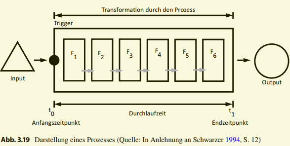

_**Prozesse transformieren einen oder mehrere Inputfaktoren durch die
Ausführung verschiedener Funktionen zu einem oder mehreren Output-Faktoren.** Deshalb kann von einem **Transformationsprozess** gesprochen werden, **der entweder Materie
(materielle Prozesse) und/oder Informationen verarbeitet (informatorische Prozesse).** Das Management der Prozesse in Anwendungssystemen beschäftigt sich mit informatorischen
Prozessen, weshalb auf die weitere Betrachtung materieller Prozesse verzichtet wird._ 

_Es zeigt **schematischen Aufbau eines Prozesses**. Zum Zeitpunkt t0 wird der
Prozess durch einen Trigger angestoßen und beginnt mit der Ausführung der Funktion F1. **Trigger sind Startereignisse, die durch Anwender des IS, durch Funktionen der Software oder durch externe Ereignisse angestoßen werden.** Nach Ende der Ausführung einer
Funktion wird die darauf folgende Funktion angestoßen, bis das Prozessende in t1 erreicht
ist.
Das Ergebnis des Prozesses ist ein Output, der in informatorischen Prozessen als Informationsprodukt bezeichnet werden kann. Der in Abb. 3.19 dargestellte Prozessablauf
zeigt eine sequentielle Folge von Funktionen, die um Verzweigungen erweitert werden kann, um komplexere und parallele Prozessabläufe darzustellen._

---
## Prozessauflösung

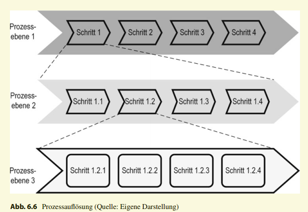

_**Die Prozessauflösung erlaubt die Gliederung eines Prozesses nach verschiedenen Kriterien.** Die **vertikale Prozessauflösung**
führt zur **Identifikation übergeordneter und untergeordneter Prozesselemente (Prozesshierarchisierung)**. In Abb. 6.6 wird jeder der Hauptprozesse in Untermengen gegliedert.
Diese werden als Subprozesse bezeichnet. Auch Subprozesse können ihrerseits in weitere
Subprozesse unterteilt werden, der Detaillierungsgrad lässt sich somit an die Anforderungen der Darstellung anpassen. Die unterste Ebene kann einzelne Tätigkeiten darstellen.Auf einem hohen Aggregationsgrad wird der Untersuchungsgegenstand häufig als Geschäftsprozess bezeichnet, wenn dieser der Erfüllung der obersten Ziele der Unternehmung (Geschäftsziele) dient und das zentrale Geschäftsfeld beschreibt. Die horizontale Prozessauflösung zielt auf die inhaltliche Trennung von Prozessen
auf der gleichen Abstraktionsebene hin. Durch die Prozessabgrenzung werden Funktionen
zu Funktionsfolgen bzw. Prozessen zusammengefasst.
Als Ergebnis der Prozessauflösung entsteht die Menge aller Prozesselemente, der Überund Unterordnungsbeziehungen sowie der Vorgänger- und Nachfolgerbeziehungen zwischen den Elementen._

---
## B. ARIS Konzept
_Das Modell der Architektur integrierter Informationssysteme (ARIS)_

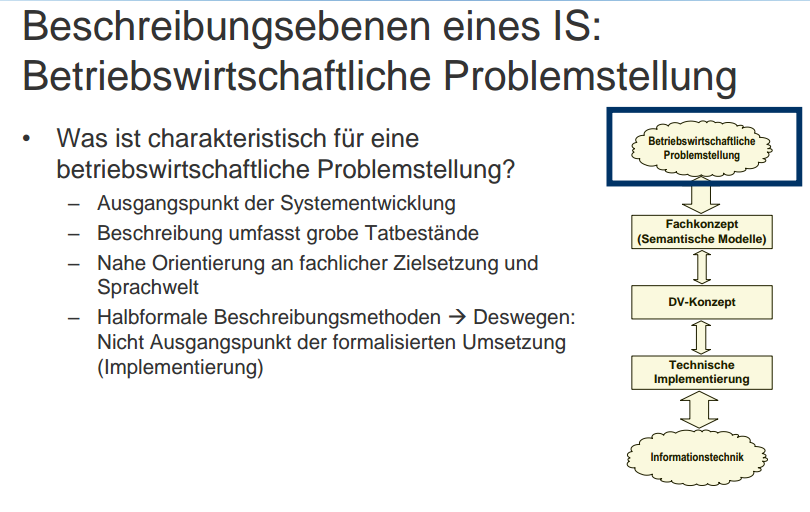
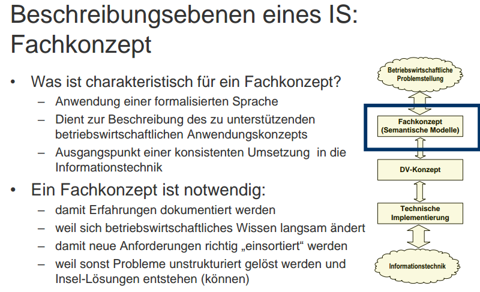
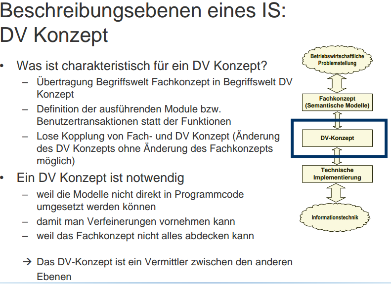
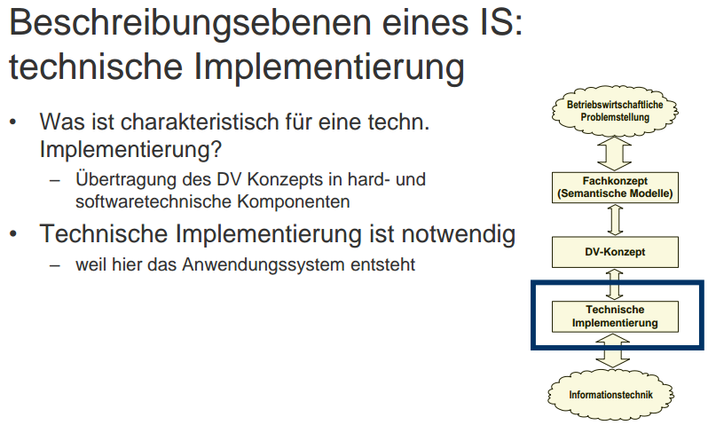
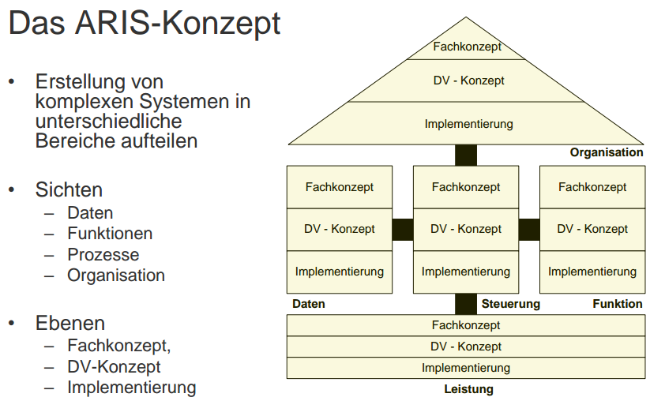

_ist die ARIS-Architektur
zunächst **auf die Gestaltung eines einzelnen IS gerichtet.** Ausgangspunkt der Entwicklung
der ARIS sind Vorgangskettenmodelle für betriebliche Bereiche. Der Ausgangspunkt Vorgangskette trägt dem Prozessgedanken Rechnung und berücksichtigt, dass der IT-Einsatz
der Unterstützung von Informationsprozessen dient. Der Ausgangspunkt bereichsorientierte Vorgangsmodelle wirkt allerdings einem bereichsübergreifenden Prozessgedanken
entgegen._

_In der ARIS kommt die Schichtung nach Techniknähe deutlich zum Ausdruck. Die
Unterscheidung von Fachkonzept, DV-Konzept und Implementierung betont die Notwendigkeit einer Abstimmung zwischen IT und den fachlichen Aufgabenerfüllungsprozessen.
Die Interpretation als Stufen eines Vorgehensmodells stellt eine Beziehung zwischen den Ebenen her. Die Anforderungen aus der fachlichen Aufgabenerfüllung werden systematisch der Gestaltung des IS zugeführt und durch IT unterstützt. Im Gegensatz zur ganzheitlichen Betrachtung der ISA bleibt bei ARIS die Einbettung des entworfenen IS in den Gesamtzusammenhang des Unternehmens unklar, da der Bezug zur Unternehmensstrategie nur implizit über die Vorgangsketten hergestellt wird._

---
## C. Prozessmodellierung mit EPKs und anderen Methoden

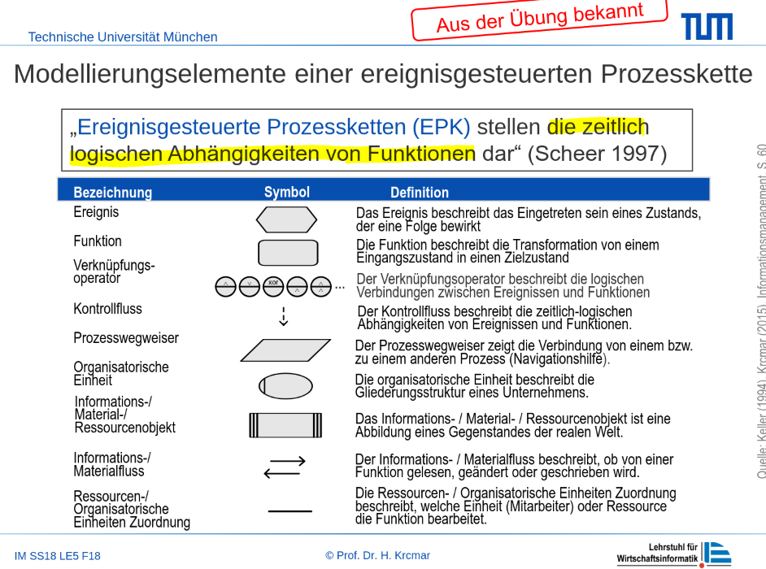
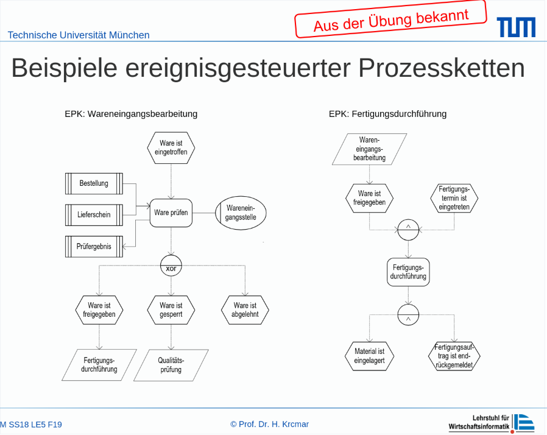
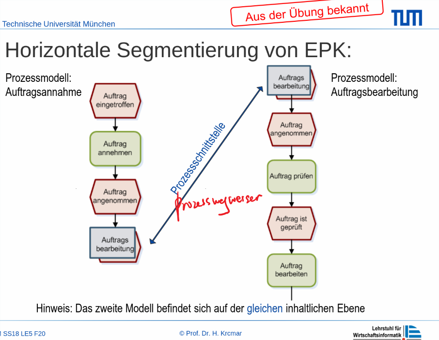
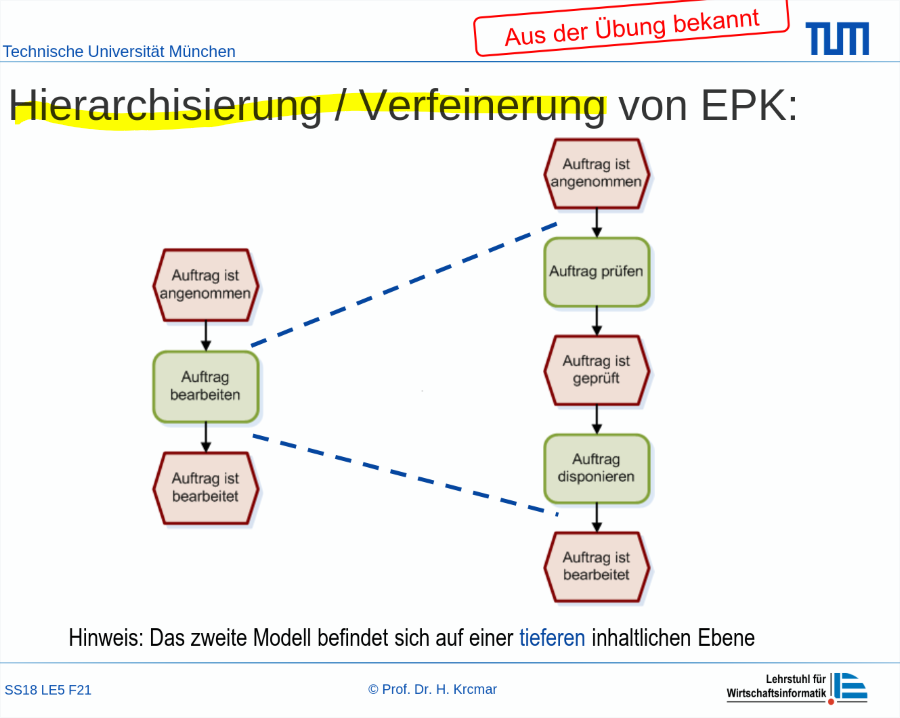

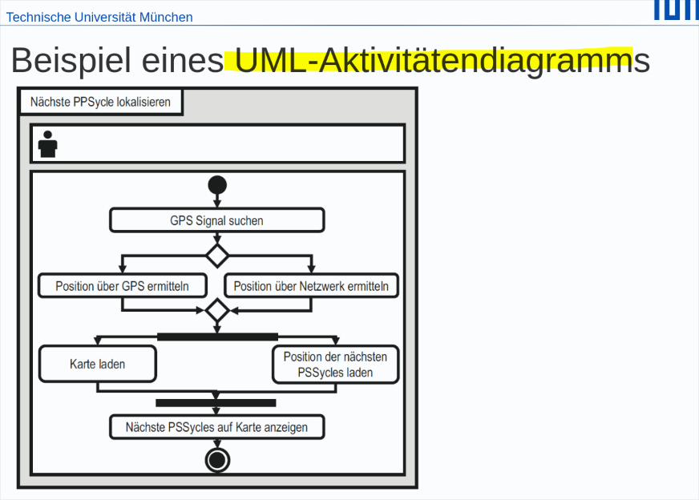
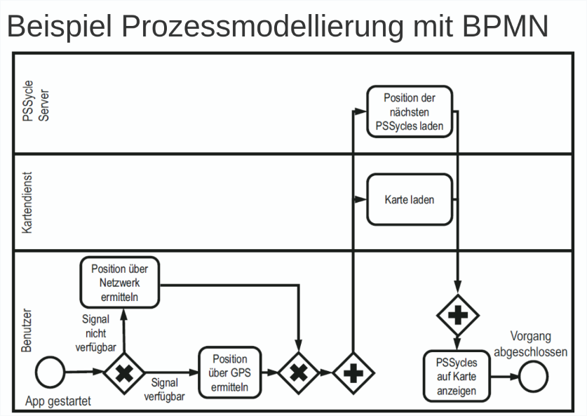

---
## D. Gestaltungsalternativen bei der Prozessmodellierung

### Gestaltungsalternativen bei der Modellierung

**Gestaltungsalternativen bei der Modellierung von Prozessen**
beziehen sich in erster Linie auf die Gestaltung des Ablaufs einer
Funktionsfolge
- Sequentielle Reihung
  - Reihung von Funktionen, Folgefunktion darf erst dann begonnen werden, wenn Vorgängerfunktion beendet ist
- Parallelisierung
  - Möglich, wenn Funktionen unabhängig voneinander ausgeführt werden können, Durchlaufzeitverkürzung
- Verzweigung
  - Bei alternativ unterschiedlichen Prozessabläufen
-  Wiederholungen
 - Mehrfache Ausführung einer Funktion/ Funktionsfolge unter festzulegender Bedingung
