# LE6

## LE6 Lernziele:

* das Konzept des **Anwendungslebenszyklus**
und die **Aufgaben**, die im Rahmen des Lebenszyklus
anfallen.

* Sie können **Methoden zur Softwareauswahl**, zur
**Beurteilung von Lizenzmodellen** und
**Softwareentwicklung** erläutern, beurteilen und
anwenden

---
## 1. Management des Anwendungslebenszyklus

### Funktionalitätsbedarf und -angebot bei Standardsoftware
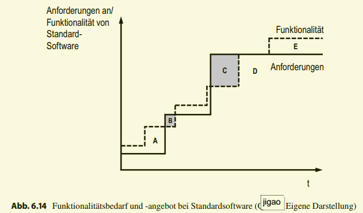

_Abbildung 6.14 zeigt die Entwicklung an Funktionalitätsbedarf und Funktionalitätsangebot durch Standardsoftware über die Zeit._

_**Die Idealsituation D**, in der das Angebot exakt dem Bedarf entspricht, stellt sich selten ein. Standardsoftware leistet demzufolge immer entweder zu viel oder zu wenig. **Die
    Situation A beschreibt den typischen Einstieg mit Software, die über einen - im Vorfeld准备阶段 reduzierten - Anforderungsbedarf hinaus etwas Puffer bietet.** **In den Situationen B und C**
hingegen wird die **Situation des Wartens auf ein neues Release nach gewachsenen Anforderungen dargestellt**, während die **Weiterentwicklung der Software in E** den Ansprüchen vorauseilt. Dadurch entsteht wiederum ein „Angebotsdruck“, der zu weiter steigenden Anforderungen führt, die in manchen Fällen ohne die Weiterentwicklung gar nicht entstanden wären_

### Anpassung von Standardsoftware an betriebliche Erfordernisse

| Situation                 | Anpassungsweg                                                                        | Probleme                                                 |
| ------------------------- | ------------------------------------------------------------------------------------ | -------------------------------------------------------- |
| Zusammenfallen            | -                                                                                    | Entweder-oder-Entscheidung                               |
| Ausnutzen                 | viele Funktionen viele Tabellen                                                      | Auswahlproblem, Komplexität                              |
| Dauerhafte Anpassung      | Anpassung innen (Modifikation)， Anpassung außen (Ergänzung durch Satellitensysteme) | Übernahme neuer Versionen Schnittstellen Wartungsaufwand |
| Fallspezifische Anpassung | Workflow Management                                                                  | Beherrschbarkeit, Erlernbarkeit                          |

_Bei großen modularen betriebswirtschaftlichen Anwendungen ist diese Aufgabe der Anpassung durch Veränderung von Parametern **so komplex**, dass sich ganze Unternehmensabteilungen und auch externe Unternehmensberater darauf spezialisiert haben. Aufgrund dieser Situation kann **eine Abwägung von Anpassungsmöglichkeiten erfolgen**, die auf die in Tabelle dargestellten Alternativen hinauslaufen._

_Falls Funktionalitätsangebot und -bedarf **zusammenfallen**, bleibt als Problem nur die Entscheidung des **„Ja“ oder „Nein“ Entschedung der Anschaffung von Standardsoftware.**_ 

_In vielen Fällen allerdings ergibt sich die Frage der richtigen **Ausnutzung**, denn außerordentlich **viele verfügbare Funktionen** erzeugen ein Auswahlproblem und **sehr viele Tabellen zur Parametrisierung erhöhen die Komplexität.** In beiden Fällen ist es notwendig, Know-how
über die Nutzungsmöglichkeiten der Software zu besitzen, ohne daraus gleich den Zwang zur Umsetzung aller Möglichkeiten abzuleiten. Das Kernproblem bei der Einführung von ausgereiften, umfangreichen Software-Produkten ist es, übermäßig komplexe Prozesse zu vermeiden, also dem „Angebotsdruck“ zu begegnen._

_Hinsichtlich der **dauerhaften Anpassung** ist zwischen der **Anpassung nach innen (Modifikation) und der äußeren Anpassung durch ergänzende Satellitensysteme** zu unterscheiden. Theoretisch besteht die Möglichkeit, ein Standardprodukt als Ausgangsbasis zu nehmen und dieses durch modifizierende Programmierung exakt auf die Bedürfnisse des Unternehmens anzupassen. Dieser Weg ist in der Vergangenheit vielfach beschritten worden, macht aber einen der Hauptvorteile von Standardsoftware zunichte. Dieser besteht in
der Weiterentwicklung durch den Anbieter zum Vorteil aller Anwender. Denn bei unternehmensspezifischer Modifikation stellt die Übernahme neuer Versionen ein Problem dar, so dass generell davon abzuraten ist Aus diesem Grund hat die Alternative der Parametrisierung von Software kontinuierlich an Bedeutung gewonnen. Wird die Standardsoftware ergänzt, ergeben sich Fragen der
Schnittstellengestaltung zum Standardprodukt und des Wartungsaufwandsmanagements._

_Im kleineren Rahmen wird bei der **fallspezifischen Anpassung** eine individuelle Interpretation der Prozesse innerhalb der Standardsoftware vorgenommen (**Workflow Management**), wobei ein höherer Aufwand bei **Beherrschbarkeit und Erlernbarkeit** zu konstatieren ist_

---
### Modellorientierte Einführung von Standardsoftware

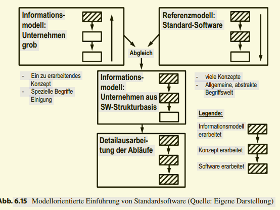

_Unabhängig von Ausmaß规模，面积 und Aufwand der Parametrisierung bzw. der organisatorischen Anpassung ist bei der **Einführung von Standardsoftware eine Implementierung auf der bestehenden IT-Infrastruktur und eine Integration mit anderen, bereits operativen Anwendungen durchzuführen.** Abbildung 6.15 zeigt die Einführung bei einer modellorientierten Vorgehensweise._

_Prinzipiell lassen sich die alternativen **Startpunkte „Unternehmen“ und „Standardsoftware“ identifizieren.** Während ein **Informationsmodell des Unternehmens, in Abb. 6.15 links oben** dargestellt, auf ein mit spezifischen Begriffen unterlegtes, allerdings in den
meisten Fällen noch zu erarbeitendes Konzept hinführt, sind **in den sog. Referenzprozessen komplexer Standardsoftware zumeist zahlreiche Konzepte realisiert**, die sich allerdings in einer abstrakten und allgemeinen Begriffswelt manifestieren显示，说明. In jedem Fall sollte bei einer modellorientierten  Vorgehensweise auf der obersten Ebene der Informationsmodelle ein Abgleich zwischen den Begriffswelten stattfinden, der zu einem Informationsmodell des
Unternehmens mittleren Detaillierungsgrads in der benötigten Form führt. Erst auf dieser Basis kann die Detailausarbeitung der Prozesse im Unternehmen mit der Standardsoftware effizient und zielgerichtet erfolgen._

---
### Anforderungen an Software
* 
* Funktionalität
* 
* Parametrisierbarkeit
* 
* Kompatibilität zur installierten Basis
* 
* hohe Datenverfügbarkeit
* 
* Benutzerfreundlichkeit (Aufgabenangemessenheit,
* Selbstbeschreibungsfähigkeit, Steuerbarkeit, Erwartungskonformität, Fehlerrobustheit)
* 
* Effizienz
* 
* Sicherheit
* 
* Anschaffung (Lieferzeit, Kaufpreis, Wartung, ..)
* 
* Anbieter (Service-Zentrum, Qualifikation, Referenzkunden, ...)

---
### Alternativen der Softwarebereitstellung
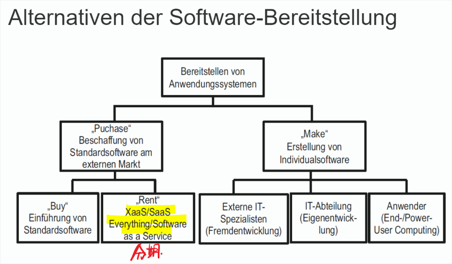

_Abbildung beschreibt die **grundlegenden Alternativen einer Make-or-Buy-Entscheidungssituation**. Für die **Eigenerstellung(Make) existieren drei Umsetzungskonzepte**: **Entweder übernehmen externe IT-Spezialisten die Entwicklung der Individualsoftware** oder die **IT-Abteilung des Unternehmens** verfügt über genügend große Ressourcen, das SoftwareProjekt umzusetzen. Bei unternehmensinterner Entwicklung ist auch eine Aufstockung增加(资金),增资 der eigenen Ressourcen denkbar. Eine Sonderstellung nimmt das **End-User oder Power-User-Computing** ein. Ersteres
charakterisiert den konventionellen und letzteres den erfahrenen Fach-/Hauptanwender.
    Diese Alternative - auch als Individuelle Datenverarbeitung (IDV) bezeichnet - beschreibt
die Möglichkeit, die Entwicklung von (Arbeitsplatz-)Software den Endusern zu übertragen. Dieses Vorgehen wird trotz gegenteiliger Erwartungen oft verwendet, selbst wenn
bereits integrierte Informationssysteme in Unternehmen verwendet werden. Versierte Anwender erstellen (Kleinst-)Anwendungen, die sie bei der Verrichtung ihres Alltagsgeschäfts unterstützen sollen. ~~Ein typisches Beispiel ist der Vertriebsmitarbeiter, der aus dem ERP-System Vertriebsdaten auf sein lokales Dateiverzeichnis exportiert und diese in einem Tabellenkalkulationsprogramm mit von ihm entwickelten Makros und Pivot-Tabellen weiterverarbeitet. Da die Komplexität der zu entwickelnden Software beim End-/PowerComputing nicht die Fähigkeiten der Enduser übersteigen sollte, setzt man Entwicklungsplattformen ein. Jedoch werden durch die individuelle Datenverarbeitung neue Problemfelder eröffnet. Kritisch sind der unkontrollierte Einsatz unterschiedlicher, zum Teil nicht kompatibler Hard- und Software (Wildwuchs, Insellösungen), die Gefahr von Doppelentwicklungen grundlegender Problemlösungen, wodurch Kapazitäten gebunden werden,
sowie die Existenz mehrerer Datenbanken teilweise gleichen Inhalts, die kaum auf dem
gleichen Stand gehalten werden können. Häufig werden die schnell entwickelten Problemlösungen von den Anwendern nicht umfassend dokumentiert, so dass eine Systempflege
nach Weggang des Mitarbeiters nur schwer möglich ist. Um diese Probleme zu lösen, gibt
es Anstrengungen, v. a. seitens der System-Anbieter, das End-/Power-User-Computing zu
harmonisieren und zu standardisieren, z. B. durch Bereitstellung von Export- aus den sowie Importfunktionen in die eingesetzten Informationssystemen~~_

_Im Zusammenhang mit der technischen Entwicklung und ihrer gestiegenen Bedeutung ist der Anteil der betrieblichen Standardsoftware ständig gestiegen. Besonders in den Bereichen der IDV mit Textverarbeitung, Tabellenkalkulation und Präsentationsgraphik, aber auch in den betriebswirtschaftlichen Kernfunktionen wie Finanzbuchhaltung, Auftragsbearbeitung oder Produktionssteuerung nimmt die Standardsoftware mit ihrer unternehmensübergreifenden oder auch branchen- übergreifenden Ausrichtung einen immer höheren Stellenwert ein. Der Kauf betrieblicher Standardsoftware lässt sich, wie der linke Ast in Abb. 6.17 veranschaulicht, unterteilen, **in „Buy“ und „Rent“ („Everything as a Service“) unterteilen**. Der erste Fall beschreibt den Kauf, bei dem ein Unternehmen die einzusetzende Software zu einem bestimmten Versionsstand vom Softwarehersteller kauft und im Rahmen des Lizenzvertrags einsetzen darf. Die zweite Alternative hat ihren Ursprung im Application Service Provider (ASP)- Gedanken, welcher sich in den letzten Jahren zum Everything as a Service-Paradigma gewandelt hat._

_An dieser Stelle soll **Software as a Service (SaaS) betrachtet und bezüglich Everything
as a Service (XaaS)** auf Abschn. 10.4.4 verwiesen werden. In Analogie zu den Application
Service Providern, versteht man unter Software-as-a-Service eine vertraglich vereinbarte
  Dienstleistung, gegen eine periodisch zu entrichtende Zahlung - Miete oder (Leasing-)
  Gebühr - Zugang zu einem zentral verwalteten und meist verteilten Software-System zu
    erhalten. Darüber hinaus - und darin liegt der wesentliche Unterschied zu ASP - deckt
diese Vereinbarung weitere Leistungen, wie z. B. (Daten-)Backup, Schulung etc.
Die wesentlichen Vor- und Nachteile von Standard-Software gegenüber eigenentwickelter Software werden im Folgenden aufgelistet._

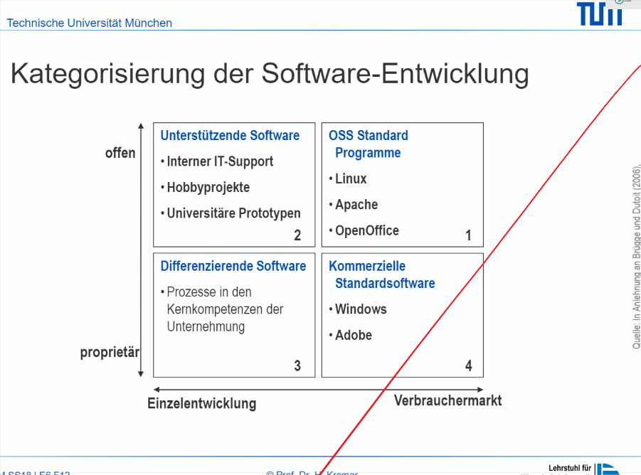
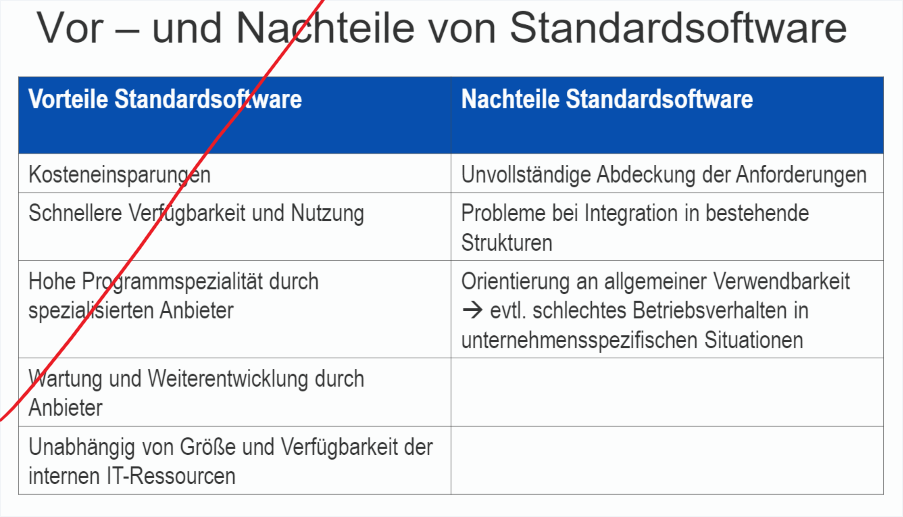
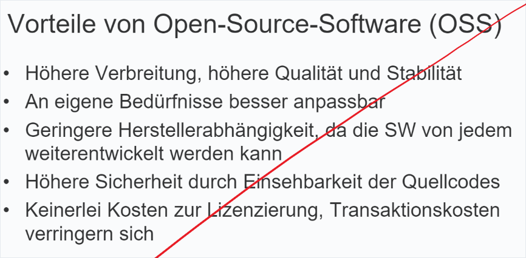

---
## Software-Lizenzmodelle

| Modelltyp und primäre Bezugsgröße                                                                      | Ausgewählte Beispiele für Lizenzmodelle in der Praxis                                               |
| ------------------------------------------------------------------------------------------------------ | --------------------------------------------------------------------------------------------------- |
| Primär nutzerbezogene Modelle: **Anzahl der Nutzer**                                                   | Definierte  Nutzer vs. indirekter Zugriff, Lizenzkosten pro Bürger, Lizenzkosten während Evaluation |
| Primär wertbezogene Modelle: z. B. **Personalbestand oder Herstellungskosten der verkauften Produkte** | Lizenzen für Personaladministrations-SW, Lizenzen für Planungs- und Dispositionssysteme             |
| Primär zeitbezogene Modelle: **Dauer der Nutzung**                                                     | Subskription (Abonnement)                                                                           |
| Primär infrastrukturbezogene Modelle: **Ausmaß der Nutzung der genutzten Infrastruktur**               | Pro-Device-Lizenz, Abrechnung nach Prozessor- oder Speichernutzung                                  |

_Mögliche Lizenzmodelle fasst Tabelle zusammen. Die in der Praxis vorzufindende Ausgestaltung der Lizenzmodelle unterschiedlicher Softwarehersteller ist in der Regel sehr individuell und nicht standardisiert. Diese Vielfältigkeit an Softwarelizenzmodellen ist u. a. darauf zurückzuführen, dass aus Sicht des Anbieters Software ein Produkt mit hohen Fixkosten und niedrigen
variablen Kosten ist. Dies erhöht dessen Gestaltungsspielraum bei der Preisbildung._

_Neue Trends zur bedarfsorientierten Dienstleistung im Rahmen der Softwareüberlassung, wie z. B. SaaS (Software-as-a-Service), führen oft zu Modifikation und/oder Kombination der in Tab. 6.4 vorgestellten Modelle. Daher finden sich auch zusätzlich zu den gezeigten noch weitere Klassifikationen. So z. B. im Bereich XaaS oder Cloud Computing
On-Demand-Lizenzen, bei denen pro verbrauchter Einheit (per use), z. B. Transaktionsaufruf etc. oder anhand eines Nutzungswerts (per value) die Lizenzkosten berechnet werden.
Darüber hinaus gibt es auch Prepaid-Tarife (Gull und Wehrmann 2009, S. 325), bei dem man ein vorher gekauftes Kontingent sukzessive aufbraucht. Die in der Praxis vorkommenden Lizenzmodelle für kommerzielle Anwendungen unterscheiden sich hauptsächlich in den Bezugsgrößen, die für die Ermittlung der Lizenzkosten herangezogen werden. Im Folgenden werden die in Tab. 6.4 aufgeführten Beispiele für Lizenzmodelle näher erläutert_

Primär nutzerbezogene Lizenzmodelle
Der Gesamtvertragswert dieses Modells setzt sich primär aus den Lizenzgebühren für
die Anzahl „definierter“ Nutzer (named users) unterschiedlicher Kategorien zusammen,
z. B. Entwickler, Standard-Anwender, Nutzer einzelner Module oder Komponenten wie
Personalwesen, Basis-Nutzer („Admin“) etc. Hinzu kommen weitere Kostenbestandteile,
bspw. Kosten für Ergänzungsprodukte, Länderaufschläge für Nutzer bestimmter Staaten
und Kosten für eine mögliche Datenbanknutzung.
Für den Einsatz in Internetanwendungen und kooperativen Szenarien (siehe Kap. 10)
muss das nutzerbasierte Lizenzmodell auf Angemessenheit überprüft werden: Denn viele
Zugriffe auf Softwareanwendungen wie Enterprise Ressource Planning (ERP) Systeme
werden nicht direkt von bekannten (und definierten) Nutzern vorgenommen, sondern über
Fremdsysteme wie bspw. einem Webshop, der an ein ERP-System angebunden ist. Eine
ähnliche Problematik ergibt sich durch Technologien wie Web Services, Portale und die
Integration heterogener Systeme. Eine Alternative, dieser Herausforderung an ihr Lizenzmodell zu begegnen, zeigt z. B. die SAP AG mit dem Nutzertyp Externes CommunityMitglied (SAP AG 2003, S. 13).
Die Lizensierung der SAP AG stellt ein ausgereiftes Beispiel primär nutzerabhängiger
Lizenzmodelle dar und verdeutlicht zugleich, dass sich die Lizensierungskostenermittlung
nicht als trivial erweist.
Primär wertbezogene Lizenzmodelle
Im Gegensatz zu den primär nutzerbezogenen Lizenzmodellen wird beim wertbasierten
Ansatz die Lizenzgebühr an den Wert einer vorher definierten Kennzahl gekoppelt. Im
Bereich der Personalabrechnung ist z. B. der Personalbestand eine häufig verwendete
Determinante für die Lizenzkosten der eingesetzten Software (Wilderman 2002). So ist
beim Einsatz des so genannten HCM-Moduls (das Human Capital Management Modul)
von SAP R/3 beispielsweise neben den Lizenzen für die Nutzer der HCM-Funktionen eine weitere Lizenzgebühr je 1000 Personalstammsätze fällig (SAP AG 2003, S. 16). Für
Planungs- und Dispositionssysteme werden häufig die Herstellungskosten der verkauften Produkte als bestimmender Faktor für die Lizenzgebühren herangezogen (Wilderman
2002).

Subskription als zeitbezogenes Lizenzierungsmodell
Traditionell wird Software mit einer dauerhaften Nutzungslizenz verkauft, denn die Software wird eingeführt und dann lange Zeit genutzt. Üblicherweise fallen für den Kunden
neben laufenden Lizenzkosten weitere Kosten für Zusatzleistungen an, z. B. Updates und
Upgrades. Beim Abonnement-(Subskriptions-)Modell bezahlt zwar der Kunde eine relativ
geringere Summe für die Nutzungslizenz, jedoch sind dann diese Zusatzleistungen nicht
Bestandteil des Lizenzvertrages und werden daher bei jedem Erscheinen neu angeboten
und berechnet. Eine Studie Ende 2008 hat ergeben, dass von den angebotenen Lizenzmodellen der befragten Softwarehersteller 34 % Subskriptionsmodelle sind; bis 2010 wird
ein Anstieg diese Anteils auf 45 % erwartet (Acresso Software 2008, S. 6). Ein Beispiel
für ein derartiges Lizenzmodell sind die Statistiksoftwareprodukte der Firma SAS, die bereits seit 1976 diese Strategie verfolgt. Damals entsprach das Lizenzmodell zudem noch
dem Subskriptions-Modell der IBM Mainframes, auf denen die SAS-Anwendungen liefen. Auch Microsoft hatte sein Betriebssystem Windows XP mit einem Lizenzmodell
vertrieben, das die Kunden verpflichtete, alle zwei Jahre ein Update zu beziehen. Zu
erwarten ist, dass die Umsätze mit Subskriptions-Softwarelizenzen steigen und gleichzeitig Umsätze mit traditionellen Lizenzen leicht zurückgehen werden. Eine Ausnahme
bilden Anbieter von Unternehmenssoftware, die das Subskriptionsmodell eher nicht adaptieren werden, falls die Lizenzen zu abschreibungsfähigen Bilanzpositionen bei den
Kunden führen.
Infrastrukturbasierte Lizenzmodelle
Das infrastrukturbasierte Lizenzmodell richtet sich am Ausmaß der Nutzung der Infrastruktur als eine im Vorfeld definierte Größe aus. Ein Beispiel hierfür ist die endgeräteabhängige Lizenzierung von Microsoft Exchange 2003. Microsoft bot zwei Modelle an:
Pro-User- und Pro-Device-Lizenzen. Während die Pro-User-Lizenz es einem bestimmten User erlaubt, von beliebigen Endgeräten, z. B. Desktop, Laptop etc. die Software zu
nutzen, koppelt die Pro-Device-Lizenz die Nutzung an das Endgerät, d. h. mehrere User
können von einem bestimmten Endgerät aus auf die Anwendung zugreifen. Somit haben
z. B. viele „schreibtischlose“ Mitarbeiter E-Mail-Zugang, wie dies in Werkstätten üblich
ist (Fontana 2003).

---
## Grundlagen des SAP-Lizenzmodells
* Subskriptionsbasierte Lizenz:
  - Diese ist ausschließlich für **Cloud-basierte** SAP-Lösungen verfügbar
  - Diese ermöglicht einem einen **zeitlich beschränkten Zugriff** auf SAPLösungen
  -  Am Anfang hat man eine bestimmte **Mindestlaufzeit**, anschließend muss die Lizenz in **regelmäßigen abständen erneuert** werden

* Kontinuierliche Lizenz
  -  Großteil der SAP Lizenzen sind kontinuierliche Lizenzen
  - Diese ermöglicht einem einen **zeitlich unbeschränkten Zugriff** auf SAPLösungen
  - Sie besteht aus **Paketlizenzen, Nutzerlizenzen und einem Wartungsvertrag**

### Bestandteile der kontinuierlichen Lizenz

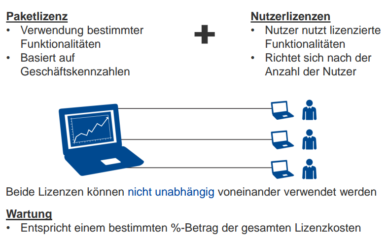

---
## Kriterien für die Bewertung von Lizenzmodellen

* Geringe Initialkosten ->
Subskriptions-Lizenzmodell

* Testphase ->
userbezogene Lizenzierung

* Gemeinsamer Zugriff mehrerer User ->
Pro-Device-Lizenzen

* Flexible Infrastruktur ->
infrastrukturbezogenes SoftwareLizenzmodell

* Regionale oder branchenspezifische Besonderheiten
->
wertbasiertes Lizenzmodell

* Application Service Provider oder Cloud Provider ->
ServiceProvider-Lizenzmodelle

Sollen für den Nutzer der Lizenz relativ geringe Initialkosten anfallen, profitiert man
beim Subskriptions-Lizenzmodell von den geringen Kosten zu Beginn der Vertragsbeziehung. Die Kosten werden in Form von Subskriptionsgebühren fortlaufend entrichtet,
woraus sich eine langfristige Beziehung zum Softwareanbieter entwickeln kann. Darüber
hinaus harmoniert das Modell mit dem Konzept einer flexiblen Infrastruktur: zunächst
geringe IT-Investitionen, die mit steigenden Anforderungen wachsen.

Wird auf IKT-Ebene eine flexible Infrastruktur eingesetzt, die für den Betrieb der
zu lizenzierenden Software verwendet wird, sollte ein primär infrastrukturbezogenes
Software-Lizenzmodell dynamische Anpassungen der Infrastruktur, z. B. das Deaktivieren einer CPU, berücksichtigen.
Befindet man sich in einer Testphase, ist die userbezogene Lizenzierung eine interessante Alternative. Die Pro-Nutzer-Lizenzierung für einzelne Testuser verhindert aufwändige Genehmigungsprozesse für teure Lizenzen im Unternehmen.
Falls ein gemeinsamer Zugriff mehrerer User geplant ist, um z. B. „schreibtischlosen“ Mitarbeitern den Zugang zu einer Anwendung zu ermöglichen, bieten sich ProDevice-Lizenzen an, bei denen die Lizenzkosten pro Endgerät anfallen. Wird auf das
zu lizenzierende Produkt nicht von einem (Dialog-)User zugegriffen, sondern z. B. über
Fremdsysteme, Web Services oder Portale, spricht man von einem indirekten Zugriff . Für
diesen Fall stellen manche Anbieter einen speziellen Nutzertyp bereit.
Liegt der Nutzung der Software ein wertbasiertes Lizenzmodell zugrunde, sollten bei
Lizenzverhandlungen auf jeden Fall die Bestimmung einer angemessenen und „fairen“
Bezugsgröße berücksichtigt werden. Dies ist vor allem dann entscheidend, wenn regionale
oder branchenspezifische Besonderheiten vorliegen. So ist beispielsweise bei den Herstellungskosten der abgesetzten Produkte zu berücksichtigen, dass diese nach US-GAAP
anders ermittelt werden als nach HGB. Zudem müssen bei Großhändlern, die ihren Gewinn weniger durch große Margen als vielmehr durch hohe Mengen erwirtschaften und
daher tendenziell hohe Umsatzkosten aufweisen, angepasste, d. h. niedrigere Multiplikatoren für die Ermittlung der Lizenzgebühren angesetzt werden. Tritt ein Unternehmen als
Application Service Provider (ASP) auf, so sind speziell auf dieses Szenario ausgerichtete
Service-Provider-Lizenzmodelle sinnvoll, um die gehostete Software kostengünstig anzubieten (Walsh 2003, S. 106). Microsoft bietet bspw. für Systemhäuser ein Service Provider
License Agreement an, das sich selbst wiederum aus nutzerbezogenen oder infrastrukturbezogenen Lizenzmodellen zusammensetzt.

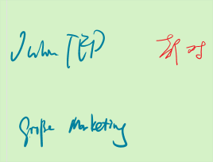

---
##  Lebenszyklus-Modell 

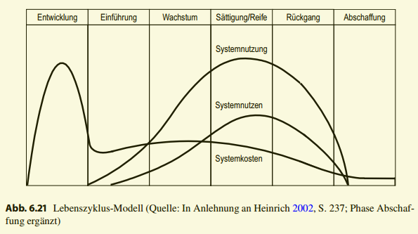
_Nachdem verschiedene Alternativen der Softwarebereitstellung betrachtet wurden, wird nun der **Lebenszyklus einer Anwendung** beschrieben, dem Entwicklung, Einführung und operativer Betrieb unterliegen. Die in Abb. 6.21 dargestellten Kurvenverläufe
repräsentieren keine kumulierten Werte, **sondern nichtkumulierte Werte zu einem bestimmten Zeitpunkt**._

* **Entwicklung**: die Schritte der **Ideenfindung und -verwirklichung** der Software-Entwicklung durchlaufen. In der Entwicklung fallen während des Lebenszyklusses die höchsten Kosten an.
* **Einführung**: Erfolgt eine schrittweise Einführung, ergibt sich **eine wachsende Nutzung.** Die Nutzungsintensität wird auch vom Auftreten und Beseitigen von Fehlern während der Installationstests und zu Beginn des produktiven Betriebs bestimmt.
* **Wachstum**: **alle Tests abgeschlossen, alle während der Einführung aufgetretenen Fehler beseitigt und alle Funktionen können produktiv genutzt werden.** **Die Nutzung nimmt durch weitere Nutzer zu**, sofern es sich nicht um eine Basisanwendung mit beschränktem Benutzerkreis handelt.
* **Sättigung/Reife**: erreicht die Nutzung ihren Höhepunkt. Bisherige Nutzer können keine weiteren Nutzungsmöglichkeiten entdecken und weitere Nutzer kommen nicht mehr hinzu. Der Rückgang kann daran liegen, dass das System nicht mehr dem Stand der Technik entspricht, mit anderen konkurriert oder die Menge und Bedeutung der unterstützten Aufgaben zurückgeht.
* **Rückgang**: Der in der Phase Sättigung饱和/Reife einsetzende Rückgang setzt sich fort.
* **Abschaffung**: Hier muss die Entscheidung getroffen werden, zu welchem Zeitpunkt ein
System durch ein neues abgelöst wird. Über den Zeitpunkt der Nutzung hinaus kann
das auslaufende System noch Umstellungskosten oder auch remanente Lizenzkosten
verursachen.

---
## Überblick der Vorgehensmodelle zur Anwendungsentwicklung

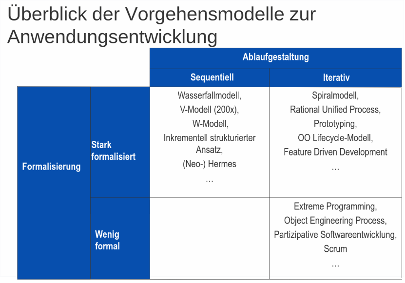
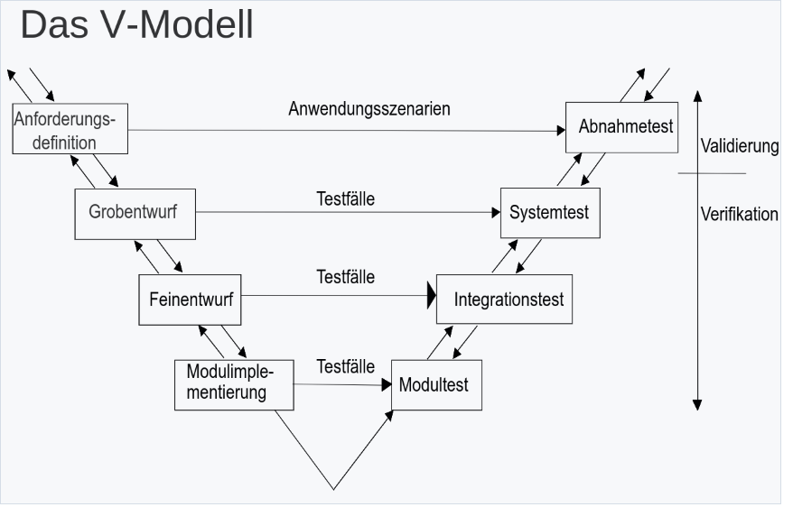
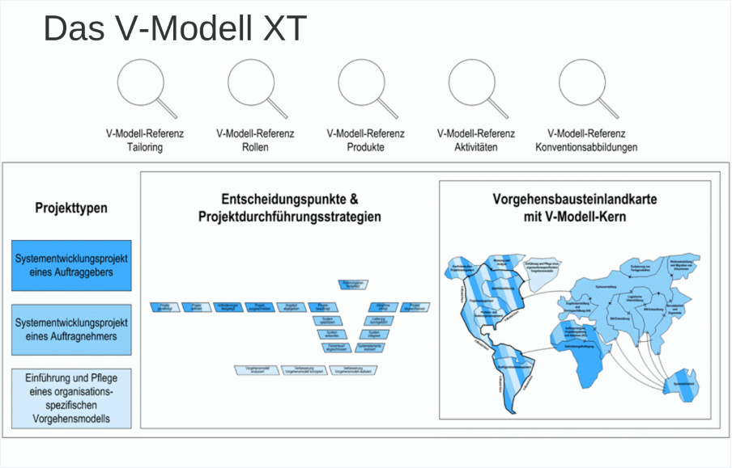
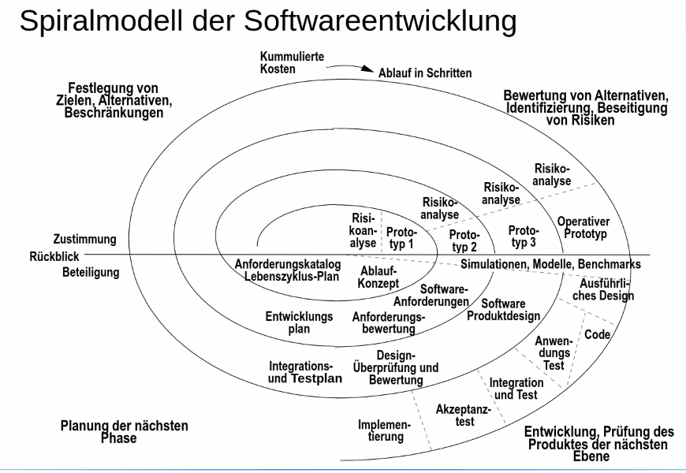
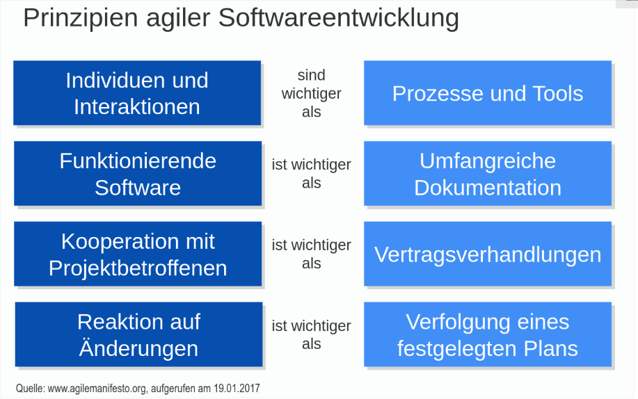
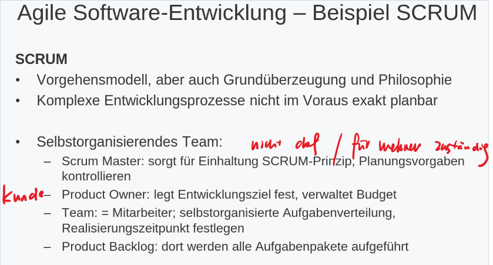
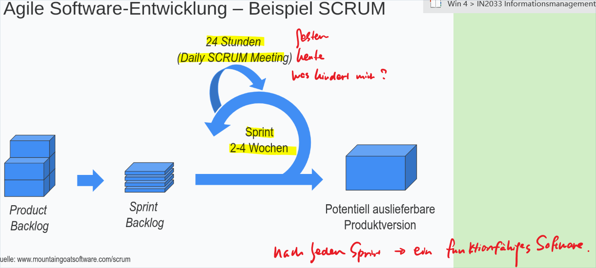
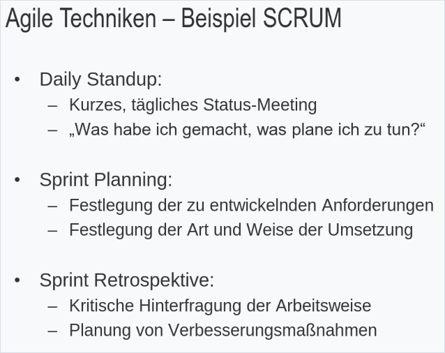
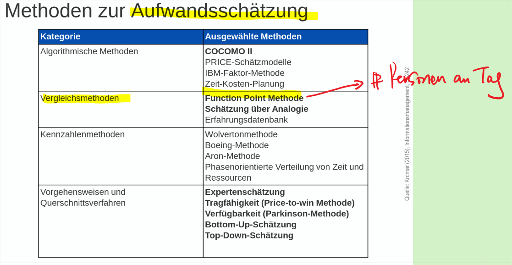
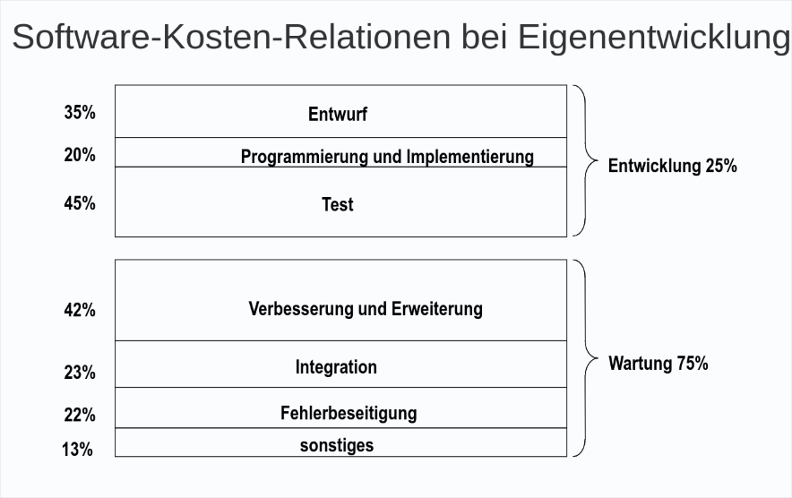
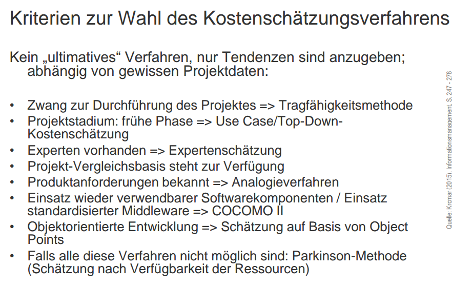

---
## 2. Einführung von Software

  ### Projekt - Produkt - Prozess
* Ein Projekt ist ein Vorhaben, dass im Wesentlichen durch
Einmaligkeit der Bedingungen gekennzeichnet ist, wie z.B.
  - Zielvorgabe,
  - Zeitliche, finanzielle und andere Begrenzungen,
  - Abgrenzung gegenüber anderen Vorhaben,
  - Projektspezifische Organisation.
* Produkt
  - als materieller oder immaterieller Gegenstand, der als Erzeugnis/ Ergebnis eines Tätigkeitsvorhabens bezeichnet werden kann und den Output von Projekten darstellt
* (Geschäfts-)Prozess
  - als sachlich-logische Abfolge von Unternehmensverrichtungen, die der Leistungserstellung dienen

### Alternativen der SW Einführung

* Stichtagsumstellung
  - Totale Umstellung vom vorherigen Zustand (kein System oder
altes System) auf die neue Anwendung zu einem Zeitpunkt
* Parallelisierung
  - Übergangsweise gleichzeitige Nutzung der alten (keine/alte
Anwendung) und neuen Methoden bis zur Sicherstellung der
Funktionsfähigkeit
* Teilweise Einführung
  - Durchführung einer Stichtagsumstellung für einzelne Teile der
neuen Anwendung durch Parallelisierung und allmähliche
Ausweitung nach Sicherstellung der Funktionalität

_Versionsumstellung_:
  _Um zu einer wesentlich höheren Version einer Software zu
gelangen, die einer gravierenden Änderung gleich kommt, kann
der Umweg über niedrigere Versionen notwendig sein_

_Für alle Konzeptionen bestehen die Aufgaben der Einführung in einer Vorbereitung des neuen Systems für den Echtbetrieb, der Installation, der Einspeisung供应 der notwendigen
Daten in die Anwendung und der Einweisung der Nutzer. Sind Daten bereits in größerem Umfang in der älteren Anwendung vorhanden, muss bereits vor der tatsächlichen Umstellung ein Konzept zur Datenübernahme entwickelt werden, so dass der operative Betrieb
direkt nach der Installation beginnen kann. Vor der Einführung werden Nutzer-Schulungen veranstaltet, in denen wesentliche Handhabungsschritte und gegebenenfalls wichtige Unterschiede zur Vorgänger-Anwendung aufgezeigt werden, um die Umstellungsphase so kurz wie möglich zu halten. Ist die Einführung erfolgreich abgeschlossen, geht die neu entwickelte Anwendung in den operativen Betrieb über._

---
## Spinnennetzdiagramm ausgewählter Implementierungsstrategien

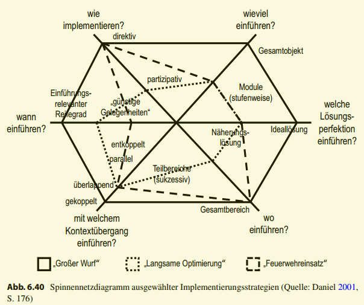

### Implementierungsstrategien
_Abbildung 6.40 zeigt **mögliche Implementierungsstrategie-Optionen bzw. -Dimensionen**
auf, deren konkrete Ausprägungen von der Projektleitung auf den jeweiligen situativen
Implementierungskontext eingestellt werden müssen. Die Frage „wo man es einführt“
(Gesamtunternehmen oder einzelne Bereiche) und die Optionen des Kontextübergangs
stellen die Kontextdimension dar. Die jeweiligen Ausprägungen der Verhaltensdimension („wie einführen“), Objektdimension („wieviel einführen“, „mit welcher Perfektion“) und
Zeitdimension („wann einführen“) sind weitere wichtige Stellschrauben.
An der Implementierungsstrategie „Großer Wurf“ (vgl. Abb. 6.40) ist die kurze Implementierungsdauer verlockend. Es darf jedoch nicht übersehen werden, dass diese Implementierungsstrategie mit einem sehr hohen Misserfolgsrisiko verbunden ist. Um das Qualitätsrisiko zu begrenzen, ist ein hoher Planungsaufwand notwendig, der seinerseits den
Einführungsbeginn hinauszögert. Zur erfolgreichen Durchführung eines „großen Wurfs“
ist zudem hinreichende Implementierungserfahrung unerlässlich. Die „langsame Optimierung“ bietet sich dann an, wenn Qualitäts- und Akzeptanzziele im Vordergrund stehen.
Notwendige Voraussetzung für diese Strategie ist, dass kein erhöhter Zeitdruck vorliegt.
Die Option „Feuerwehreinsatz“ ist zu nutzen, wenn Zeit- und Problemdruck zu schnellen
Erfolgen auf möglichst breiter Front zwingt. Dieser Erzielung früher Ergebniswirkungen
hat sich dann alles andere unterzuordnen._

---
## 3. Gesamtheit der Anwendungen

### Einordnung von IS-Architekturen
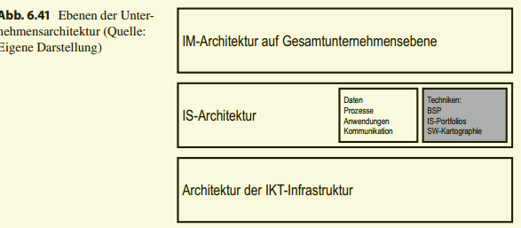

### Definition IS-Architektur
* „A software architecture describes the layout of the software modules and the connections and relationships among them. A hardware architecture
can describe how the hardware components are organized.“

* „Eine **IS-Architektur** ist die strukturierende Abstraktion existierender oder geplanter
Informationssysteme.

### Ziel der Entwicklung einer IS-Architektur
* Gemeinsame Kommunikationsplattform aller an der Gestaltung von Informationssystemen
Beteiligten zu schaffen
* Damit wird die Planbarkeit und die Steuerbarkeit der Gestaltung der betrieblichen Anwendungslandschaft erhöht