# LE7

## LE7 Lernziele
* **das Modell der Technikauswirkung** und
können es auf die Beurteilung neuer Techniken
anwenden. Sie können verschiedene Ansätze zur
**Technikaneignung** sowie den **Diffusionsansatz nach
Rogers** darstellen und Konsequenzen für die Praxis
ableiten.
* **Aufgaben und Rahmenbedingungen des
Managements der Verarbeitung**.

---
## 1. Management der Aneignung获得 von IKT

### Modell der Technikauswirkung - Inhalte, Ziel

* Änderungen der Technik -> adäquate Aneignung von IKT
* Wann sind Änderungen der Technik wesentlich?
* Bedarf für einfache Verfahren zur Unterstützung der IKTBeobachtung und -Beurteilung
* Bakopoulos (1985): Unternehmensleitung muss nicht jeden Bereich
der Technik im Detail und fortwährend beurteilen, aus dem Modell
sind jedoch die sich eröffnenden Potenziale der IKT ableitbar, die
tatsächlich zu beachten sind

### Modell der Technikauswirkung - Ausprägungen 
* Speicherkapazität
  - Kontinuierlich **steigender Umfang** der Datenbasis
  - Ursache **fallende Kosten** pro Speichereinheit
* Qualität der Speicherung
  - **Angemessenheit der Daten** in Bezug auf eine Entscheidung fällt mit der Zeit, die ein Suchmechanismus benötigt, um bestimmte Daten zu finden
  - Qualität fällt mit abnehmendem Wissen der Nutzer über Inhalte der gespeicherten Daten
  - Größere Datenbasis, längere Suchzeiten, geringerer Überblick, aber höhere Wahrscheinlichkeit, dass die benötigten Daten dabei sind, Ausgleich der beiden Effekte
* **Stückkosten der Speicherung**
  - Stückkosten je gespeicherter Einheit eines Datums **stark fallend**
  -------
* **Kapazität** der **Verarbeitung**
  - Anwendungssysteme bieten immer **mehr Funktionalität**
* **Qualität** der Verarbeitung
  - **Höhere Benutzerfreundlichkeit** durch Ergonomie der Oberfläche oder verbesserte Hilfetexte
* **Stückkosten der Verarbeitung**
  - **Für eine Transaktion sinkend**, da zunehmende Zahl von Funktionalitäten bei gleich bleibenden Hardware-Kosten
  - **Je Nutzer ungefähr gleich**, da die Ansprüche der Nutzer mit der technologischen Entwicklung ungefähr Schritt halten
  -----
* **Kapazität** der **Kommunikation**
  - Größe des Netzwerkes und damit die Erreichbarkeit von Personen **nimmt zu**, je mehr Nutzer angebunden sind
  - Für die Kommunikation ist es wichtig, eine kritische Masse zu erreichen
* **Qualität** der Kommunikation
  - Eignung der Medien zu adäquaten Übermittlung einer Nachricht **steigt**
* **Kosten** der Kommunikation
  - Kosten je Nachricht und je Nutzer **stark sinkend**
  - Wachstum des Marktes, Preiskampf und Breitband-KommunikationsInfrastruktur
  
Technik ändert sich fortlaufend, doch nicht jeder Bereich muss kontinuierlich
beobachtet und beurteilt werden. Aus dem Modell ist ersichtlich, welche
Potenziale der IKT relevant sind:

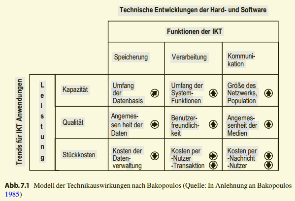

---
## Diffusion扩散
* Diffusion beschreibt den **Prozess der raum-zeitlichen
Ausbreitung einer Innovation** in einem sozialen System.
Die Diffusion einer Innovation findet durch die **Adoption (Annahme) der Innovationen** durch einzelne Individuen
statt.
* **Zentrales Objekt** der Diffusionsforschung ist die
**Innovation**, die eine **mit** technischem, sozialem oder
wirtschaftlichem **Wandel einhergehende Neuerung**
darstellt -> ein IS wird für das einzelne Unternehmen in diesem Kontext als
eine solche Neuerung verstanden

### Abgrenzung Diffusion - Adoption - Akzeptanz 

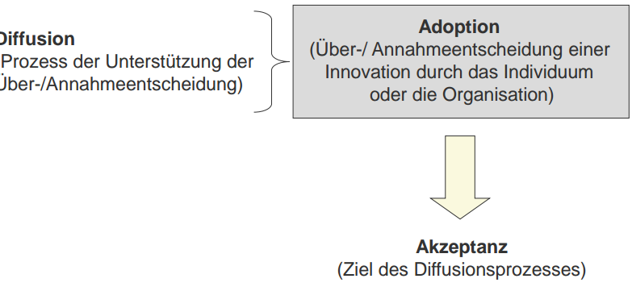
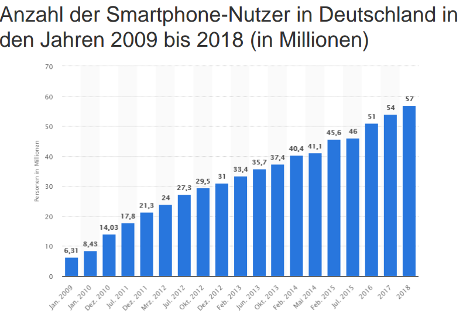

### Klassisches Diffusionsmodell (nach Rogers)

* Modell der Diffusionstheorie **zunächst bezogen auf
Individuen** als Adoptereinheiten!

* **Begriff der Diffusion (nach Rogers):**
  
  „…der Prozess, durch den eine **Innovation** mittels
  verschiedener **Kanäle** über eine **Zeit** hinweg den Mitgliedern eines **sozialen Systems** kommuniziert wird…“

  -> daraus ergeben sich **4 Eckpunkte der Diffusionstheorie**:
  * Innovation selbst
  * Kommunikation über Kanäle
  * Zeit
  * Soziales System
---
### Eckpunkt: Innovation

Begriff **Innovation** (nach Rogers):
**Innovation** versteht sich als **Idee, Praxis oder Objekt, die vom
Adopter** (Individuum oder Gruppe) **als neu empfunden感觉到 wird**

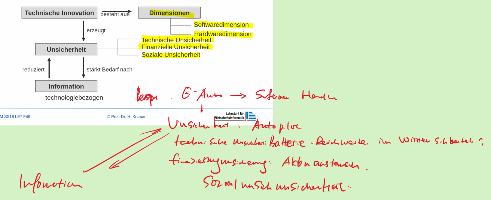

### Eigenschaften von Innovationen

Innovationseigenschaften (wahrgenommen von potenziellen Adoptern) beeinflussen die Adoption und die Geschwindigkeit
der Innovationsdiffusion

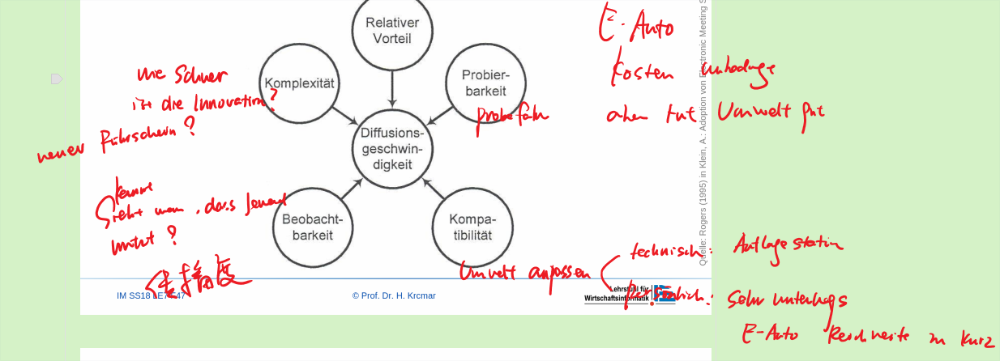
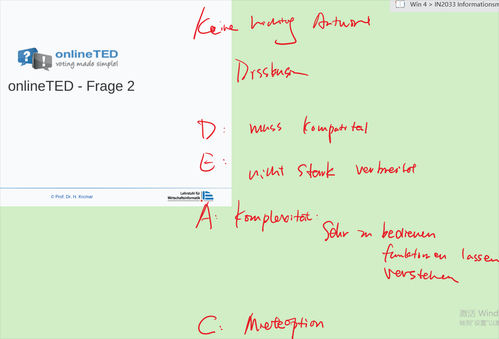
---
### Eckpunkt: Kommunikationskanäle

* Kommunikation versteht sich als **Ein- und ZweiwegeInformationsfluss**, der ein **kooperatives Handeln** zwischen einer **Adoptereinheit**, die von der Innovation Kenntnis hat sowie einer, die noch keine Kenntnis besitzt, ermöglicht
* Verbindung der Adoptereinheiten durch
**Kommunikationskanäle**
* Unterscheidung der Kommunikationskanäle
  * -> **Massenmedien**
  * -> **Interpersonale Kommunikation**

---
  ### Eckpunkt: Zeit - Adopterkategorien

* Anhand der **Innovationsfreudigkeit** (Innovativeness) der
Adopter können **Adopterkategorien** unterschieden werden
  * -> Innovators (Innovatoren)
  * -> Early Adopters (frühe Übernehmer)
  * -> Early Majority (frühe Mehrheit)
  * -> Late Majority (späte Mehrheit)
  * -> Laggards (Nachzügler)
* Adoptionsrate beschreibt die Anzahl von Adoptern über
die Zeit hinweg

### Unterscheidung von Adoptern nach dem Zeitpunkt der Adoption einer Innovation

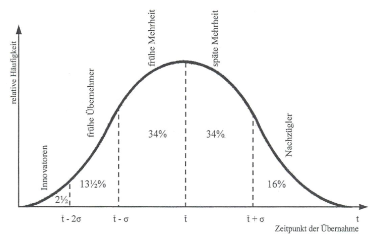

---
### Eckpunkt: Soziales System

**Unterscheidung hinsichtlich Beschreibung und Analyse des
sozialen Systems nach:**
  
  -> Soziale Struktur
  - Arrangementmuster der Einheiten im System inkl. ihrer
Wirkungsbeziehungen

-> Systemnormen
  - Reglementierung und Legitimation menschliches Handeln
situativ
  - Orientierung an gesellschaftlich verankerten Wertvorstellungen
  - Beeinflussung des Verhaltens von Adoptern und können
Barrieren für Adoption und Diffusion darstellen
  - Erwartungssicherheit für die Interaktionspartner hinsichtlich
Verhalten
  - Geltung der Normen bei Veränderungen

---
## 2. Management der Verarbeitung

### Aufgaben des Managements der Verarbeitung

* **Organisation, Steuerung und Kontrolle** aller Daten- bzw. Informationsveränderungsaktivitäten im Unternehmen.
  * Veränderungen (Transformation, Aggregation und Spezifizierung von Informationen) sind gemäß dem Aufgabenzusammenhang zu steuern.
* Herausforderung im Management der Verarbeitung :
  - -> weniger: Computer-interne Verarbeitung managen
  - -> vielmehr: Finden eines geeigneten Abgleichs
zwischen:

_Aufgabe des Managements der Verarbeitung ist es, Veränderungen von Daten zu ermöglichen und diese Veränderungen im Aufgabenzusammenhang zu steuern. Veränderungen
sind bspw. die Transformation, Aggregation und Spezifizierung von Daten. Die Verarbeitung findet in Rechnern durch Software statt._ 

---
### Argumente und Gegenargumente der verteilten Verarbeitung

| Gründe für dezentrale Verarbeitung (Endnutzer) | Gründe für zentrale Verarbeitung(Datenhattung)                                                           |
| ---------------------------------------------- | -------------------------------------------------------------------------------------------------------- |
| Geringere Anfangskosten                        | Größere Fähigkeiten der Hardware                                                                         |
| bessere Größenvariation                        | Bessere Lastverteilung(zeitlich und kapazitativ)                                                         |
| Innovativ                                      | Weniger Datenredundanz                                                                                   |
| Autonome Nutzer (Motivation)                   | Höhere Datenintegrität                                                                                   |
| Einfachere Datenpflege                         | Anwendung einheitlicher Verarbeitungsverfahren Individuelle Verarbeitungsverfahren (Programme) anwendbar | Besser qualifiziertes Personal |
| Zurechenbarkeit der Kosten                     | Weniger Aus- und Fortbildungsaufwand                                                                     |

_Tabelle 7.1 fasst die Überlegungen zusammen, die der Informationsmanager bei Entscheidungen über die örtliche Verteilung der Verarbeitung abzuwägen hat._ 

---
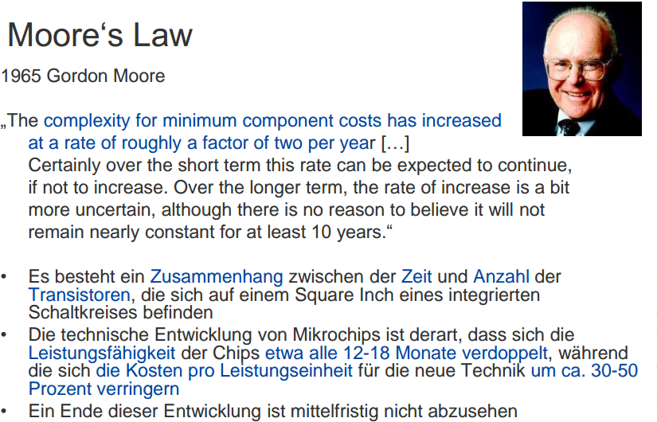
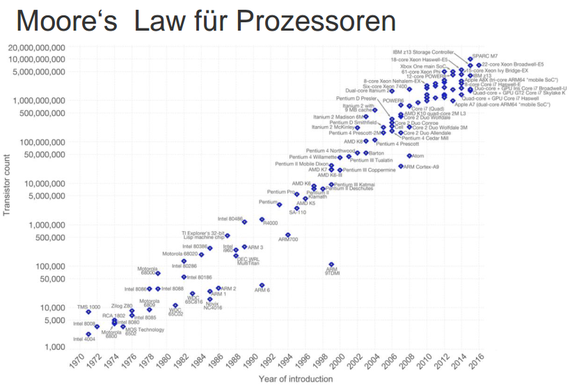

_~~1965 stellte Gordon Moore, einer der Gründer der Intel Corp., einen Zusammenhang zwischen der Zeit und der Anzahl der Transistoren fest, die sich auf einem Square Inch eines
integrierten Schaltkreises befinden. Dieser,~~ als **Moore’s Law** bekannt gewordene Zusammenhang besagt, dass die technische Entwicklung von Mikrochips derart ist, dass sich **die
Leistungsfähigkeit der Chips etwa alle 12–18 Monate verdoppelt**, während sich **die Kosten
pro Leistungseinheit für die neue Technik um ca. 30 bis 50 % verringern**.
Moore sprach zunächst von **einem Zeitabstand von 24 Monaten für die Verdoppelung der
Anzahl von Transistoren auf einem Mikrochip**, revidierte diese Zeitangabe jedoch aufgrund der enormen Entwicklung einige Jahre später auf 12 Monate. Heutzutage wird der
Zeitabstand auf 18 Monate geschätzt. Ein Ende dieser Entwicklung ist trotz vieler gegenteiliger Meinungen mittelfristig noch nicht abzusehen_

_Konkret bedeutet dies: Als Moore’s Law entstand, hatte der komplexeste Mikrochip
64 Transistoren. Auf heutigen Rechnern befinden sich bereits mehrere Milliarden_

---

### Cloud Computing - Definitionen

Das NIST definiert **Cloud Computing** als: “[…] a model for enabling **ubiquitous, convenient, on-demand network access** to a shared pool of configurable computing resources (e.g., networks, servers, storage,
applications, and services) that can be **rapidly provisioned and released** with minimal management effort or service provider
interaction”

Unter Cloud Computing versteht man ein IT-basiertes
**Bereitstellungsmodell**, bei dem **Ressourcen**, sowohl in Form von **Infrastruktur** als auch **Anwendungen** und **Daten**, als **verteilter Dienst**
über das Internet durch einen oder mehrere Leistungsbringer
bereitgestellt werden

Dienst Bereitstellung

_Cloud Computing kann dabei den Gestaltungsspielraum bei der **Bereitstellung von
Technikbündeln** erweitern. Auf **technischer** Ebene ermöglicht die dynamische Virtualisierung von Ressourcen eine „Elastizität“ der Technikbündel in Abhängigkeit des jeweilig aktuellen Bedarfs. Durch dynamische Zuschaltung sowohl virtueller als auch realer
Basistechniken können die Basisfunktionalitäten der Verarbeitung und der Speicherung
flexibilisiert werden. Dies bedeutet, dass Anwendungen und Basisfunktionalitäten (z.B.
Rechenleistung oder Speicherplatz) immer entsprechend der aktuellen Geschäftssituation genutzt werden können.
Aus **betriebswirtschaftlicher** Perspektive bedeutet Cloud Computing eine neue Form
des **Outsourcings von Technikbündeln** (vgl. Abschn. 8.1.3). Cloud Computing ermöglicht es **IT-Leistungen an externe Dienstleister zu vergeben und so Kosten-, Qualitäts-,
Flexibilitäts- und Kompetenzvorteile für das Unternehmen zu nutzen**. So können aufgrund der beschriebenen Elastizität zusätzliche Kapazitäten für **Verarbeitung, Speicherung und Kommunikation** kurzfristig der bestehenden Leistungsfähigkeit hinzugefügt werden. Dies impliziert, dass die Kosten für die Verwendung dieser Ressourcen nutzungsbezogen anfallen_

### Perspektiven des Cloud Computings

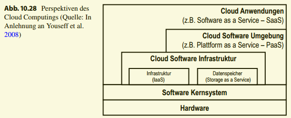

_In Abhängigkeit der verschiedenen Basistechniken und Technikbündel zeigt Abb. 10.28
die resultierenden **Perspektiven des Cloud Computings**. Wie zu erkennen ist, wird das Paradigma der Dienstleistungsorientierung auf die einzelnen Basistechniken und Technikbündel bis hin zu Informationssystemen angewendet.
Diese Dienstleistungsorientierung führt auch zu einer zunehmenden Modularisierung von
IT Diensten und deren Bezug über Wertschöpfungsnetzwerke. Hierfür
sind neben den **IaaS-, PaaS- und SaaS-Anbietern** noch weitere Akteure wie beispielsweise
Agregatoren oder Integratoren notwendig. Im Folgenden werden die
dargestellten Konzepte vorgestellt und die Implikationen dieser Dienstleistungsorientierung diskutiert._

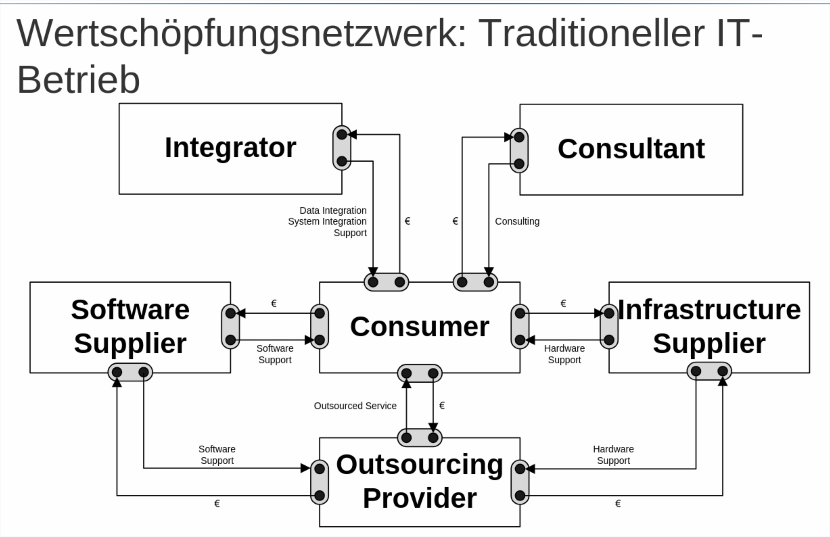
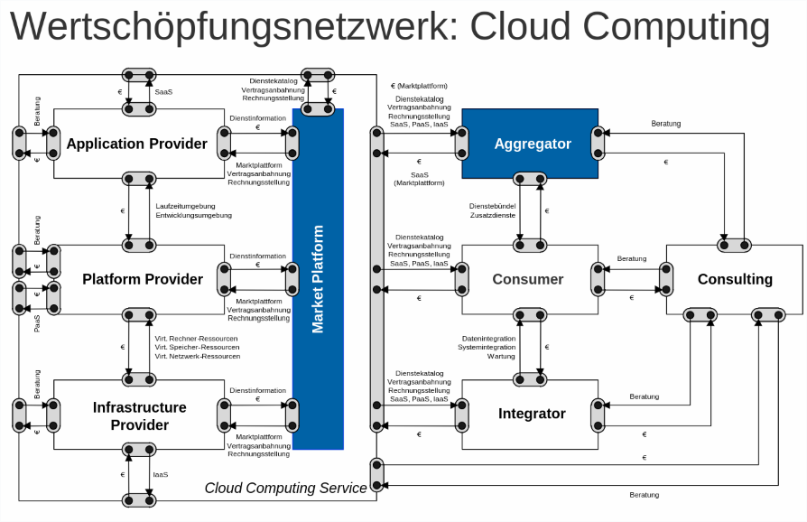

---
## Hype Cycle Modell(Innovationzyklus)

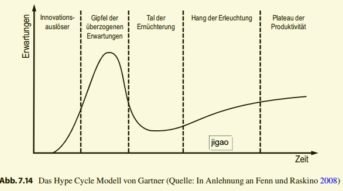
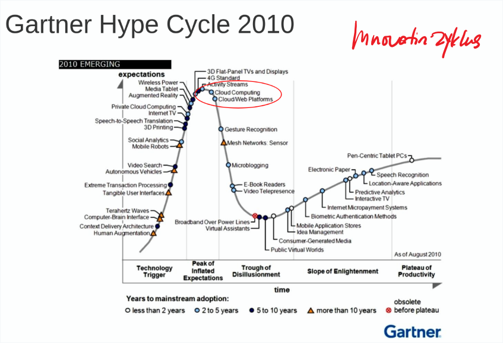
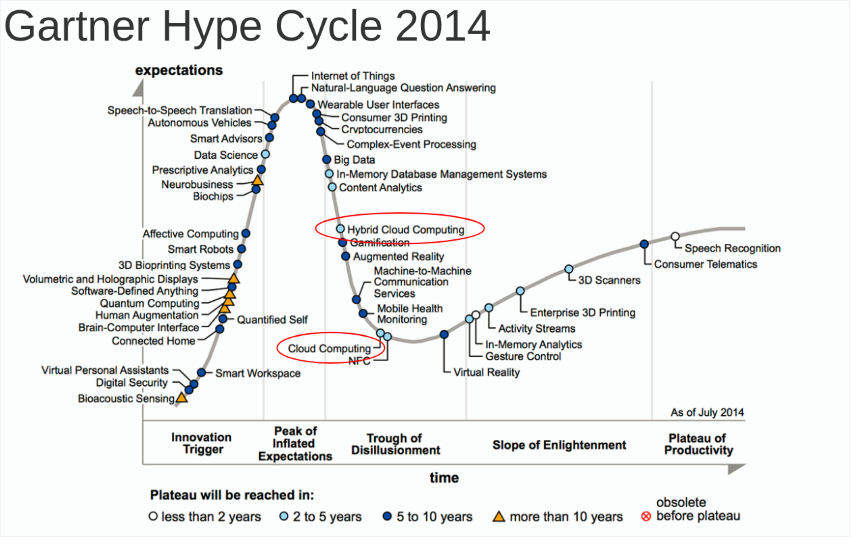
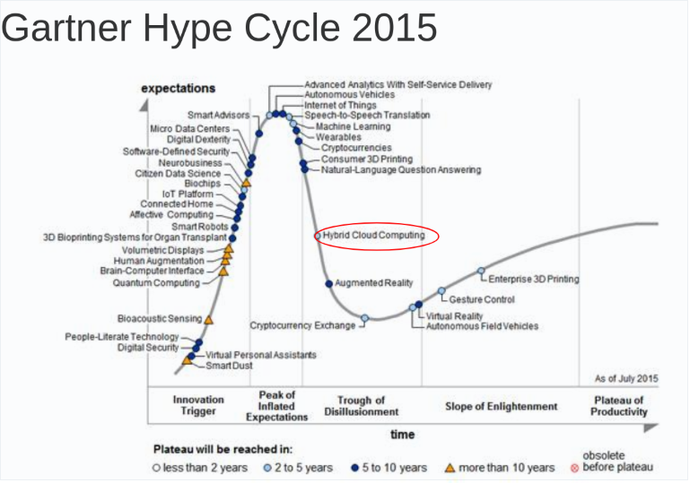
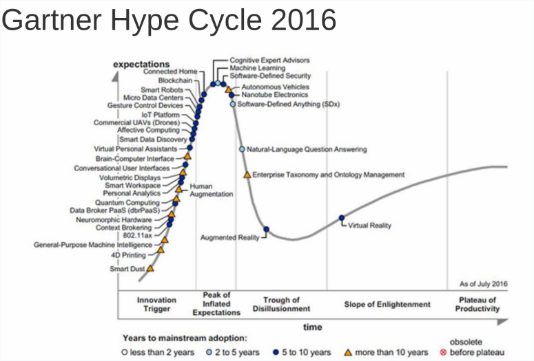

Das **Hype Cycle Modell** von Gartner beschreibt **die Erwartungen an eine Technologie im zeitlichen Verlauf aus Nachfrager-Sicht.** Als Maßgröße
werden dazu **die Erwartungen bezüglich einer neuen Technologie, der Grad der öffentlichen Aufmerksamkeit und das Interesse an der Technologie im Verlauf der Zeit betrachtet.** Es wird davon ausgegangen, dass die menschliche bzw. mediale Reaktion auf neue Technologien immer nach demselben Muster verläuft. Der aktuelle Zustand einer Technologie im Lebenszyklus kann entsprechend bspw. durch Analyse der Anzahl von Publikationen im Zeitverlauf ermittelt werden. Der Hype Cycle wird in fünf Phasen unterteilt. In der ersten Phase, dem **Technologie-Auslöser**, ist zum ersten Mal nach **Technologieeinführung ein signifikantes Medien- und Öffentlichkeitsinteresse zu verzeichnen**. In der zweiten Phase (**Gipfel** der überzogenen Erwartungen) **steigt das Interesse an der neuen Technologie** weiter und führt zu übertriebenem Enthusiasmus und unrealistischen Erwartungen gegenüber der Leistungsfähigkeit. Trotz einiger erfolgreicher Anwendungen der neuen Technologie, scheitert jedoch eine überwiegende Mehrheit an der Aneignung, geplanten Technologienutzung und Vermarktung von auf der Technologie aufbauenden Produkten und Dienstleistungen. Aufgrund der **unerfüllten Erwartungen** kommt es in der nächsten Phase (**Tal谷 der Ernüchterung失望**) zu einem deutlichen **Rückgang des öffentlichen Interesses**. Technologieanbieter arbeiten dennoch auch in dieser Phase **kontinuierlich an der Verbesserung und Weiterentwicklung der Technologie**. Dies führt zum Übergang in die nächste Phase, dem **Hang斜面 der Erleuchtung**. Durch erfolgreiche Verbesserungen der Technologie entstehen neue Anwendungen und Produktgenerationen, was ein langsam steigendes Interesse auf der Seite möglicher Technologieanwender nach sich zieht. Schließlich steigt
die Leistungsfähigkeit der Technologie immer weiter an und stabilisiert sich (Plateau der Produktivität). Die letztendlich erreichte Höhe der Erwartungen hängt davon ab, ob die Technologie in Nischen- oder Massenmärkten Anwendung findet.

