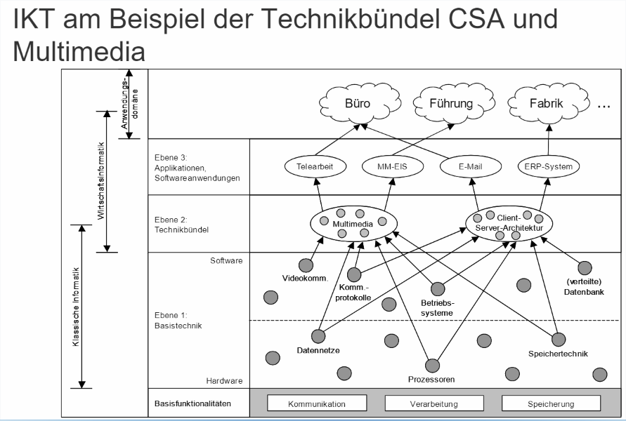

# LE8

* die Begriffe im Zusammenhang mit dem
**Management der IKT** definieren und von einander abgrenzen.
*  **operativem und
strategischem Management der IKT** an Aufgaben verbirgt und können relevante Methoden wie z.B.
**Technology Roadmapping** anwenden.

---
## 1. Überblick IKT, Basistechnik, Technikbündel

### Technologie vs Technik

* Technik
  - Von griech. „techne“ Kunst, bzw. **Handwerk**
  - Menge der nutzerorientierten, künstlichen, gegenständlichen
Gebilde (Artefakte oder Sachsysteme)
  - Menge der menschlichen Handlungen und Einrichtungen, in
denen Sachsysteme entstehen
  - Menge menschlicher Handlungen, in denen Sachsysteme
verwandt werden
* Technologie
  - **Wissenschaft** von der Technik

### Definition: IKT und Infrastruktur

### **Informations- und Kommunikationstechnik** 

wurde definiert
als **Gesamtheit der zur Speicherung, Verarbeitung und
Kommunikation  (Basisfunktionalitäten)**  zur Verfügung stehenden Ressourcen sowie die Art und Weise, wie diese Ressourcen organisiert sind.

_~~IKT-Lösungen lassen sich analytisch als ein Wertgerüst mit unterschiedlichen Ebenen der Wertschöpfung darstellen.~~ In der Praxis werden für die Unternehmens-IT in der
Regel die **Ebenen der Infrastruktur, der betrieblichen Anwendungssysteme und der Geschäftsprozesse unterschieden**. Zu der Ebene der Infrastruktur werden dabei **Netzwerke, Rechenzentren und Endgeräte** gerechnet._

### **Infrastruktur** 
besteht aus **Hard- und Software zur Verarbeitung,
Speicherung und Kommunikation**, die eine Softwareanwendung
voraussetzt (technische Infrastruktur), als auch
Humanressourcen und Dienstleistungen, die zur Installation
und Nutzung benötigt werden (organisatorische Infrastruktur).

_Die Bereitstellung der Infrastruktur **ermöglicht den Einsatz von betrieblichen Anwendungssystemen**. Die technische Unterstützung zur Umsetzung der Infrastruktur lässt sich als **Basistechnik** bezeichnen._

### **Basistechnik**
 bezeichnet die
**Basiseinheiten der IKT zur Bereitstellung der
Basisfunktionalitäten Verarbeitung, Speicherung
und Kommunikation**.

### **!!!Technikbündel!!!** 
sind applikationsunabhängige
**Kombinationen von Basistechnik zur Realisierung
spezieller Konzepte.**

_Nur bestimmte **Kombinationen von Basistechnik (Hard- und Software)** sind jedoch als Infrastruktur für eine bestimmte Anwendung sinnvoll, nämlich diejenigen, die dem Konzept,
das sich hinter einer solchen Anwendung verbirgt, entsprechen._

_Abbildung fasst diese **Zusammenhänge von Basisfunktionalitäten, Basistechnik, Technikbündeln und darauf aufbauenden Softwareanwendungen** zusammen._

_Ein **Beispiel** soll diese Ebenen erläutern: Es soll ein Enterprise Ressource Planning-System (**ERPSystem**) installiert und genutzt werden, das eine **Client-Server-Architektur** implementiert.
Als technische Infrastruktur werden neben **passender Hardware und Verkabelung auch spezielle Kommunikationsprotokolle, ein Betriebssystem** etc. benötigt. Alle diese Komponenten müssen **aufeinander und auf das ERP-System abgestimmt** werden, bevor die
Anwendung funktioniert. Die technische Grundlage eines klassischen SAP-ERP-Systems, und damit alle, speziell für dieses Produkt benötigten, Basistechniken werden als ABAPStack bezeichnet. Die Kombinationen von Basistechnik zu Technikbündeln können nahezu beliebig komplex werden. Auf diese Weise können neue komplexere Funktionalitäten bereitgestellt werden, die über diejenigen der Basistechnik weit hinausreichen._

---
## 3. Management der Technikbündel von LE9

Ein typisches Beispiel für Technikbündel sind Client-Server-Architekturen (CSA). Sie
entstehen durch Bündelung von Basistechniken und liefern spezielle Formen der drei
Basisfunktionalitäten. (siehe Abb. 7.24). Im Basisfunktionalitätsbereich Kommunikation
bestehen CSA aus der Basistechnik Datennetze sowie Koordinationsverfahren, insbesondere Remote Procedure Calls (RPC) und Message Passing Systems (MPS). Im Basisfunktionalitätsbereich der Verarbeitung wird Rechenkapazität an den Netzknoten der CSA
benötigt. Weiterhin sind für CSA grafische Benutzeroberflächen als Präsentationstechniken charakteristisch. Im Basisfunktionalitätsbereich der Speicherung werden verteilte
Datenbankkonzepte als Basistechnik verwendet. Obwohl verschiedene Formen der Basistechnik schon vorher bestanden, macht erst die sinnvolle Kombination das Potenzial des
Technikbündels CSA aus.
Durch die zunehmende Verbreitung von IT-Anlagen und deren Vernetzung hat sich diese hybride Form zwischen der zentralen sowie der verteilten und lokalen IT entwickelt.
Bei Client-Server-Systemen übernehmen unter den über ein LAN oder WAN vernetzten
Rechnern einige Rechner, die so genannten Server, bestimmte Dienstleistungen für andere Rechner, die Clients, die diese Dienstleistungen nutzen. Die Dienstleistung kann in
der Datenhaltung, auf der Ebene der Anwendung oder auch nur in der Präsentation der
Daten bestehen (). Die Dienstleistung kann in Form von Datenhaltung oder auf Ebene der
Anwendung erbracht werden. Wie Abb. 7.24 zeigt, bestehen Applikationen auf Basis von
CSA aus den Komponenten Darstellung, Anwendung und Datenhaltung.

---
## Definition: Ziele und Aufgaben des Managements von IKT

### Management
Das **Management** der Informations- und Kommunikationstechnik
umfasst:
1. Das Management der **bereits im Unternehmen im Einsatz** befindlichen IKT
2. Das Management **neuer Technik für den potentiellen Einsatz** im Unternehmen

### Ziel
**Ziel** des IKT-Managements ist es, durch den Einsatz von
Informations- und Kommunikationstechnik einen Beitrag zur **Verbesserung der Effizienz und der Profitabilität eines Unternehmens** zu leisten.

_Aus diesem Ziel lassen sich in der Operationalisierung唯实践论 einzelne Aufgaben ableiten._

Die **Aufgabe** des IKT-Managements ist es, die IKT als Infrastruktur zu planen, sowie deren effiziente und effektive Implementierung,
Nutzung sowie Weiterentwicklung zu steuern und zu kontrollieren.

---
### Verbesserungspotenziale für ein Unternehmen

Abbildung 7.2 stellt die sich daraus ableitbaren Arten von technischen Produkten dar:
  * Quadrant I: Produkte, die **bereits etablierte Technik** nutzen, um die **Effizienz** der bereits im Unternehmen etablierten Tätigkeiten zu **verbessern**.
  * Quadrant II: Produkte, die **bereits etablierte Technik** nutzen, um dem Unternehmen den Schritt **zu neuen Tätigkeitsfeldern** zu ermöglichen.
  * Quadrant III: Produkte, die **neue Technik** nutzen, um die **Effizienz** der bereits im Unternehmen etablierten Tätigkeiten zu **verbessern**.
  * Quadrant IV: Produkte, die **neue Technik** nutzen, um dem Unternehmen den Schritt **zu neuen Tätigkeitsfeldern** zu ermöglichen.
  
_Betrachtet man nun die Quadranten I und II, so kann man diese Techniken nochmals aufteilen in solche, die **bereits im Unternehmen im Einsatz sind** und solche, die (noch) nicht genutzt werden. **Das Verbesserungspotenzial liegt in der effizienteren oder neuen Nutzung bereits im Unternehmen befindlicher Produkte als auch in der Anschaffung von Produkten, die bereits etablierte Technik nutzen, aber noch nicht im Unternehmen eingesetzt werden.** ~~Aufgabe des Technikmanagements ist es, die effiziente und effektive Techniknutzung im Unternehmen zu ermöglichen sowie sich einen Marktüberblick zu verschaffen und das Potenzial von bereits auf dem Markt etablierten Produkten einzuschätzen.~~_

_~~Ein Unternehmen muss darüber hinaus in der Lage sein, die Bedeutung~~ **neuer Technik** für das eigene Unternehmensgeschehen zu erkennen (III und IV). Dabei spielen sowohl **die Wahrnehmung der Nutzbarkeit der Technik als auch die Fähigkeiten zur Nutzung eine Rolle**. In diesem Zusammenhang sind Fragen der zeitlichen Abfolge der Technikadaption und des organisatorischen Lernens von zentraler Bedeutung. Auch die Beeinflussung der in Entwicklung befindlichen Technik kann zum Aufgabenbereich des Technikmanagements gezählt werden. Hinsichtlich des Grades der Veränderung unterscheidet man hier
zwischen inkrementellen und radikalen Innovationen. Während erstere bestehende Produkte schrittweise und nur geringfügig verbessern, basieren radikale Innovationen auf gänzlich neuen Erkenntnissen_

---
### Herausforderungen des IKT-Managements

Die **Herausforderungen des IKT-Managements** liegen
darin,
  - Technische Entwicklungen und deren Bedeutung für das eigene
Unternehmen,
  - den komplexen IKT-Markt mit Produkten, die Technik
implementieren, einerseits und Technikanbietern, die
Marktpositionen inne haben, andererseits, sowie
  - die Möglichkeit und Fähigkeit des eigenen Unternehmens,
Technik anzuwenden bzw. neue Technik zu integrieren,

..... **korrekt einschätzen** zu können und **nachhaltige
Entscheidungen** zu treffen.

---

## 2. Management der IKT

  ### Wartung und Betrieb - operatives IKTManagement 
不重要
* Im Auftrag der britischen Regierung durch die CCTA (heute
OGC) in Norwich (England) entwickelter Leitfaden **ITIL (IT
Infrastructure Library)**
* Weltweiter de facto Standard im Bereich Service
Management
* Beinhaltet eine umfassende und öffentlich verfügbare
fachliche Dokumentation zur Planung, Erbringung und
Unterstützung von IT-Serviceleistungen
* ITIL bietet die Grundlage zur Verbesserung von Einsatz und
Wirkung einer operationell eingesetzten IT-Infrastruktur
* **Best Practice** Leitfaden, in dem das **„WAS“** beschrieben
wird, und nicht das **„WIE“**

---

### Teilaufgaben des strategischen IKTManagements
书上没有
* Die **Bestimmung** des **IKT-Bedarfs** des Unternehmens
* Die **Beeinflussung** der **IKT-Entwicklung** im
Unternehmen
* Das **Beobachten** der **IKT-Entwicklung** außerhalb des
Unternehmens
* Das **Treffen** von **IKT-Einsatzentscheidungen** nach
Technik- und Systemart, Umfang und Zeitpunkt
* Die **Evaluierung** des **Technikeinsatzes**
* **Entwicklung** neuer Informations- und
Kommunikationstechnik (u.U. mit Entwicklungspartnern)

### Methoden des strategischen IKT-Managements
* Bestimmung des optimalen Ersatzzeitpunktes einer
Anwendung
  - Bestimmung des optimalen Zeitpunktes für den Austausch bestehender
Anwendungen mit Unterstützung durch betriebswirtschaftliche
Berechnungsverfahren
* Standardauswahl
  - Entscheidungen bezüglich der Implementierung von Standards mit
mathematischen Beschreibungsmitteln abbilden
* Technology Roadmapping
  - Entwicklung von Technologien auf der Grundlage von **Expertenwissen** einschätzen

_Daher wird IKT-Management sowohl auf strategischer als auch auf operativer Ebene._

_**Methoden zur Bewältigung der oben genannten Aufgaben** sind u. a. das Technology Roadmapping, die Standardauswahl sowie die Bestimmung von optimalen Ersatzzeitpunkten._

_**Bestimmung des optimalen Ersatzzeitpunktes einer Anwendung**: Diese Methode unterstützt mittels betriebswirtschaftlicher Berechnungsverfahren die Bestimmung des optimalen Zeitpunktes für den Austausch bestehender Anwendungen._

_**Standardauswahl**: Die Methode unterstützt Entscheidungen bezüglich der Implementierung von Standards. Die beschriebenen Modelle bilden das Standardisierungsverhalten von mehreren Akteuren mit mathematischen Beschreibungsmitteln ab._

_**Technology Roadmapping**: Dieser Prozess schätzt die Entwicklung von Techniken auf der Grundlage von Expertenwissen ab. Dabei wird untersucht, wie **mit den vorhandenen Ressourcen** eines Unternehmens die angestrebten **Ziele realisiert werden** können. Zusätzlich wird die Machbarkeit der gefundenen Realisierungsmöglichkeiten überprüft._

### Bestimmung des Ersatzzeitpunktes einer Anwendung
* Analyse der Kostenstruktur
  - Zu erwartende Aufwendungen für den gesamten Lebenszyklus
  - Erstellungskosten, Aufwand für kontinuierliche Pflege und Wartung in
der Phase der Reife
* Methoden der Nutzenstrukturanalyse
  - Erfassung wichtiger Auswirkungen auf den Prozessablauf im
Unternehmen
  - Nutzen abschätzen und monetär ausdrücken
* Bestimmung des Abschaffungszeitpunktes
  - Gegenüberstellung der Kosten- und Nutzenanalyse
  - Errechnung des ökonomisch sinnvollsten Termins

_~~Sollten diese Standardisierungsbemühungen zu einem Wechsel der eingesetzten Technologie in einer Abteilung oder unternehmensweit führen, kann dies auch in einigen Fällen
dazu führen~~, dass der Einsatz von Technologien **beendet** wird. Es stellt sich die Frage,
**wann ein entsprechender Zeitpunkt gut gewählt ist und wie die Abschaffung oder ein
Wechsel organisiert wird**. Die Bestimmung des Ersatzzeitpunktes vor der Inbetriebnahme
erfolgt in **drei Schritten**_

_* Durch die Analyse der Kostenstruktur werden die zu erwartenden Aufwendungen für
den gesamten Lebenszyklus erhoben. Dabei spielen neben den Erstellungskosten insbesondere der Aufwand für die kontinuierliche Pflege und Wartung in der Phase der
Reife eine bedeutende Rolle._

_* Methoden der Nutzenstrukturanalyse versuchen durch Erfassung wichtiger Auswirkungen auf den Prozessablauf im Unternehmen, den Nutzen abzuschätzen und monetär auszudrücken._

_* Zur Bestimmung des Abschaffungszeitpunktes müssen in einem letzten Schritt die
Kosten- und Nutzenanalyse gegenübergestellt werden. Dadurch kann zumindest der
ökonomisch sinnvollste Termin errechnet werden._

---

### Bedeutung von Standards
* Standards als Kaufkriterium:
  - ohne Standard Unsicherheit bezüglich direkter und indirekter
Netzeffekte
  - Gefahr der Entscheidung für das ‚falsche‘ System
  - als Reaktion häufig Verzögerung der Kaufentscheidung
* Lock-In:
  - **Kosten für einen Wechse**l des Systems sind teurer als der
entstehende Nutzen -> Windows vs. Linux
  - Lock-In stellt für den Anbieter ein Quasimonopol似乎垄断 her

### Nutzen von Standards

* Standards **senken Kommunikationskosten**
* Standards **schützen Investitionen** durch die
auf der Offenheit basierenden vielseitigen Verwendbarkeit der
Systeme
* Standardprotokolle und Standard-Software sind **vielseitiger und mit geringerem Einarbeitungsaufwand einsetzbar**, Kostenreduzierung
* **Bilaterale双边的 Vereinbarungen** zwischen Unternehmen und
Unternehmensteilen entfallen 
* Standardisierung schafft **Zeitvorteile in der Kommunikation**, es
sind weniger Medienbrüche notwendig
* Durch standardisierte, offene Kommunikationssysteme ergibt
sich eine zusätzliche **Markttransparenz**, was positiv auf den Wettbewerb wirkt

### Mögliche Strategien für das IM
1. Das IM kann unternehmensweite Standards vorgeben.
2. Das IM kann auf Standards bestehen, die konkrete
Wahl aber der Verhandlung zwischen den Abteilungen
überlassen.
3. Das IM besteht nicht auf den Einsatz eines Standards.
4. Das IM lässt Insellösungen zu.

_Bei Strategie 2 werden keine unternehmensweiten Standards vorgegeben (Strategie 1),
sondern die einzelnen Abteilungen verhandeln selbstständig um einen geeigneten Standard. Bei dieser Strategie wird sich ein effizienter Standard nach einer bestimmten Zeitspanne von selbst ergeben. Obwohl bei Strategie 3 keine Standards vorgesehen sind, kann sich auch hier ein gemeinsamer Standard herausbilden. Dies ist der Fall, wenn ähnliche Benutzeranforderungen in den Organisationseinheiten bestehen, ein hohes internes
Kommunikationsaufkommen zwischen den Abteilungen vorherrscht, hohe Inkompatibilitätskosten aufgrund stark ausgeprägter technischer Systemheterogenität bei Nichteinigung drohen, oder die Economies of Scale insgesamt umfangreich sind. Bei bewusster Unterlassung einer Steuerung durch das Management sowie heterogenen Anforderungen können
sich Insellösungen etablieren (Strategie 4). Dies ist nach Dewan et al. (1995) eine durchaus
gangbare Strategie, wenn die einzelnen Abteilungen stark dedizierte Aufgaben besitzen,
wenig Datenaustausch zwischen den Abteilungen besteht, Daten einfach transformiert
werden können und geringe Preisvorteile beim umfassenden Erwerb eines einheitlichen
Softwaresystems existieren._

---

---
### Technology Roadmapping

* Produktentwicklungen von Unternehmen werden u.a. von sich ständig und zunehmend stark ändernden externen Bedingungen getrieben
* Um die **Risiken zu minimieren**, gilt es die äußeren
Bedingungen **möglichst früh abzuschätzen** -> Methode: **Technology Roadmapping**

A layout of paths or routes that exists (or could exist) in some
particular geographical space… (that) serves as a traveller‘s tool that provides essential understanding, proximity, direction, and some degree of certainty in travel planning.

_Eine Methode, die **äußeren Bedingungen abzuschätzen** und den **Technologieeinsatz im Zeitverlauf zu planen**, ist das Roadmapping, welches den Prozess der Erstellung einer Roadmap bezeichnet. Der Begriff Roadmap ist angelehnt an die Straßenkarte und bezeichnet meist eine grafische Darstellung._

### Ziele und Inhalte von Roadmap

Roadmaps communicate visions, attract resources from business and government, stimulate investigations, and monitor progress. They become the inventory of possibilities for a particular field, thus
stimulating earlier, more targeted investigations.

- Ergebnis eines Expertentreffens oder einer -befragung
- Den Ausgangspunkt, die Ziele, sowie die verschiedenen Wege, um
mit den gegebenen Ressourcen das gewünschte Ziel zu erreichen
- Unter Berücksichtigung möglicher Hindernisse und Schwierigkeiten
- Visualisierung

_Eine Roadmap umfasst als **Ergebnis eines Expertentreffens oder einer -befragung**, vergleichbar einer Straßenkarte, den Ausgangspunkt, die Ziele sowie die verschiedenen Wege, um mit den gegebenen Ressourcen die angestrebten Ziele zu erreichen._

---
### Disruptive破坏性的 Technologien

_Eine besondere Herausforderung in der Technologiefrüherkennung stellen disruptive
Technologien dar._

* „Disruptive Technologie“ bezeichnet **eine neue Technik, die eine bereits etablierte Technik vom Markt verdrängt**, ohne dass dies zunächst zu erwarten gewesen wäre.
* Das führt dazu, dass gut geführte Unternehmen ihre
Marktposition verlieren oder gar vollständig aus dem Markt
gedrängt werden.

### Klausuraufgabe
Definieren Disruptive Technologien und Beispiel.
Beispiel: Mobilzahlung mit Payback Pay
---
## S-Kurven-Konzept

_Das S-Kurven-Modell als eines der **zentralen Modelle des Technikmanagements** beschreibt **das Verhältnis zwischen dem kumulierten Entwicklungsaufwand ~~der in eine Technologie geflossen ist~~ und ihrer Leistungsfähigkeit.** In welchem Maß die Leistungsfähigkeit zunimmt hängt in diesem Modell von den bereits investierten Ressourcen in die betrachtete Technologie ab. Dem S-Kurven-Modell liegt die Annahme zugrunde, dass die **Leistungsfähigkeit zweier Produkte oder Technologien mit den gleichen Parametern gemessen werden kann und somit Vergleichbarkeit gegeben ist.**_

_Abb. 7.15 zeigt, **steigt** in den frühen Entwicklungsphasen die **Leistungsfähigkeit** einer konkreten Technik (1) zunächst nur langsam an. Ist die Technik dann **ausgereifter成熟的**, **nimmt die Leistungsfähigkeit stark zu**, **bis** die Implementierung einer konkreten Technik **an ihre Grenzen stößt und der Zuwachs im Leistungswachstum sich wieder verlangsamt**. Bezogen auf die IKT liegen die **Herausforderungen** für das IKT-Management
nun darin, **den Moment zu erkennen, zu dem das Leistungswachstum eines eingesetzten IKT-Produktes oder einer eingesetzten Technik nachlässt und die Kurve der Leistungsfähigkeit von einer sich parallel entwickelnden Technik (2), derselben oder einer ähnlichen Technologie, geschnitten wird.** Laut Modell empfiehlt sich **ein Wechsel**, wenn sich die Leistungsfähigkeit zweier Produkte in etwa **entspricht, dem Schnittpunkt der beiden SKurven**_

**Disruptive Technologien** erfüllen zunächst nicht die Anforderungen der bedeutenden Kunden auf einem betrachteten Markt, besitzen dafür aber andere Eigenschaften, die zwar zunächst nicht erkannt oder für unwesentlich gehalten werden, dann aber maßgeblich zum Erfolg der Technik beitragen. Disruptive Technologien entwickeln sich entsprechend **auf parallelen Märkten (Markt B).** Dabei **bauen sie ihre Stärken noch weiter aus**, **verringern jedoch auch ihre Schwächen**, welche ihren **Eintritt in den initial betrachteten Markt (Markt A) ursprünglich verhindert haben. Wird die Technologie in form konkreter Techniken dann auch in Markt A angeboten, kann dies disruptive Auswirkungen auf bisher etablierte Techniken haben**.

_Beispielsweise bestanden in den 70er Jahren die Marktanbieter für 14-Zoll Festplatten aus Herstellern von Großrechnern, deren Kunden ein jährliches 20-prozentiges Wachstum des Speicherplatzes und ein Minimum von 300 MB Plattenplatz verlangten. In dieser Zeit entwickelten einige Start-Ups 8-Zoll Festplatten, die zwar nur weniger als 50 MB Speicherkapazität hatten, dafür aber leichter herzustellen waren. Zunächst bestand der Markt für diese neue Technik nur aus einigen wenigen Abnehmern und viele der neuen Firmen kämpften ums Überleben. Völlig unerwartet konnte die neue Festplattentechnik jedoch die Speicherkapazitäten um mehr als 40 % jährlich steigern und entsprach
bald den Anforderungen der Großrechner, während durch die geringe Größe Vorteile wie geringere Vibrationen und Platzeinsparung zusätzlich für die neuen Platten sprachen. Innerhalb von vier Jahren hatten die 8-Zoll Festplatten 14-Zoll Festplatten vollkommen vom Großrechner-Markt verdrängt._

