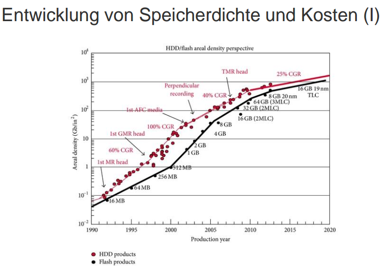
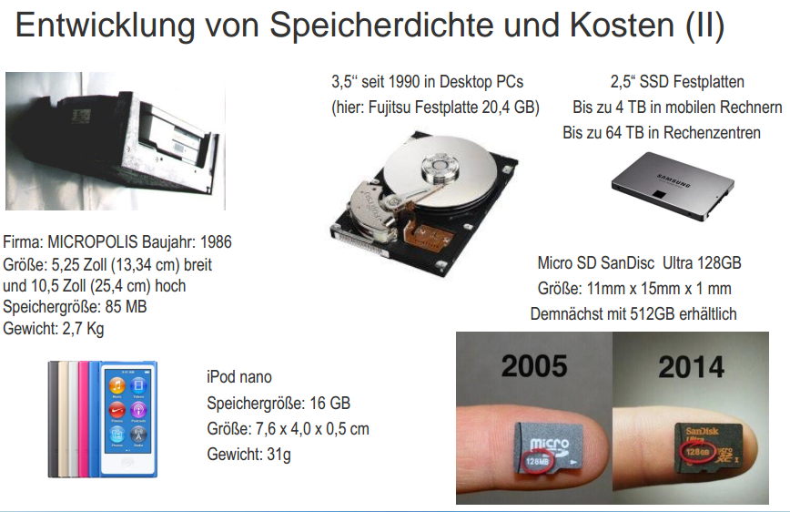
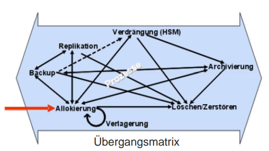
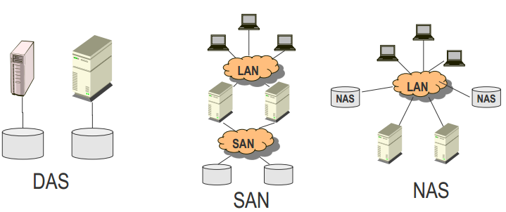
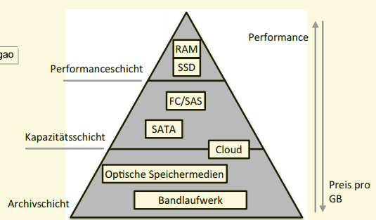
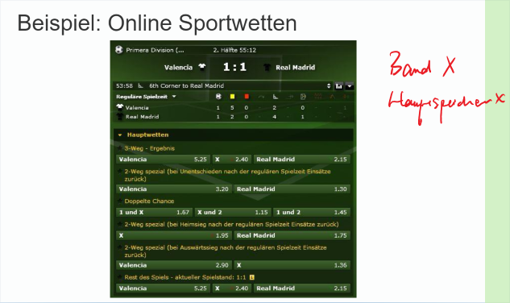
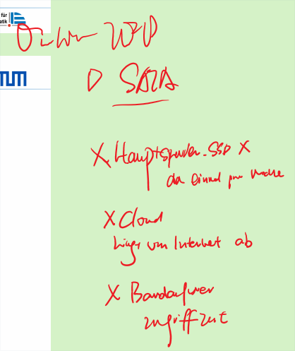
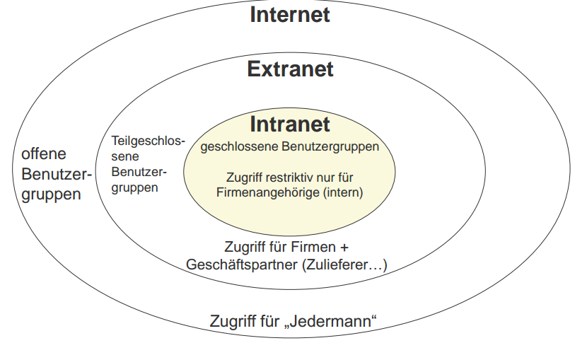

# LE 9

## 1. Management der Speicherung

### Information Lifecycle Management 

Eine typische Klausurfrage könnte sein…
**Definieren Sie das Konzept des Information Lifecycle Managements.**

„Information Lifecycle Management (ILM) ist ein **StorageManagement-Konzept**, welches **Informationsobjekte** während der **gesamten Lebenszeit aktiv verwaltet**. Dabei bestimmt eine Regelmaschine unter Berücksichtigung von Vorgaben aus den Geschäftsprozessen und der Bewertung der Kostenstrukturen der
Speicherhierarchie in einem Optimierungsprozess den **best geeigneten Speicherplatz** für die verwalteten Informationsobjekte.“

Kriterien:
* Wert eines Informationsobjektes
* Gesetzliche oder regulatorische Vorgaben
* Aufbewahrungszeiten
* Zugriffsrechte
* Service Level Vereinbarungen

*Das Information Lifecycle Management (ILM) ist
ein **Storage Management-Konzept**, das Information als einen Produktionsfaktor versteht,
der einem Lebenszyklus unterliegt. Zentraler Bestandteil sind die **Informationsobjekte**,
welche unter Berücksichtigung von Geschäftsprozessvorgaben und der Klassifizierung der
vorhandenen Speicherlösungen bzgl. Kosten und bereitgestellten SLAs von einer Regelmaschine an besten **geeigneten Speicherplatz** abgelegt werden. **Der Wert der Informationsobjekte**, **gesetzliche oder regulatorische Vorgaben** und **Aufbewahrungszeiten** stellen
Beispiele für Vorgaben aus Geschäftsprozessen dar. Unter Informationsobjekten versteht
man unter anderem Dateien, Volumes, Logische Units, Dateiverzeichnisse oder E-MailNachrichten. Diese Informationsobjekte werden zeit- oder ereignisgesteuert in geeigneten
Intervallen durch einen Optimierungsprozess anhand der Vorgaben neu bewertet. Anhand　dieser Bewertung erfolgt entsprechend der Regelmaschine eine automatische Aktion*

ILM ist […] kein Produkt, sondern eine **Kombination aus
Prozessen und Technologien**.“

*Innerhalb des ILM ist das Management der Informationen nicht auf die Zuteilung zu
einer Speicherebene im tiered Storage beschränkt. **Die Instanzen des ILM** Prozesses, wie **Backup, Replikation, Allokierung, Archivierung und Löschung** der Daten sind ebenso
relevant, wie die Ablage auf einer anderen Speicherhierarchie. Die Beziehungen zwischen den Instanzen wird im ILM Modell durch eine **Übergangsmatrix** beschrieben*

*Unter **Allokation** versteht man die **initiale Erstellung eines Informationsobjektes** auf
einer durch das ILM bestimmten Speicherhierarchie.*

*Beim **Backup** wird ein Informationsobjekt in **regelmäßigen Abständen** auf ein anderes
Medium **kopiert**, ohne die vorherige Kopie oder das Original zu löschen*.

*Unter **Replikation复印** versteht man eine **kontinuierliche Spiegelung von Informationsobjekten**. Wird ein Informationsobjekt verändert, so wird **diese Änderung schnellstmöglich
auf das andere Informationsobjekt übertragen**. Es gibt die Replikation auch noch in der
Ausprägung Point-in-Time. Dabei wird ein Informationsobjekt nur einmal kopiert. Änderungen am Original werden nicht gespiegelt. Die Kopie stellt die Ausprägung der Originaldaten zu einem gewissen Zeitpunkt dar.*

*Die **Verschiebung von Daten auf eine andere Hierarchieebene des Speichers** wird als
**Verdrängung** bezeichnet. Charakteristisch ist, dass sich bei diesem Vorgang lediglich die
Zugriffzeit, nicht jedoch die Syntax des Datenzugriffs ändert.*

*Die gezielte **Speicherung** eines oder einer zusammengehörenden Menge von Informationsobjekten **in einer anderen Speicherklasse**, in Verbindung mit einer Vorschrift, wie
lange diese Daten nicht gelöscht werden dürfen, wird als **Archivierung** bezeichnet. Gesetze und Richtlinien bestimmen, wie lange Informationen aufbewahrt und welche Vorgaben für den Zugriff in dieser Zeit erfüllt werden müssen.*

Die **Verlagerung** eines Informationsobjekts beinhaltet die **Veränderung des Speicherorts**. Dieser Vorgang ist für die Benutzer transparent. Sind alle Informationsobjekte kopiert
und verfügbar, so werden die Originale gelöscht. ~~Als Beispiel für eine Verlagerung dient
der Ersatz alter Hardware. In diesem Fall müssen die Informationen, welche darauf gespeichert waren, an einen anderen Ort kopiert werden. Am Ende des Informationslebenszyklus
steht der Prozess Löschen bzw. Zerstören. In diesem Prozessschritt liegt der besondere
Fokus auf eine nichtwiederherstellbare Vernichtung der Daten, da Daten z. T. aufgrund gesetzlicher Regelungen gelöscht werden müssen. Dies führt dazu, dass grundsätzlich kein
Übergang von Löschen bzw. Zerstören in einen anderen Zustand möglich ist.~~

---
### Speichernetze (DAS)

### **Direct Attached Storage (DAS)**
Der Speicher ist **direkt** durch ein Kabel an den **Computer Prozessor** angeschlossen. Die Festplatte im PC oder ein
Bandspeicherlaufwerk, das direkt an einen Server angeschlossen
ist, sind einfache Typen von DAS. **I/O Anfragen** (auch Protokolle oder Befehle genannt) greifen **direkt auf die Geräte** zu.

### Speichernetze (NAS, SAN)

_Für die flexible Bereitstellung von Speicher haben sich in Unternehmen Speichernetze
etabliert._

### Network Attached Storage (NAS) 
ist **direkt** an ein lokales Netz **angeschlossener Speicher**. Eine NAS-Einheit ist ein mit **geringem Aufwand** zu installierendes und einfach zu verwaltendes Gerät, das aus einem oder mehreren internen Servern, vorkonfigurierter Plattenkapazität und einem
**speziell auf die Dateiverwaltung und Datenübertragung** ausgelegten
Betriebssystem besteht (schlüsselfertiger Dateiserver)

### Storage Area Network (SAN) 
ein **zentral verwaltetes, speziell** auf den
**blockbasierten Datenaustausch** zwischen **Servern und Speichergeräten**
(Magnetplatten-, optische Speicherplatten- und Magnetbandeinheiten)
zugeschnittenes Speichernetz für **heterogene Umgebungen**. Die
Speichergeräte sind im **Gegensatz zu NAS von den Servern getrennt**, und über ein unabhängiges, vom lokalen Netz völlig getrenntes Netz zugänglich. Die meisten Anbieter von SAN-Lösungen haben sich hierfür auf den **FibreChannel-Standard** geeinigt

| -              | NAS                                                                                                                                                                                                                                                                 | SAN                                                                                                                                                                                                                                                                                  |
| -------------- | ------------------------------------------------------------------------------------------------------------------------------------------------------------------------------------------------------------------------------------------------------------------- | ------------------------------------------------------------------------------------------------------------------------------------------------------------------------------------------------------------------------------------------------------------------------------------ |
| _Grundkonzept_ | _Klassisches Dateiserverkonzept im lokalen Netzwerk_                                                                                                                                                                                                                | _**Trennung von Server- und Speicherfunktionen**; spezielle Switches verarbeiten Block-I/O-Protokolle im Auftrag anderer Systeme (z. B. Server)_                                                                                                                                         |
| Vorteile       | **Einfache Installation und Wartung**, **günstiger** Ausbau,Erprobte Schnittstellen, **geeignet für kleinere und mittlere Dateiserver und Webserver**,**Geringer Schulungsaufwand** für Administratoren                                                                             | **Hohe Leistung** beim Datenaustausch zwischen Server und Speichergerät, **Reduzierte Belastung** des lokalen Netzes, Offene Architektur und damit große **Flexibilität**, Hohe **Skalierbarkeit**, Einfaches zentrales Ressourcenmanagement, Erleichterte **Ausfallsicherung** und Katastrophenvorsorge |
| Nachteile      | **Beschränkte Leistung** - für große Netze unzureichend\ **Zugriff** auf gespeicherte Daten erfolgt **über das lokale Netz** -> was zusätzliche Server- und Netzlast erzeugt \ **Geringe Entfernung zwischen Controller und Speichermedien** \ Ausschließlicher唯一的 **Zugriff auf Dateien** | **Schwierige** Planung, Installation und Wartung \  **teuer** \ Standardisierung noch nicht abgeschlossen                                                                                                                                                                            |

---
### Einsatz in Unternehmen
* **Information Lifecycle Management**: „Je **wichtiger** die **Daten** für ein Unternehmen sind, desto höher sollte ihre
**Verfügbarkeit** sein.“
* Datenwert ändert sich im Laufe der Zeit
  

_**Die Kosten für die Bereitstellung** der Daten **steigen** mit den **Anforderungen an das
Speichermedium**, wie in Abb. 7.8 dargestellt ist. Aus ökonomischer Sicht ist es angesichts
stetig steigender Datenmengen nötig, Daten zu konsolidieren und die Kosten für die Speicherung zu senken. Für die Zuordnung von Daten zu Speichermedien gibt es verschiedene
Ansätze._

_Abbildung 7.8 zeigt eine Übersicht verschiedener Speicherformen in Abhängigkeit von
Preis pro Speichereinheit und Performanz. Neben den immer stärker aufkommenden Solid
State Disks (SSD) zeichnet sich auch ein Trend in Richtung Hauptspeicher (RAM) als
Datenspeicher ab._

---
## 2. Management der Kommunikation

### Kommunikationsmanagement
* Allumfassende Kommunikationsplattform -> Internet
* Kommunikationsmanagement in Netzen ->
schwerpunktmäßig Netzmanagement
* Aufgaben:
  - **Netzgestaltung**: Auswahl von Hardware- und SoftwareKomponenten sowie Verkabelungs- und Installationsplanung
  - **Netzverwaltung**: Dient der Aufrechterhaltung des Netzbetriebs, mit den Aufgaben Beschaffung, Bestandsregistratur, Koordinierung der Instandhaltung
  - **Netzbetrieb**: Netzbedienung, laufende Instandhaltung und Benutzerservice

_Das Internet hat sich zur **allumfassenden Kommunikationsplattform** entwickelt. ~~Kommunikation und Interaktion innerhalb und zwischen Unternehmen und Organisationen sowie
von und mit Privatnutzern werden immer häufiger mit Unterstützung des Internet abgewickelt. Die Protokolle und Standards des Internet ermöglichen auf der logischen Ebene
eine standardisierte Kommunikation zwischen beliebigen Rechnern auf der Welt. Voraussetzung ist, dass sie über einen Zugang zum Internet und eine Internet-Adresse verfügen.~~
Das **Kommunikationsmanagement in Netzen** wird **schwerpunktmäßig zum Netzmanagement** mit den Aufgabenkomplexen **Netzgestaltung, Netzverwaltung und Netzbetrieb**
und ist damit eine **Teilaufgabe des operativen IKT-Managements**._

* _**Netzgestaltung**: Hierunter fällt die **Auswahl von Hardware- und Software-Komponenten sowie die Verkabelungs- und Installationsplanung**. Die Netzgestaltung kann bereits
in der **Planungsphase für Gebäude** ansetzen, wenn es z.B. um die Festlegung von Kabelschächten geht._

* _**Netzverwaltung**: Die Netzverwaltung **dient der Aufrechterhaltung维护 des Netzbetriebes.
Aufgaben sind Beschaffung, Bestandsregistratur注册 und Koordinierung der Instandhaltung**._

* _**Netzbetrieb**: Der Netzbetrieb subsumiert **Netzbedienung, laufende Instandhaltung und
Benutzerservice**_

---
## Definition: Netz(werk)topologie, Punkt-zu-Punkt Netzwerke und Mehrpunktnetzwerke

_Bei der **Netzgestaltung** können verschiedene Strukturen (Topologien) implementiert
werden._

### Netz(werk)topologie

Die **Netz(werk)topologie** legt fest, in welcher **physischen
Form** die **Rechner** bzw. **Datenstationen** (Knoten des Netzwerks) eines **Datenübertragungsnetzes miteinander verknüpft** werden. Die **Kommunikationsverbindungen** werden auch als **Kanten** des **Netzwerkes** bezeichnet

### Punkt-zu-Punkt-Netzwerke: 
Durch einen Übertragungsweg werden jeweils
genau zwei Datenstationen miteinander verbunden. Die einzelnen
Datenstationen empfangen Meldungen, untersuchen, ob eine Meldung für
sie bestimmt ist, und leiten die Meldungen ggf. weiter.

### Mehrpunktnetzwerke: 
Durch einen Übertragungsweg werden mehr als
zwei Datenstationen durch ein gemeinsames Medium miteinander
verbunden. Jeder Knoten kann prinzipiell auf jede Meldung zugreifen, die
über das gemeinsame Medium ausgetauscht wird.

_Netzwerktopologien von Punkt-zu-Punkt-Netzwerken sind u. a. Sternnetz, Schleifennetz und Maschennetz. Die bekannteste Netzwerktopologie für Mehrpunktnetzwerke ist
das Busnetz._

---
### Intranet, Extranet und Internet

_**Intranets und Extranets** (siehe Abb. 7.10) spielen eine große Rolle im **Unternehmensalltag**. In unternehmensinternen Netzen werden Internet-Techniken (WWW-Server, Browser,
TCP/IP etc.) immer häufiger eingesetzt._

_Wenn ein **Intranet für die Integration der eigenen Wertschöpfungskette** mit Zulieferern,
Kunden etc. erweitert wird, so spricht man von einem **Extranet**. Der **Zugriff** auf bestimmte Inhalte des unternehmenseigenen Netzes kann **auf klar definierte Gruppen außerhalb
des Unternehmens erweitert** werden. So kann das Bestellwesen mit Lieferanten über das
Extranet als vertraulichem Kanal abgewickelt werden, der verhindert, dass unberechtigte
Dritte die Inhalte der Kommunikation einsehen können._

---
## 3. Management der Technikbündel
go to the LE8

